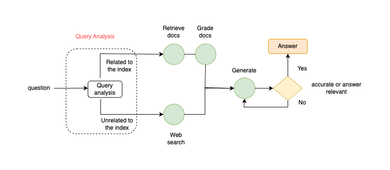
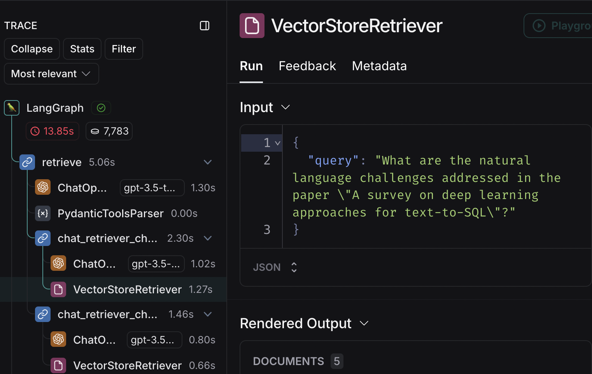
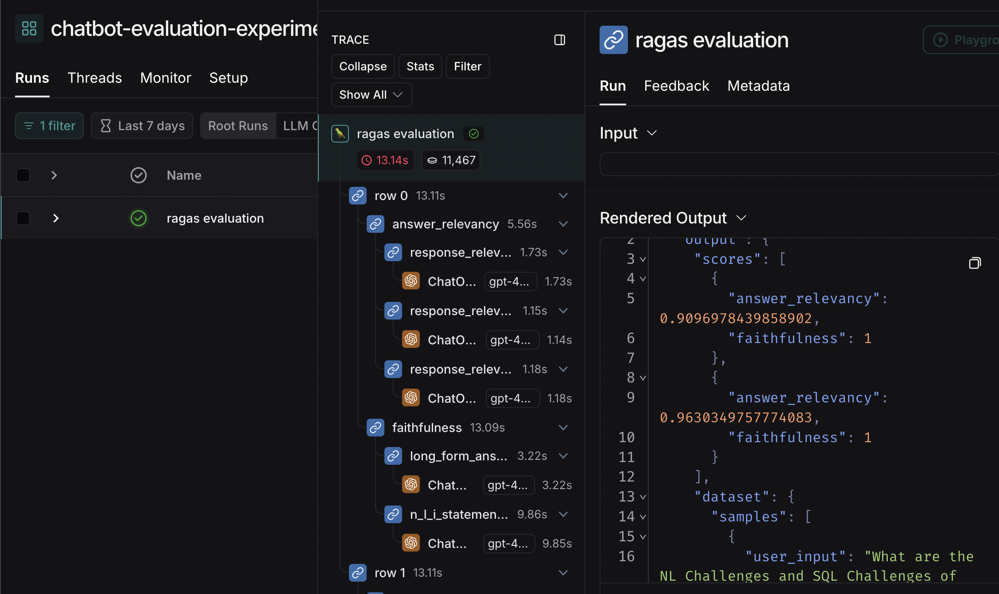

# About the project
The goal of this project is to enable the chatbot API to answer questions based on the papers by leveraging Generative AI.

## Tech Stack
* LangGraph: Utilized for designing and managing the chatbot's conversational flow.
* LangSmith: Employed for tracing interactions and generating output datasets, providing valuable insights for model evaluation.
* OpenAI: Powers the chatbot with a robust Large Language Model (LLM) and embedding model to enhance understanding and response quality.
* FastAPI: Serves as the application server, enabling efficient deployment and handling of API requests.
* Pytest: Ensures reliability through comprehensive testing, validating the application's functionality and performance.
* ChromaDB: Acts as the local vector database, offering optimized vector storage for quick retrieval of relevant embeddings.
* Marker Tool: Handles PDF parsing, enabling efficient extraction and processing of information from PDF documents.(https://github.com/VikParuchuri/marker)

## How PDF Files are prepared
To efficiently process research papers, I use the Marker tool to detect key elements such as two-column layouts, tables, and equations, converting them into Markdown format to facilitate easy extraction of valuable information. For more details, please refer to this [notebook](https://colab.research.google.com/drive/1YYK8Gae2JL5CM8ZS90nStYX6wIPMdMRS?usp=sharing).

## RAG Graph


The RAG Graph includes the following nodes:
* Query analysis
    - To analyze the question is related to the papers or not
    - Make decision to route the question to the relatd path
* Retrieve
    - Retrieve node is fetch the documents related to the user question
    - Retrieve node includes query decomposition and chat history aware retriever to retrieve based on the context
    - Query decomposition breaks down complex questions into sub-questions.
        -   For example: `What are the NL Challenges in the paper 'A survey on deep learning approaches for text-to-SQL' and what is the abstract?` should be break down into two questions
        - Query decomposition handles that effectively. See the example output below:
            
* Grade document
    - Grades the retrieved documents, removing those that are irrelevant to improve response accuracy.
* Generate
    - The goal of generate node aims to give the accurate and relevant answer to the user.
    - To achieve this, it includes a hallucination checker and an answer relevancy checker as part of the answer generation process.

## How To Run the project
* Please change the .env.sample to .env file with appropriate values
* please run `docker compose up --build`

## How to test the project
* APIs can be easily test by going to the swagger documentation. For example `http://localhost:8000/docs/`.
* Two APIs are available: one for asking questions and another for clearing the chatbot's memory or state.

## How to run the test cases
Please run the following command:
```sh
$ docker exec -it chatbot_app bash
# Please run the pytest command inside the docker container - chatbot_app
$ pytest .
```
## To Load the data to the vector db
Please install the requirements first to the scripts by runnning `pip install -r requirements.txt`.
To add the data into the chroma vector database, please run `$ python scripts/load_pdf_to_vector_db/markdown_ingestion.py`.

The script performs the following tasks:
* Will load the markdown files
* The docs are splitted by markdown headers.
* Ingest the splitted docs into the vector database with metadata.

Note: Please replace chatbot_app/.chroma with the output .chroma to update the database.

## Evaluate the chatbot output
We can use the output of hallucinations grader and answer relevant grader outputs as online evaluation results. Please run the follwing script for offline evaluation to evaluate the dataset from langsmith. For this project, I set up the automation pipeline to add output to the dataset in langsmith.

The evaluation metrics are from the [ragas](https://docs.ragas.io/en/stable/) library.
```sh
$ python scripts/evaluate.py
```
Evaluation output can be traced in the langsmith trace experiment like below.


## Improvements need to be implemented
* Add authentication and store chat history
* Implement memory for multiple users
* Implement chat bot long term memory using vector storage
* Migrate to more scalable vector database
