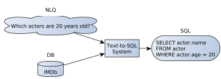
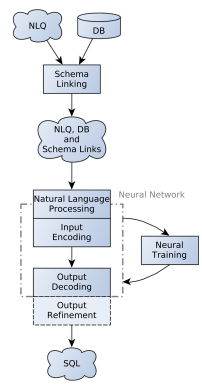
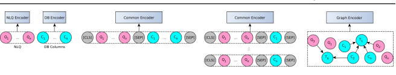
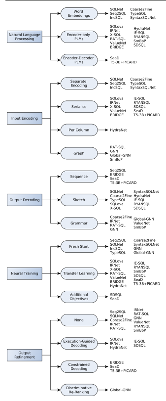
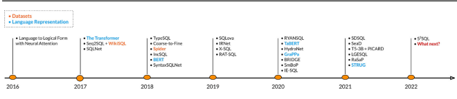

# A Survey On Deep Learning Approaches For Text-To-Sql

George Katsogiannis-Meimarakis1 · **Georgia Koutrika1**
Received: 27 May 2022 / Revised: 31 October 2022 / Accepted: 10 December 2022 / Published online: 23 January 2023 © The Author(s) 2023

### Abstract

To bridge the gap between users and data, numerous text-to-SQL systems have been developed that allow users to pose natural language questions over relational databases. Recently, novel text-to-SQL systems are adopting deep learning methods with very promising results. At the same time, several challenges remain open making this area an active and flourishing field of research and development. To make real progress in building text-to-SQL systems, we need to de-mystify what has been done, understand how and when each approach can be used, and, finally, identify the research challenges ahead of us. The purpose of this survey is to present a detailed taxonomy of neural text-to-SQL systems that will enable a deeper study of all the parts of such a system. This taxonomy will allow us to make a better comparison between different approaches, as well as highlight specific challenges in each step of the process, thus enabling researchers to better strategise their quest towards the "holy grail" of database accessibility.

Keywords Text-to-SQL · Deep learning · Natural language processing · Natural language interface for databases

# 1 Introduction

In the age of the Digital Revolution, data is now an indispensable commodity that drives almost all human activities, from business operations to scientific research. Nevertheless, its explosive volume and increasing complexity make data querying and exploration challenging even for experts. Existing data query interfaces are either form-based, which are easy to use but offer limited query capabilities, or low-level tools that allow users to synthesise queries in the underlying database query language (e.g. SQL) but are intended for the few (e.g. SQL experts). To empower everyone to access, use, understand, and derive value from data, we need to lift the technical barriers that impede access to data and eliminate dependency to IT experts. Expressing queries in natural language can open up data access to everyone. In the words of E. F. Codd: "If we are to satisfy the needs of casual users of databases we must break the barriers that presently prevent these users from freely employing their native language" [14].

Towards this direction, there has been an increasing

research focus on Natural Language (NL) Interfaces for Databases (NLIDBs) that allow users to pose queries in natural language and translate these queries to the underlying database query language. In particular, text-to-SQL (or NL- to-SQL) systems translate queries from NL to SQL. As the text-to-SQL problem is notoriously hard, these systems have been the holy grail of the database community for several decades [5]. Early efforts [36,37,60,110] rely primarily on the database schema and data indexes to build the respective SQL query from a NL query. A query answer is defined as a graph where nodes are the relations that contain the query keywords and edges represent the joins between them. Parsing-based approaches parse the input question to understand its grammatical structure, which is then mapped to the structure of the desired SQL query [42,53,69,90,98]. Recently, there has been a growing interest in neural machine translation (NMT)
approaches[33,89,112] that formulate the text-to-SQL problem as a language translation problem, and train a neural network on a large amount of {NL query/SQL} pairs. These approaches have bloomed due to the recent advances in deep learning and natural language processing (NLP), along with the creation of two large datasets (WikiSQL [112] and Spider [107]) for training text-to-SQL systems.

As neural text-to-SQL systems are popping up "like mushrooms after a rain" with promising results, an exciting, but,

B
 George Katsogiannis-Meimarakis katso@athenarc.gr Georgia Koutrika georgia@athenarc.gr 1 Athena Research Center, Athens, Greece
at the same time, highly competitive and fast-paced research field is opening up. While a growing interest on the subject is shown by various tutorials [44,45,54] and literature reviews [1,2,5,17,40,47,55,72] presented at top conferences and journals, an in-depth, systematic study and taxonomy of neural approaches for text-to-SQL is missing. We believe that in order to make real progress in building text-to-SQL systems, we need to de-mystify what has been done, understand how and when each model and approach can be used, and recognise the research challenges ahead of us. Two earlier works [2,55] study rule-based approaches that originated from the database community; our work has a different scope, focusing entirely on deep learning systems. Additionally, two studies consider both rule-based and neural text-to-SQL systems: [47] provides a taxonomy of both types of systems and an experimental evaluation based on a new accuracy metric proposed by the authors, while [72] provides a large-scale overview of rule-based, neural and conversational NLIDBs. The biggest difference with these works is that we present an in-depth taxonomy tailored to neural systems and their peculiarities (while also covering more and newer efforts). Finally, three studies focus on neural text-to-SQL systems: [1] provides an overview of the neural text-to-SQL landscape, but in a more bare-bones manner compared to our work, and [17,40], which are the closest to our work, since they both attempt to organise the existing neural text-to-SQL approaches. However, our work goes in greater depth than these works, both by presenting a taxonomy with additional dimensions, but also by using this taxonomy to analyse and compare different systems and design choices. We also point the interested reader to recent surveys on semantic parsing [43] and context-dependent semantic parsing [56], two broader domains that the text-to-SQL problem is a part of.

In a nutshell, this survey aims at catching up with recent advances in deep learning text-to-SQL systems and systematically organising all the different techniques that have been proposed for each step of the translation process. Our objective is to (a) put different neural text-to-SQL works in perspective, (b) create a fine-grained taxonomy that covers each step of the neural text-to-SQL pipeline, (c) explain and organise all the techniques used for each dimension of the taxonomy, (d) use the taxonomy to compare and highlight the strengths and weaknesses of different systems and techniques, and (e) highlight open challenges and research opportunities for the database and the machine learning communities. Our study is also relevant to other areas, including the broader area of data exploration (e.g. natural language explanations, recommendations), entity resolution, and query optimisation, where the methods presented here may be transferred to or inspire the development of new methods.

In particular, our contributions are the following:
- We present the current state of the deep learning textto-SQL landscape, the particularities of the problem, the benchmarks and evaluation methods that are most commonly used, and a wide spectrum of the most recent efforts that leverage the latest and most sophisticated deep learning approaches
- We provide a taxonomy that not only enables a sideby-side comparison of the systems but also allows decomposing the text-to-SQL problem in a number of sub-problems and categorising existing techniques accordingly
- We provide a detailed discussion of methods used in these systems, taking advantage of our taxonomy to highlight the advantages and shortcomings of different design choices
- We discuss in detail open challenges that are highlighted from our study and provide directions for critical future research The rest of this paper is organised as follows: Sect. 2 provides a definition and explanation of the text-to-SQL problem, including an analysis of the challenges that make the problem so hard. In Sect. 3, we present the datasets that are currently fuelling the creation of deep learning systems. We also touch on the problem of evaluating system performance based on these benchmarks. Section 4 presents a fine-grained taxonomy for deep learning text-to-SQL systems, analysing the most important steps followed by all systems and presenting current work, open problems and hints for future research for each step. Section 5 gives an overview of the main neural building blocks used for text-to-SQL systems, as well as their most common usage. Having established a concrete set of axes for comparing and classifying textto-SQL systems, in Sect. 6, a multitude of neural systems are presented and compared based on the aforementioned taxonomy, allowing the reader to grasp the progress that has been made in this domain and the differences between key approaches. In Sect. 7, we take advantage of the taxonomy, to compare different design choices and provide useful insights for researchers and practitioners that are interested in implementing a novel text-to-SQL system. Finally, Sect. 8 aims at inspiring practitioners and researchers in the fields of database systems, natural language processing and deep learning, by shedding light on open problems that need to be addressed, as well as closely related areas that could both give and receive benefit from research done in the text-to- SQL problem.

# 2 The Text-To-Sql Problem

The text-to-SQL problem can be described as follows:

Fig. 1 The text-to-SQL problem

Given a natural language query (NLQ) on a Relational Database (RDB) with a specific schema, produce a SQL query equivalent in meaning, which is valid for the said RDB and that when executed will return results that match the user's intent.

A NLQ may be expressed as a complete and fluent utterance (e.g. "What movies has Spielberg directed since 2012?") or it may be just a few keywords (e.g. *"Italian* Restaurants in Vienna"). A text-to-SQL example can be seen in Fig. 1. Translating a NLQ to SQL hides challenges related to the understanding of the input NL query as well as related to building the correct (syntactically and semantically) SQL query based on the underlying database schema.

### 2.1 Nl Challenges

Ambiguity Natural language is inherently ambiguous, which means that it allows the formulation of expressions that are open to more than one interpretation. There are several types of ambiguity [3,66]. We describe the most common ones below.

Lexical ambiguity (or *polysemy*) refers to a single word having multiple meanings. For example, *"Paris"* can be a city or a person.

Syntactic ambiguity refers to a sentence having multiple interpretations based on its syntactic structure. For example, the question *"Find all German movie directors"* can be parsed into *"directors that have directed German movies"* or "directors from Germany that have directed a movie".

Semantic ambiguity refers to a sentence with multiple semantic interpretations. For instance, "Are Brad and Angelina married?" may mean they are married to each other or separately.

Context-dependent ambiguity refers to a term having different meanings depending on the query context, the data domain, and the user goals. The most common example terms are *"top"* and *"best"*. Based on *the query context*, for the query *"Who was the best runner of the marathon?"*, the one who completed the race faster (min operation) should be returned, but when asking "Which was the best nation of the 2004 Olympics?" the one with the most medals (max operation) is expected. Based on *the domain*, for the query "Return the top movie" on a movie database, *"top"* may mean based on the number of ratings collected. On the other hand, for the query *"Return the top scorer"* on a football database, *"top"* refers to the number of goals scored. Based on *the user*, for a business analyst, the query *"Return the top* product" should return the most profitable products, whereas for a consumer it should return the top-rated products.

Paraphrasing In natural language, two sentences can have the exact same meaning but be expressed in two completely different ways. For instance, "How many people live in Texas?" and *"What is the population of Texas?"*. Both translate to the same SQL query, but the second one may actually be easier for a system because it is likely that a "population" attribute exists in the database schema, and thus, the user intent can be inferred with high confidence. Paraphrasing includes *synonymy* where multiple words have the same meaning (e.g. *"movies"* and *"films"*).

Inference A query may not contain all information needed for a system to fully understand it. The system has to *infer* the missing information based on the given context. We distinguish two main types of inference:
Elliptical queries are sentences from which one or more words are omitted but can still be understood in the context of the sentence.1 An example is "Who was the president before Obama". The fact that the query refers to US presidents needs to be inferred.

Follow-up questions are common in conversations between humans. We ask a question, receive an answer, and then ask a follow-up question assuming that the context of the first question is known. For example, "Q: Which is the capital of Germany?", "A: Berlin", *"Q: What about France?"*. In the absence of the first question, the second one does not make sense, but given the query context, it is obvious that it is asking about the capital city of France.

User mistakes Spelling errors as well as syntactical or grammatical errors make the translation problem even more challenging.

### 2.2 Sql Challenges

SQL syntax SQL has a strict syntax, which leads to limited expressivity compared to natural language. There are queries that are easy to express in natural language, but the respective SQL query may be complex. For example, the query "Return the movie with the best rating" maps to a nested SQL query.

Furthermore, while a sentence in natural language may contain some mistakes, and still be understood by a human, SQL is not that forgiving. An SQL query translated from a NL query needs to be syntactically and semantically correct in order to be executable over the underlying data.

Database structure The user's conceptual model of the data, i.e. the entities, their attributes and relationships that are

1 https://en.wikipedia.org/wiki/Ellipsis_(linguistics).
described in the data, may not match the database schema, and that poses several challenges.

The *vocabulary gap* refers to the differences between the vocabulary used by the database and the one used by the user. For example, in the query "Who was the best actress in 2011?", *"actress"* should map to the *Actor.name* attribute in the database).

Schema ambiguity is when a part of the query may map to more than one database element. For example, *"model"*
could refer to car.model or *engine.model*.

Implicit join operations occur when parts of a query are translated into joins across multiple relations. For example, "Find the director of the movie "A Beautiful Mind"" entails joins due to database normalisation.

Entity modelling is the problem where a set of entities may be modelled differently, e.g. as different tables or as rows (or values) in a single table. For example, in a university database, every person is either a *Student* or a *Faculty* member, so these two relations suffice. On the other hand, movies have several genres that cannot be stored as different tables.

They are stored in a *Genre* relation and are connected with movies through a many-to-many relationship. As a result, similar queries, such as *"Find comedies released in 2018"* and *"Find students enrolled in 2018"* need in fact to be handled differently. The system maps *"comedies"* to a value in the *Genre* table and joins it with the *Movie* table whereas it maps *"students"* to the *Student* relation.

# 3 Datasets And Evaluation

To build a neural text-to-SQL system, it is necessary to consider the available datasets for training and evaluation, as well as the evaluation methodology for testing and comparing its performance to other systems. A *text-to-SQL dataset* (or *benchmark*) refers to a set of NL/SQL query pairs defined over one or more databases.

Early system evaluations *did not rely on common datasets*,
they rather employed a variety of datasets that combined different databases and query sets of varying size and complexity. In general, the query sets were small and designed in an ad-hoc way by the system developers, and as a result it was hard to reach meaningful conclusions about the translation capabilities of a system. Often, the query sets were proprietary and hence not available to reproduce the experiments. The *lack of a common dataset* to be used by different system evaluations and the *poor cross-system evaluations* impeded a fair system comparison and a clear view of the text-to-SQL
landscape. In addition to these shortcomings, training deep learning text-to-SQL systems requires a substantial query set. As a result, for a long time, the lack of appropriate datasets delayed the adoption of deep learning techniques for the textto-SQL problem.

Table 1 A comparison of the two most popular text-to-SQL benchmarks: WikiSQL and Spider

| WikiSQL                       | Spider                     |
|-------------------------------|----------------------------|
| Crowd\-sourced                | Created by experts         |
| 25K Wikipedia tables          | 200 databases, 138 domains |
| 80K NL questions              | 10K NL questions           |
| Single\-table, simple queries | Complex queries            |
| Contains errors               | Higher quality             |
| No query categorisation       | 4 hardness categories      |

| queries and databases   |                     |         |           |
|-------------------------|---------------------|---------|-----------|
| Year                    | Dataset             | Queries | Databases |
| 1994                    | ATIS [15,71]        | 275     | 1         |
| 1996                    | GeoQuery [109]      | 525     | 1         |
| 2003                    | Restaurants [70,84] | 39      | 1         |
| 2014                    | Academic [53]       | 179     | 1         |
| 2017                    | IMDb [98]           | 111     | 1         |
|                         | Yelp [98]           | 68      | 1         |
|                         | Scholar [42]        | 396     | 1         |
|                         | WikiSQL [112]       | 80,654  | 24,241    |
| 2018                    | Advising [27]       | 281     | 1         |
|                         | Spider [107]        | 10,181  | 200       |
| 2020                    | MIMICSQL [92]       | 10,000  | 1         |
|                         | SQUALL [80]         | 11,276  | 1679      |
|                         | FIBEN [77]          | 300     | 1         |
| 2021                    | Spider\-Syn [28]    | 8034    | 160       |
|                         | Spider\-DK [29]     | 535     | 10        |
|                         | KaggleDBQA [51]     | 272     | 8         |
|                         | SEDE [34]           | 12,023  | 1         |

Table 2 An overview of text-to-SQL benchmarks and their size in

This situation drastically changes with the emergence of WikiSQL [112] and Spider [107], in 2017 and 2018, respectively. These are the first large-scale, multi-domain benchmarks that made it possible to train and evaluate neural text-to-SQL systems and provided a common tool to compare different systems easily. While other benchmarks have followed, these two remain the most popular ones. Table 1 summarises and compares the two benchmarks.

This section provides an overview of various text-to-SQL
datasets (summarised in Table 2), covering either a single or multiple domains, as well as the evaluation methodologies for comparing the system predictions to the ground truth.

### 3.1 Domain-Specific Text-To-Sql Datasets

Domain-specific text-to-SQL datasets focus on one domain and typically include a single database, such as: movies and television series (IMDb [98]), restaurant and shop reviews
(Yelp [98] and Restaurants [70,84]), academic research (Scholar [42] and Academic [53]), financial data (Advising [27] and FIBEN [77]), medical data (MIMICSQL [92]), and questions and answers from Stack Exchange (SEDE [34]).

Interestingly, these datasets have not seen the same widespread use as WikiSQL or Spider for a number of reasons. Since they focus on a single domain, it is not possible to argue that a proposed system can be considered a "universal solution" even if it performs well on a specific domain. Second, their size is relatively small compared to Spider and WikiSQL, usually not surpassing a thousand examples. Third, most of these datasets do not have a pre-defined train/dev/test split so that systems trained and evaluated on them would be compared fairly to one another.

Even though the generalisation capability of a text-to-
SQL model is an important challenge, a realistic application would most likely require a text-to-SQL system to work with a single database of a specific domain, or with a few related databases. In such a scenario, a high performance on a single domain may be even more important than a cross-domain generalisation capability, and achieving it is very challenging [34].

Furthermore, datasets such as SEDE [34], are made specifically to reflect that SQL queries in real-life scenarios can be very complex and long; having numerical computations, variable declarations, date manipulations, and other elements that are not present in the Spider and WikiSQL datasets. SEDE's authors demonstrate that the state-of-the-art systems which achieve high scores on Spider, do not perform as well on SEDE, proving the necessity for new and more advanced benchmarks.

### 3.2 Cross-Domain Text-To-Sql Datasets

WikiSQL WikiSQL [112] is a large crowd-sourced dataset for developing natural language interfaces for relational databases, released along with the Seq2SQL text-to-SQL
system. It contains over 25,000 Wikipedia tables and over 80,000 natural language and SQL question pairs created by crowd-sourcing. Each entry in the dataset consists of a table with its columns, a Natural Language Question (NLQ) and a SQL query. Figure 2 shows an example from the dataset.

The complexity of the SQL queries found in WikiSQL
is low because each query is directed to a single table and not to a relational database and they are do not use any complex SQL clause such as JOIN, GROUP BY, ORDER BY, UNION, and INTERSECTION. Additionally, WikiSQL does not allow the selection of multiple columns in a single query or the use of the asterisk (*) operator. Consequently, the proposed task is much simpler than the ultimate goal of creating a natural language interface for relational databases.

We must also note that WikiSQL contains multiple errors and ambiguities, which might hinder the performance of a model trained on it. Figure 3 demonstrates an example of a table incorrectly copied from Wikipedia that was nevertheless used to generate a pair of a NLQ and a SQL query that, ultimately, make no sense. Research even suggests that the state-of-the-art systems have reached the upper barrier of accuracy on the task [39]. This is also demonstrated by evaluating human performance on a small proportion of the dataset.

Spider Spider [107] is a large-scale complex and crossdomain semantic parsing and text-to-SQL dataset annotated by 11 Yale students. It contains 200 relational databases from 138 different domains along with over 10,000 natural language questions and over 5000 SQL queries. Its queries range from simple to hard, using all the common SQL elements, including nesting. These characteristics of the dataset along with its high quality, since it was hand-crafted and rechecked, have led researchers to widely rely on it for building systems that can generate quite complex SQL queries.

Other cross-domain datasetsRecent cross-domain datasets focus on particular aspects of the text-to-SQL problem.

Spider-DK [28] extends Spider to explore system capabilities at cross-domain generalisation (i.e. robustness to domain-specific vocabulary across different domains), while Spider-Syn [28] focuses on robustness to synonyms and different vocabulary. Both datasets highlight very interesting and important requirements for a text-to-SQL system, and can be used as supplementary benchmarks.

SQUALL [80] is based on a previous dataset named WikiTableQuestions [67], consisting of NL Questions posed on Wikipedia tables along with the expected answers. In contrast to WikiSQL, there are no structured queries in the WikiTable- Questions dataset. The authors of SQUALL have created the corresponding SQL queries for most of the examples in the WikiTableQuestions dataset, while also providing an alignment between words in the NLQ and the parts of the SQL query that they refer to. This additional feature could steer more thorough research on the schema linking and schema ambiguity problems (briefly mentioned in Sect. 2 and more thoroughly examined in Sect. 4).

Finally, KaggleDBQA [51] is another cross-domain dataset, although of much smaller size, that has been extracted from Kaggle and features real-world databases taken from the Web, having all the peculiarities of a DB that are missing from Spider, whose DBs were created specifically for benchmarking text-to-SQL systems. KaggleDBQA also includes documentation and metadata for its DBs, posing an interesting research question of how this additional information could be used to improve the system performance.

### 3.3 Evaluation Metrics

Having a ground truth SQL query for each NLQ enables us to train and evaluate a deep learning text-to-SQL system on Fig. 2 An example from the WikiSQL dataset Fig. 3 An incoherent example from the WikiSQL dataset it. In this section, we will present metrics used to evaluate a text-to-SQL system's predictions.

String matching (introduced as Logical Form Accuracy
[112]) is the simplest accuracy metric for text-to-SQL. It considers the ground truth and predicted queries as simple strings and checks whether they are identical. A match is only found when the predicted query is written exactly as the ground truth, without taking into account that many parts of a SQL query can be written in a different order or even in a different but still equivalent way.

Execution accuracy [107,112] (or Query Accuracy [11])
is another simple approach for comparing SQL queries. For each NLQ, both the ground truth and the predicted queries are executed against the corresponding database (or table) and their results are compared. If the results are the same, then the prediction is considered correct. False positives can occur when both queries return the same results, but are different on a semantic level (e.g. when they return empty results or when an aggregation function is applied to different columns that happen to return the same result).

Component matching [107] is proposed in order to obtain a better understanding of which parts of the SQL query are predicted correctly. For example, we might consider the SELECT column accuracy, i.e. the percentage of the predicted queries that have the same columns in the SELECT clause as the corresponding ground truth queries. For some parts, a more sophisticated approach might be necessary to avoid incorrect classifications. For instance, when comparing the conditions of the WHERE clause, their order should not be taken into account.

Exact set matching [107] (or Query Match Accuracy [96])
considers all the possible component matches and classifies a prediction as correct if all component matches are correct (e.g. aggregation function, condition operators, SELECT columns, etc.).

Exact set match without values is a category in the Spider
[107] dataset, that works in the same way as exact set matching, but does not take into account if the values that appear in the predicted query are the same as the ones that appear in the gold query. The reason for this simplification is that predicting the correct values can be very challenging, especially when these values appear in the NLQ differently to the way they are stored in the DB (e.g. the word "Greek" might imply a condition such as country="Greece"). Although this metric might be considered as common practice in the Spider benchmark, as research shows [27], disregarding values during evaluation removes an important challenge of the textto-SQL problem.

Sub-tree elements matching (or Partial Component Match F1—PCMF1) [34] is a metric proposed to avoid a score of zero by the exact set match metric, when some parts of the predicted query are correct. It considers parts of the query such as the SELECT, WHERE and FROM clauses and it calculates the F1 score of each clause based on the precision and recall of the predicted attributes in the clause. The final PCMF1 score of a predicted query is the average F1 score of all the considered query parts. For example, in large queries, the system might predict a large part of the query correctly and make some errors in the WHERE clause. While the exact match metric would assign a score of zero even for a small mistake, the PCMF1 metric would assign a score relatively close to one, thus providing a better assessment of the system performance.

A more thorough methodology for evaluating the semantic equivalence of two SQL queries has been proposed by [47], but has yet to be adopted by any deep learning systems. This approach starts by comparing the execution result of the two queries, as well as their results on additional generated data, in case the original database contains a small amount of data. Furthermore, a prover is used to provide a proof of equivalence between the queries or a counter example in the case of non-equivalence. If the prover cannot work for the given queries, then a query re-writer is applied on both queries and the re-written queries' parse trees are compared. If the re-written parse trees are structurally identical then the queries are semantically equivalent, otherwise the queries are manually evaluated by an expert. While this approach could detect matches even if queries are expressed in fundamentally different ways, the requirement of manual labour as well as the extra processing requirements it presents, are some of the reasons why it has not seen widespread use yet.

What metric each system is using greatly depends on the dataset that each system is created for and aims at entering its leaderboard.2,3 Specifically, systems that are built for the WikiSQL dataset, use Logical Form Accuracy and Execution Accuracy, while systems built for the Spider dataset use Exact Set Matching without Values and Execution Accuracy. This strongly indicates the influence that benchmark creators have on the evaluation strategy of text-to-SQL systems. It also highlights the responsibility of the next benchmark creators to address the problems of current metrics and include more thorough evaluation metrics.

# 4 Taxonomy

Despite the fact that deep learning approaches have only recently become popular for the text-to-SQL problem, numerous systems have already been proposed, that bring a wide variety of novelties and employ different approaches. Nevertheless, there are key parts that serve common purposes across almost all systems, which allow us to build a general model that can help us better understand them. Hence, the goal of this section is to present an overview of the most important parts of neural text-to-SQL systems as well as a taxonomy of the possible choices in each part.

Figure 4 shows an overview of a neural text-to-SQL system. The main input of a text-to-SQL system is a NL query (NLQ) and the database (DB) that the NLQ is posed on. The first step, whenever employed, is*schema linking*, which aims at the discovery of possible mentions of database elements (tables, columns and values) in the NLQ. These discovered schema links, along with the rest of the inputs, will be fed into the neural network that is responsible for the translation.

The core of this neural network consists of two main parts: the *encoder* and the *decoder*. The encoder takes one or more inputs of variable shapes and transforms them into one or more internal representations with fixed shapes that are consumed by the decoder. Additionally, the encoder usually infuses the representation of each input with information from the rest of the inputs, so as to create a more informed representation that better captures the instance of the problem at hand. The decoder uses the representations calculated by the encoder and makes predictions on the most probable SQL query (or parts of it).

Given that the inputs (NLQ, DB, schema links) are mainly textual, *natural language representation* is responsible for creating an efficient numerical representation that can be accepted by the encoder. *Input encoding* is the process of further structuring the inputs in a format that can be accepted by the encoder, as well as the choice of an appropriate encoder network for processing them and producing an internal hidden representation. Finally, *output decoding* consists of designing the structure of the predictions that the network will make, as well as choosing the appropriate network for making such predictions (e.g. a SQL query can be viewed as a simple string, or as a structured program which follows a certain grammar). While some systems perform the NL representation and *encoding* steps separately (e.g. a representation based on word embeddings which is then encoded by a LSTM), in some cases, they can be almost indistinguishable (e.g. when using BERT [19]). It is even possible for all three steps to be merged into one (e.g. when using the T5 encoder–decoder pre-trained language model [74]). Finally, the *neural training* refers to the procedure followed for training the neural network.

The last dimension of the taxonomy is the output refinement, which can be applied during the decoding phase in order to reduce the possibility of errors and to achieve better results. Note that even though output refinement is closely related to output decoding and even interacts with the decoder, it is not a part of the neural network. As such, in most cases, it is possible to add or remove an output refinement technique once the system has been created and trained.

### 4.1 Schema Linking

To better grasp the concept of schema linking, let us think of how a human, asked to write a SQL query from a NLQ, would start by looking at the underlying database and by trying to identify how the entities mentioned in the NL are stored in the database. In other words, they would attempt to *link* parts of the NLQ to the database elements they are referring to. Intuitively, a text-to-SQL system could benefit by doing the same when translating a NLQ.

2 https://yale-lily.github.io/spider.

3 https://github.com/salesforce/WikiSQL.

Fig. 4 Overview of a neural text-to-SQL system, based on the proposed taxonomy

More formally, schema linking is the process of discovering which parts of the NLQ refer to which database elements. The NLQ parts that could possibly refer to a database element are called *query candidates*, while the database elements that could occur in the NLQ are called database candidates. Query candidates can be words or phrases, while database candidates can be tables, columns, and values in the database. A connection between a query candidate and a database candidate is called a *schema link*, which can be further categorised as a table link or *column link*, when the query candidate maps to a table name or column name, respectively, and *value link*, when it matches a value of a column.

Schema linking is very challenging for a variety of reasons. Query and database candidates may not use the same vocabulary nor appear in the exact same phrasing. For example, the phrase *"sang by"* in the NLQ might refer to the database column *"singer"* (same word stem, phrased differently) or *"artist"* (vocabulary mismatch). This problem is even more challenging when the NLQ expresses a condition (i.e. a reference to a DB value) in a different way than how the value is stored in the DB. This is an issue because in contrast to the table and column names of the DB, the sheer volume of data stored in a DB prohibits using all DB values as inputs to the system, making it very challenging for the system to build the correct SQL condition. For example, the word *"female"* might imply a condition such as
"gender=F". In this case, besides a schema link between "female" and the column *"gender"*, the system must also be given the value as it is stored in the DB ("F") as part of the input, in order to use it when constructing the SQL prediction. Otherwise, it will most likely produce a condition like "gender=female", which would return no rows. Due to the volume of a DB, finding value links is not only hard but can be very computation-expensive.

The schema linking process has two parts. Candidate discovery is the process of extracting query candidates from the NLQ and database candidates from the underlying database. Candidate matching is the process of comparing a set of query candidates and a set of database candidates and establishing the links.

Schema linking enhances the input, and a system can operate without it. Hence, performing no schema linking is possible too. In fact, while most recent systems incorporate some form of schema linking in their workflow, earlier ones (e.g. Seq2SQL [112], SQLNet [96]) and even some recent ones (e.g. HydraNet [62], T5+PICARD [76], SeaD [97]) simply rely on their neural components to make predictions.

### 4.1.1 Query Candidate Discovery

We first walk through the techniques used for discovering query candidates.

Single tokens A simple approach for finding query candidates is to consider all the single words of the NLQ as query candidates. This is obviously prone to errors as it is likely that a query candidate spans over multiple tokens (e.g. "New York", "Iggy Pop and the Stooges").

Multi-word candidates To find all possible query candidates, even multi-word ones, it is necessary to consider n-grams of varying length. For example, IRNet [33] uses all n-grams of length from 1 to 6 in the user question as query candidates. It processes them in descending order of length and if a n-gram is marked as a schema link, the system discards all the smaller n-grams that are contained in it, to avoid generating duplicate links. Furthermore, IRNet [33] assumes that any phrase (n-gram) appearing inside quotes must be a reference to a value stored inside the database. Note that in this case, the system not only discovers a query candidate, but also asserts that the database candidate that will be linked to it must be a value.

Named entities ValueNet [10] adds an extra step for intelligent candidate discovery, by performing Named Entity Recognition (NER) on the user's NLQ to discover possible query candidates. This technique is very effective in discovering candidates that refer to a widely known entity such as a place or a person but might not generalise to entities that are specific to a certain domain. ValueNet asserts that candidates discovered through NER refer to a DB value, i.e. the DB candidate they will be matched to, must be a value. TypeSQL
[103] uses the Freebase4 Knowledge Graph to perform NER.

It searches for five types of entities, namely: Person, Place, Country, Organization and Sport. However, the query candidates that are found to be Named Entities are not matched to a DB candidate, but simply marked with the entity type that describes them.

Additional candidates As mentioned earlier, creating correct conditions can be even more challenging when the value is not expressed in the NLQ exactly as it is stored in the DB. ValueNet [10] proposes an improved pipeline for generating additional candidates for value links that consists of: (a) identifying possible query candidates using NER, (b) generating additional candidates by looking up similar values in the database and by using string manipulation, and (c) validating all the generated candidates by confirming they appear in the database. The validated candidates are then given to the system, to aid it in generating correct conditions. Let us consider the following example, where the NLQ contains the phrase *"New York"*, but the DB contains the value *"NY"*. ValueNet would recognise *"New York"* as a named entity, it would generate additional similar candidates (e.g. *"N. York"*,
"N.Y." and "NY") and it would look them up in the DB. Doing so, it would discover that only *"NY"* appears in the DB, and would only add this value in the input to help the system create a correct condition (e.g. *"state=NY"*).

### 4.1.2 Database Candidate Discovery

Table and column names The first and most obvious source for database candidates are the names of the tables and columns of the database. Given that most databases contain a relatively small number of tables and columns, all of them can be database candidates.

Values via lookup Values stored in the database comprise another large pool for database candidates. However, due to the volume of data, iterating over all the DB values is not performance-wise. Indexes have been widely used in earlier text-to-SQL systems, which do not rely on deep learning [36,53], to accelerate the search. ValueNet [10] also uses indexes and computationally cheap methods for retrieving values from the DB. It is necessary to note that a database lookup requires the use of an already discovered query candidate. In order to avoid greedily looking up all the query candidates, the system might only look up certain query candidates that seem more likely to refer to a value (e.g. because they are found inside quotes or based on heuristics).

Values via knowledge graphs IRNet [33] assumes that access to the database contents is not possible and employs the knowledge graph ConceptNet [82] for recognising value links. As a first step, IRNet considers that all n-grams beginning and ending with single quotes are query candidates referring to values. In order to discover the DB column or table that could contain a value such as the discovered query candidate, the system searches each candidate in the knowledge graph and only keeps two types of results: *is-type-of* and *related-terms*. For example, when searching for "New York" in ConceptNet, one of the returned results is is-type-of "state". This result helps IRNet link *"New York"* to a column named *"state"* or similarly. Note that this approach stands out from what has been discussed so far, in the way that a value link is discovered using an intermediate candidate (knowledge graph result) and the column names.

### 4.1.3 Candidate Matching

Having discovered the query and database candidates, an efficient method is needed for comparing them to identify possible links. As discussed earlier, candidates are not always expressed in the same way in both sides, so identifying links is not straightforward. Techniques that can recognise semantic similarities between candidates are required.

Exact and partial matching The simplest approach is to look for exact and partial matches, as it is done by IRNet [33]. An exact match requires that the candidates are identical, while a partial match occurs when one candidate is a substring of the other. Admittedly, this approach is barebone and while it can discover more obvious links, it can also result in false positive matches when candidates share the same words (e.g. *"residence"* would be considered a partial match with *"former residence"*).

Fuzzy/approximate string matching Another useful technique for identifying matches when the link in the candidates are written differently is approximate string matching. An example of such an approach is the Damerau–Levenshtein distance [16], used by ValueNet [10]. While such techniques aid at identifying matches with different spelling or spelling mistakes (e.g. "color"-*"colour"*), they cannot handle synonyms and thus are not robust to the use of different vocabulary.

Learned embeddings To calculate the similarity between words of the NLQ and schema entities, an earlier work in the area of semantic parsing [49] proposes the use of learned word embeddings. The system learns word embeddings using the words of the text-to-SQL training corpus and combines them with additional features that are calculated using NER, edit distance and indicators for exact token and lemma match. These embeddings are then used to calculate the similarity of query candidates to DB candidates. While this approach is more expensive than previous matching techniques, it allows for much more flexible and intelligent matching. This approach was also adopted by text-to-SQL systems [8,9] as well.

4 https://developers.google.com/freebase.
Classifiers Given the complexity of schema linking, it may be possible to achieve better results by training a model to perform schema linking.

A Conditional Random Field (CRF) model [50] can be trained on a small group of hand-labelled samples to recognise column links, table links and value links for numerical and textual values [11]. The predictions of this model can then be passed to the main neural network of the text-to- SQL system along with the rest of the inputs. DBTagger [86] uses a similar approach to solve the schema linking problem as a sequence tagging problem. It employs CRFs on every token of the NLQ to identify: (a) its Part of Speech (POS), (b) schema link type (e.g. table link, value link, etc.), and (c) the specific schema element that it refers to. The authors argue that learning these three tasks in a multi-learning paradigm helps the system achieve better performance than it would if it only learned to identify the schema element each token refers to.

The SDSQL [38] system is simultaneously trained on two tasks: (a) the text-to-SQL task, similarly to all systems, and (b) the *Schema Dependency Learning* task. For this additional learning task, the system is essentially trained to discover schema links in the form of dependencies between the words of the NLQ and the parts of the SQL query. Namely, the possible dependencies are: select-column (S- Col), select-aggregation (S-Agg), where-column (W-Col), where-operator (W-Op) and where-value (W-Val). For example, a select-column (S-Col) label is assigned to the dependency between the column appearing in the SELECT clause and the word of the NLQ that refers to it. A deep biaffine network [23,25] is trained along the rest of the system to detect the existence and type of these dependencies. Training data for this task is created from the already available NL
and SQL pairs, by assigning dependency labels between the NLQ tokens and table columns. Although the schema links discovered by the system are not directly used for predicting the SQL query, training for both tasks simultaneously has a positive effect on the system performance. This task goes beyond the schema linking task, as some of the aforementioned dependencies include query candidates that might refer to query parts (e.g. aggregation functions and condition operations). It should also be noted that this approach has been applied to WikiSQL, but it has not yet been extended to the more challenging Spider dataset.

Neural attention While attention layers do not directly determine a match, we mention them briefly because of their capability to highlight connections between query and DB candidates, which can improve the system's internal representation and boost its performance. SQLNet [96] was the first system to introduce such a mechanism, named Column Attention, that processes the NLQ and column names and finds relevant columns for each word of the NLQ. The Transformer [87] neural architecture, which is based on an attention mechanism, has been instrumental to the widespread use of PLMs that have become the go-to solution for input encoding, greatly benefiting the accuracy of text-to-SQL systems. Finally, RAT-SQL [89] proposed a modified Transformer layer, called Relation-Aware Transformer (RAT), that biases the attention mechanism of the Transformer towards already-known relations from the DB schema and discovered schema links.

### 4.2 Natural Language Representation

An essential step for text-to-SQL systems is creating and processing numerical representations of their NL inputs. Until recently, the most popular technique for NL representation has been pre-trained word embeddings. Recent advances in NLP, such as the introduction of the Transformer architecture [87] followed by its use to create large Pre-trained Language Models (PLMs), has tipped the scales greatly to its favour. Additionally, as new PLMs are emerging, a new research path is being paved focusing on the design of better PLMs or PLMs created specifically for certain problems (such as the text-to-SQL problem).

### 4.2.1 Word Embeddings

Word embeddings aim at mapping each word to a unique numerical vector. While there are simplistic approaches for creating such vectors (e.g. one-hot embeddings), more advanced algorithms [65,68] aim at making the value of each vector meaningful. These vectors are usually trained from a large text corpus (e.g. Wikipedia or Twitter) using a self-supervised algorithm that is mainly based on word cooccurrences. The set of pre-trained vectors can then be used to build a model that benefits from the inherent knowledge that is present in the vectors due to their training.

For example, the GloVe [68] embeddings, which capture interesting word relationships, were frequently used by the first text-to-SQL systems. Such word relationships include words with similar meaning being near neighbours and linear substructures that indicate similar relationships between words (e.g. the distances between the word pairs Paris-France and Athens-Greece will be similar because these words share a capital-country relation). A pre-trained set of GloVe embeddings can be used to create numerical representations for NL inputs of a model, which can then be encoded using a RNN (such as a LSTM).

### 4.2.2 Pre-Trained Language Models

The introduction of the Transformer architecture [87] and its use in PLMs such as BERT [19] has led to a great performance boost in many NLP problems. The text-to-SQL problem is no exception, as the use of PLMs has quickly become the go-to solution for NL representation. In order to understand how a PLM can be used in a text-to-SQL system, it is first necessary to highlight the difference between two main categories of PLMs: (a) encoder-only and (b) encoder–decoder models.

Encoder-only models, like BERT [19], RoBERTa [59],
and TaBERT [101], take a sequential input and produce a contextualised numerical representation for each input token. The term "contextualized" marks a notable difference to word embedding techniques, which map each word to a fixed vector, while the representations given by PLMs are computed taking all tokens of the input into account. This representation can then be used by additional neural layers to make a prediction for the downstream task at hand. While GloVe representations can be seen as improved word embeddings and can be used in similar fashion (e.g. using an LSTM), this is not necessary. In fact, due to the robustness of PLMs, it is possible to process their outputs using very simple and small neural networks and still achieve better results than complex networks using word embeddings.

Encoder–decoder models, like T5 [74] and BART [52],
are full end-to-end models that take a sequential text input and return a sequential text output (seq-to-seq). These models produce the final output on their own, without the need for any extra neural layers, and can be used on any downstream task as long as the expected output can be modelled as a text sequence.

Furthermore, as such models are gaining more attention, the creation of task-specific PLMs is becoming a new research area of its own. Such models can be customised to work with different types of inputs and perform better on less generic tasks, such as the text-to-SQL task. There are multiple PLMs, such as GraPPa [104] and TaBERT [101], that have been designed to work with structured and tabular data as well as to better generalise in tasks that use SQL, and they can improve the performance of a text-to-SQL system when used in place of a generic PLM. It must also be noted that while most text-to-SQL systems are originally proposed with BERT [19] or another general-purpose PLM, they often manage to achieve higher scores by replacing it with a PLM, such as TaBERT [101], that was specifically pre-trained for a task that uses structured data, like the text-to-SQL task.

### 4.3 Input Encoding

The dimension of input encoding examines how the input is structured and fed to the neural encoder of the system, so that it can be processed effectively. There are different inputs that are useful for translating a NLQ to SQL. The NLQ and the names of the DB columns and tables could be considered the minimum required input. Other features that could improve the network performance include: (a) the relationships present in the DB schema, including primary-to-foreign key relationships and relationships between columns and tables, and (b) links and additional values that have been discovered during the schema linking process.

The use of neural networks mandates the transformation of all inputs into a form that can be accepted by the network. This can be very restrictive, given how heterogeneous these types of inputs are and how difficult it is to represent them all in a single type of input. In this section, we examine the most representative choices for input encoding, while also taking into account the additional features that each choice can incorporate. We distinguish four encoding schemes: (a) separate NLQ and column encodings (b) input serialisation (c) encoding NLQ with each column separately, and (d) schema graph encoding. A schematic overview of the possible encoding choices can be seen in Fig. 5.

### 4.3.1 Separate Nlq And Column Encodings

A first approach, used mostly by earlier systems (e.g. Seq2SQL [112], SQLNet [96]), is to encode the NLQ separately from the table columns. The main reason for encoding the two inputs separately is the shape mismatch between them; while the NLQ is a simple sentence (i.e. a sequence of words), the table header is a list of column names, where each name can contain multiple words, i.e. it is a sequence of sequences of words.

In Seq2SQL [112], SQLNet [96] and IncSQL [79], each word (embedding) of the NLQ is fed into a bi-directional LSTM (bi-LSTM) that produces a hidden state representation for each word. For column headers, since each column name can have multiple words, a bi-LSTM is used for each column name, and the final hidden state of each column is used as the initial representation for the column. Notice that by keeping only the last state of each column name, the representation of the header becomes a simple sequence and not a nested sequence. Since the two inputs are encoded separately, they must be combined at some point so that the output is influenced by both of them. This can be done by using cross-serial dot-product attention [61], concatenating the two representations, summing them or using a combination of the above.

None of the studied systems that follow this encoding approach use any extra features besides the NLQ and DB columns. This may be attributed to the fact that these are some of the earliest neural text-to-SQL proposals, which did not perform schema linking and focused on the simpler WikiSQL dataset.

### 4.3.2 Input Serialisation

A different approach is to serialise all the inputs into a single sequence and encode it all at once. This is a very common practice when using PLMs (e.g. BERT [19], T5 [74]) that create a contextualised representation of their input, because if

Fig. 5 An overview of the possible encoding choices. Pink tokens represent words of the NLQ, blue tokens represent database elements and grey

tokens are auxiliary tokens (color figure online)
each input were to be encoded separately, the system would not benefit from the PLM's contextualisation ability. This approach simplifies the encoding process and benefits from the robustness of PLMs. However, it also carries disadvantages, such as losing schema structure information and being unable to easily represent relationships between the inputs (e.g. primary-foreign key relationships, schema links, etc.). As we go through some different serialisation approaches, we will also examine how much information can be retained in each case.

It should also be noted that PLMs usually employ a few special tokens that are added to the serialised sequence. For example, BERT [19] uses the classification [CLS] and the separating [SEP] special tokens. The [CLS] token is added at the start of the sequence. Its contextualised output, which gathers information from all the tokens in the sequence thanks to the underlying attention networks, can be used to make classification predictions that concern the entire sequence. The [SEP] special token can be used to separate different sentences in the same sequence. These tokens are also useful for the text-to-SQL problem.

The simplest serialisation technique, used by several systems [35,39,63] that work on the WikiSQL dataset, creates a single input sequence that only contains the NLQ and all the table headers. The serialised sequence starts with the [CLS] token, as is common for BERT, then the NLQ tokens are appended, followed by a [SEP] token marking the end of the NLQ and then each column name is added followed by a [SEP] token. This input is processed by BERT, which creates a contextualised representation that has the same length as the input, and that can be processed by the rest of the network to make predictions. Since these systems only work with single tables, there is not a lot of information that needs to be preserved, but it could be argued that this approach separates the column names much less strictly compared to the separate encoding approach.

IRNet [33] (when using BERT) creates an input that starts with a [CLS] token, then continues with the NLQ's tokens followed by a [SEP] token, the name of each column of the database followed by a [SEP] token, and finally the table names of the schema, each separated with a [SEP] token as well. In order to encode discovered schema links along with the rest of the input, IRNet uses three extra tokens, namely [Column], [Table], [Value], that can be appended before a NLQ token or phrase, to mark that it was linked to a database candidate. Still, using this serialisation format, there is a lot of schema information not captured. For example, it is not possible to extract any primary-foreign key relationships, or to which table each column belongs.

Finally, BRIDGE [57] constructs an input for a PLM that starts with a [CLS] token, followed by the NLQ and a [SEP]
token, as well as the tables and column of the DB, where a [T] and [C] token is added before each table and column name, respectively, so as to better preserve each attribute's role. The difference between IRNet's and BRIDGE's use of the special [C]/[Column] and [T]/[Table] tokens is that the former uses them in the NLQ part to indicate a schema link to a column or table, while the latter uses them to indicate that the tokens after a [C] or [T] token are a column or table name, respectively. BRIDGE also uses an extra third token [V] along with a value, after a column name, to mark that this value appears under the column at hand and was discovered as a possible value link to some NLQ candidate. In this case, BRIDGE uses the [V] token in the DB schema part of the input while also appending a value after it, while IRNet uses the [Value] token in the NLQ part, without providing the actual value. Additionally, all the columns belonging to a certain table are added right after the table's name in the sequence so as to better preserve the schema structure in this serialised representation. Nevertheless, all relationships between attributes (e.g. primary/foreign keys) are still lost when following this representation.

### 4.3.3 Encoding Nlq With Each Column Separately

HydraNet [62] employs a unique approach: it processes the NLQ with each column separately and makes predictions for each column independently. For each table column, a different input is constructed by concatenating the NLQ with the column name and type and the table name. Using this input, the system predicts the probability of the column at hand appearing in the SELECT clause, the probability of the

Fig. 6 System categorisation on the taxonomy dimensions of natural language representation, input encoding, output decoding, neural training and output refinement

column appearing in the WHERE clause, the operation that will be used if this column appears in the WHERE clause, and so on. It could be argued that this approach does not allow the system to have a complete view of the problem instance, because the neural network makes predictions for each column separately, without being aware of the rest of the table columns. Nevertheless, HydraNet achieves exceptional performance on the WikiSOL benchmark.

This approach does not utilise any additional features (e.g.

schema links). However, given that it also serialises its inputs
(albeit, only keeping a single column each time), it could draw inspiration from the serialisation techniques described in Sect. 4.3.2 to encode information about schema links. For example, it could append values similarly to BRIDGE [57],
or use [Table] and [Column] tokens to explicitly mark column and table names in the input NLQ.

It should be noted, however, that generalising this approach to a complete relational DB would not be an easy task. First of all, a DB usually has multiple tables, each containing multiple columns, which means that the network would have to make predictions for a much larger number of columns, greatly increasing time complexity for predicting a single SQL query. Furthermore, queries posed on complete DBs often contain JOIN clauses and other operations that depend on more than one entity; as such, processing each column separately becomes very counter-intuitive. Finally, this approach is based on a sketch-based decoder (more in Sect. 4.4), which is hard to extend for complete DBs.

### 4.3.4 Schema Graph Encoding

A graph is the most effective way for representing the DB
elements and their relationships. Representing and encoding the input using a graph is used only by a handful of systems [8,9,89]. Each node in the graph represents a database table or a column, while their relationships can be represented by edges that connect the respective nodes. It is also possible to add the NLQ words as nodes in the graph, and add edges that connect the query candidates with their equivalent database candidates for representing all the discovered schema links.

Additionally, the used graph representation may allow for different classes of nodes and edges leading to even higher expressivity. There can be different classes of nodes to distinguish between tables, columns and NLQ words and different classes of edges to distinguish between edges that represent foreign-primary key relations, edges that indicate a column belonging to a table and edges that represent schema links.

Even though representing the system input as a graph allows for minimal loss of information and can include many types of additional inputs, processing a graph with a neural network is far more difficult than processing a sequence. This is the main reason why graphs have yet to see widespread use in the text-to-SQL problem. However, recent advances in graph neural networks and the clever use of Transformers [87] proposed by RAT-SQL [89] and [78], are showing very promising and might be a good choice for future research.

### 4.4 Output Decoding

Text-to-SQL systems following the encoder–decoder architecture can be divided into three categories based on how their decoder generates the output [13]: (a) sequence-based, (b) grammar-based, and (c) sketch-based slot-filling approaches.

#### 4.4.1 Sequence-Based Approaches

This category includes systems that generate the predicted SQL, or a large part of it, as a sequence of words (comprising SQL tokens and schema elements) [11,57,112]. This decoding technique is the simplest, and was adopted by Seq2SQL [112], which is one of the first deep-learning text-to-SQL systems. Later systems steered away from sequence decoding because it is prone to errors.

The main drawback of sequence decoding is that it treats the SQL query as a sequence that needs to be learnt, and at prediction time, there are no measures to safeguard from producing syntactically incorrect queries. When generating a query, it does not take into account the strict SQL grammatical rules, nor does it actively prevent generating incorrect column and table names that do not exist in the DB.

Nevertheless, sequence-based approaches are starting to be used again and are proving to be very efficient thanks to two advances: (a) the introduction of large pre-trained seqto-seq Transformer [87] models (e.g. T5 [74], BART [52]) and (b) the use of smarter decoding techniques that constrain the predictions of the decoder and prevent it from producing invalid queries (e.g. PICARD [76]).

#### 4.4.2 Sketch-Based Slot-Filling Approaches

Systems in this category [35,39,62,63,96,103] aim at simplifying the difficult task of generating a SQL query to the easier task of predicting certain parts of the query, such as predicting the table columns that appear in the SELECT clause. In this way, the SQL generation task is transformed into a classification task. In particular, we consider a query sketch with a number of empty slots that must be filled in, and develop neural networks that predict the most probable elements for each slot. A basic prerequisite for such approaches is to have a query sketch that, when completed, will be able to capture the NLQ's intention.

While dividing the text-to-SQL problem into small subtasks makes it easier to generate syntactically correct queries, sketch-based approaches may have two drawbacks. Firstly, the resulting neural network architecture may end up being quite complex since dedicated networks may be used for each slot or part of the query. Furthermore, it is hard to extend to complex SQL queries, because generating sketches for any type of SQL query is not trivial.

#### 4.4.3 Grammar-Based Approaches

Systems using a grammar-based decoder [13,22,33,79,89] are an evolution of sequence-to-sequence approaches, and produce a sequence of grammar rules instead of simple tokens in their output. These grammar rules are instructions that, when applied, can create a structured query.

The most often used grammar-based decoders by textto-SQL systems have been previously proposed for code generation as an Abstract Syntax Tree (AST) [99,100]. These models take into account the grammar of the target code language (in our case, the SQL grammar) and consider the target program to be an AST, whose nodes are expanded at every tree level using the grammar rules, until all branches reach a terminal rule. When it reaches a terminal rule, the model might generate a token, for example, a table name, an operator or a condition value, in the case of text-to-SQL. The decoder uses a LSTM-based architecture that predicts a sequence of actions, where each action is the next rule to apply to the program AST. Because the available predictions are based both on the given grammar and the current state of the AST, the possibility of generating a grammatically incorrect query is greatly reduced.

Grammar-based approaches are considered the most advantageous option for generating complex SQL queries, as sequence-based approaches were too prone to errors and sketch-based approaches are difficult to be extended to complex queries. While their status is recently being challenged by the advances of sequence-based decoders discussed earlier, the quest for the most effective decoding technique is far from over.

### 4.5 Neural Training

Another dimension that must be examined when considering a neural text-to-SQL system is the methodology that is followed to train it.

Even though the description of a system is usually focused around its architecture and neural layers as well as the way it encodes the inputs and decodes the output, the dimension of neural training is important, because it is the process that enables the neural network to learn how to perform the task at hand.

Earlier systems adopted the simple paradigm of training the network exclusively on a text-to-SQL dataset, however, recent systems have proposed more sophisticated approaches that can greatly benefit the network performance and its generalisation capabilities.

Fresh start The most common approach is to train the network from scratch, i.e. initialise all the weights with a random initialisation algorithm and train them on a downstream task. However, recent developments in the domain of NLP are showing that pre-trained networks and self-supervised learning are able to achieve much better performance.

Transfer learning The use of transfer learning is quickly gaining ground in the NLP community, due to the introduction of Transformers [87], which greatly reduce training time compared to RNNs. Transfer learning refers to when a model trained on a different, usually more generic task, and a different dataset, is incorporated to a new model and further trained on a downstream task (e.g. text-to-SQL). Language models, i.e. networks that have been trained to predict missing words or phrases on huge text corpora, are becoming the standard approach for most NLP tasks, given the performance boost they provide in almost all cases.

Some systems, such as HydraNet [62], rely on language models almost completely, only using linear output layers to produce predictions. Most systems however, incorporate language models as an alternative or an enhancement for word embeddings and RNNs.

Additional objectives Another interesting approach that follows the success of language models and self-supervised learning is that of using additional self-supervised tasks while training for the text-to-SQL problem. Recent research [12,38,97] suggests that training neural models for more generic tasks besides the downstream task of text-to-SQL that the model is designed to solve, can improve performance on the downstream task. When using additional objectives, one must decide whether the model should be trained on all the auxiliary objectives along the downstream task or whether it should be first trained on the auxiliary tasks and then finetuned on the downstream task.

- *Erosion* The erosion task, proposed by [97], consists of randomly permuting, removing and adding columns to the input schema and training the model to produce the correct SQL query using the eroded schema. Additionally, the system must learn to produce an unknown token when it has to use a column that has been removed from the given schema.

- *Shuffling* The shuffle task, proposed by [97], randomly changes the order of schema entities and condition values in the input SQL query and NLQ, training the model to correctly re-order them.

- *Graph pruning* The graph pruning task, proposed by [12],
trains the model to prune all the nodes of the input graph representation that are irrelevant to the given NLQ.

- *Schema dependency learning* SDSQL [38] proposes an additional task to the text-to-SQL task, that closely resonates to the schema linking problem. SDSQL is designed for the WikiSQL dataset. Schema Dependency Learning consists of predicting which words or phrases of the NLQ have a dependency to which columns of the table and the type of the dependency that connects them. The goal is to learn which parts of the NLQ signify that a specific column will appear in the SQL query and the role that the column will have in it (e.g. if it appears in the SELECT clause, if it implies the use of the MAX aggregation function, etc.).

Pre-training specific components Another approach is to train specific parts of our network so that they can better adjust to the peculiarities of the task. For example, GP [111] proposes a framework that pre-trains the system decoder, before training the entire system, in order to better train it on the context-free parts of the SQL grammar, e.g. SQL queries always start with SELECT, the FROM clause is second, and so forth. For this purpose, the encoder's semantic information is replaced by zero vectors so that the decoder is pre-trained without any information about the particular NLQ.

### 4.6 Output Refinement

Once trained, a neural model can be used for inference. There is one last dimension to consider; that of output refinement, i.e. additional techniques that can be applied on a trained model to produce even better results, or to avoid producing incorrect SQL queries.

None An obvious approach is to use the trained model as is, without output refinement.

The most important reason for this approach concerns time and resource availability; in some applications, it might be crucial to achieve low latency responses or to run on everyday machines. For example, PICARD [76], increases inference time by 0.6s when running on a machine with very high-end GPU and arguably even more so on a personal computer. It must be noted however that almost all leader-board entries that achieve high results, use some refinement technique.

Execution-guided decoding This is a mechanism [91] that helps prevent text-to-SQL systems from predicting SQL queries that return execution errors. Even though sketchbased approaches are designed to avoid syntactical errors, the possibility for semantical errors is ever-present. Some examples of such errors include aggregation functions mismatches (e.g. using AVERAGE on a string type column), condition type mismatches (e.g. comparing a float type column with a string type value), and so forth. To avoid these type of errors, execution-guided decoding can execute partially complete SQL queries at prediction time and decide to avoid a certain prediction if the execution fails or if it returns an empty output. Execution-guided decoding is system-agnostic and can be applied to most sketch-based systems (e.g. HydraNet, IE- SQL), increasing their accuracy in almost all cases. Let us note that even though some systems presented in this work might not be proposed using execution-guided decoding in their original paper, they are subsequently shown to perform better in the WikiSQL leaderboard when using it. For this reason, they are shown to use execution-guided decoding in Fig. 6 and Table 3.

Constrained decoding While generative models with sequence-based outputs are becoming more powerful for NL generation, they are clearly prone to errors when it comes to generating structured language like SQL. PICARD [76] proposes a novel method for incrementally parsing and constraining auto-regressive decoders, to prevent them from producing grammatical or syntactical errors. For each token prediction, PICARD examines the generated sequence so far along with the k most probable next tokens and discards all tokens that would produce a grammatically incorrect SQL query, use an attribute that is not present in the DB at hand, or use a table column without having its table in the query scope (i.e. not having the appropriate table in the FROM clause). Using PICARD, a seq-to-seq pre-trained transformer model (T5-3B [74]) has managed to reach the top of the SPIDER leader-board, lifting the barriers of using sequence-based decoders for text-to-SQL. It should be noted that while PICARD could be considered as the most sophisticated constrained decoding technique, other systems with sequence-based decoders have proposed similar decoding techniques to avoid errors. Some examples of such systems are SeaD [97] and BRIDGE [57].

Discriminative re-ranking The Global-GNN
parser [9] proposes an additional network that re-ranks the top-k predictions of the main text-to-SQL network and is trained separately from it. The discriminative re-ranker network takes into account the words of the NLQ and the database elements used by each of the k highest-confidence SQL predictions, by the text-to-SQL network, and re-ranks them based on how relevant it believes they are. Its authors argue that while the text-to-SQL network usually predicts the correct structure for the target SQL query, it might not always predict the correct columns, tables and aggregation functions, because each of them is predicted only knowing already predicted elements and not future predictions. On the other hand, the re-ranker can look at the completed predictions and judge the use of each database element in hindsight, thus improving the prediction quality.

# 5 Neural Architecture

Neural architecture refers to the building blocks used to create all neural parts of the system. This section examines the types of neural layers used by text-to-SQL systems and analyses the roles and functions that each one of them is often used for.

Linear networks Linear (or Dense) Neural Networks are often used as output layers for sketch-based decoders or to process an internal representation. Given that this type of neural layer is not suited for processing data in a sequence format, they are not effective at processing input such as a NLQ, or producing output in a sequence format (e.g. in a sequence or grammar-based decoder). In sketch-based decoders, however, where the network must predict the correct choice for a certain slot, linear layers are the best suited option to perform this classification task (i.e. choose the best option for filling a slot out of all the available options).

Recurrent neural networks Recurrent neural networks
(RNNs) have long been considered the go-to solution for NLP, only to be recently dethroned by the powerful Transformers. The main advantage of RNNs is their ability to (a) effectively process series inputs, such as a NLQ, which is a series of words, and (b) to generate a series output, such as the condition value of a WHERE clause, or a series of grammar rules that can generate a SQL query. Well-known RNN architectures include the LSTM (Long Short-Term Memory) and the GRU (Gated Recurrent Unit). The LSTM is popular for NLP tasks and most often used in text-to-SQL systems.

Early systems, such as Seq2SQL [112] and SQLNet [96],
relied on LSTMs for input encoding (along with pre-trained word embeddings), but this type of use is now outperformed by pre-trained Language Models. Even though the recent success of Transformers and Language Models has greatly reduced the use of RNNs in the input encoding phase, RNNs are still being used to assist LMs in input encoding and to generate non-NL series outputs. For example, IRNet [33] uses BERT to encode the input NLQ and schema but also employs LSTMs to create single-token representations for columns and tables with more than one word in their name
(and more than one token to represent them).

RNNs are also often used for generating a series output. For example, Seq2SQL [112] and SQLNet [96] employ pointer networks [88] comprised of LSTM layers that generate the entire WHERE clause or the condition value of the WHERE clause, respectively. Another case of RNNs for output generation is seen in systems (e.g. IRNet [33], RAT-SQL [89]) that employ a grammar-based decoder that generates an SQL query as an abstract syntax tree, leveraging work in semantic parsing [99] that uses LSTMs.

Transformers In text-to-SQL systems, Transformers are commonly used in Transformer-based Pre-trained Language Models for input encoding, to create a contextualised representation of the input text. Pre-trained Language Models offer more robust representations and greatly improve the model performance almost all of the times, making them more preferable than pre-trained word embeddings. To use them for input encoding, one can simply replace the input encoder (e.g. word embeddings and LSTM) with a model like BERT.

There have been also other, rarer uses of Transformers in text-to-SQL systems. For example, HydraNet is a system completely reliant on a pre-trained language model. In this case, the text-to-SQL problem is formulated so that it matches the pre-training logic of a language model and only very simple linear networks are used to make predictions using the contextualised representations created by the Language Model.

Another unique example is RAT-SQL [89], which uses specifically modified Relation Aware Transformers (RAT) to encode its input. What is special about RAT is that they also accept pre-defined relations about the elements of input series, which essentially allows to bias the encoder towards already known relations in the database schema and the user question. A similar approach is used by [78] in order to extend the Transformer architecture to support relations between elements of the inputs, in the form of a GNN Sub-layer. This extension of the Transformer allows to encode the input as a graph, where the edges can have different layers, similarly to RAT-SQL; however, its performance is much lower on the Spider benchmark.

Conditional random fields (CRFs) CRFs [50] are a type of discriminative machine learning model that excels at modelling relations and dependencies. Because of this capability, CRFs are often used in NLP for labelling tasks such as Partof-Speech (POS) tagging and Named Entity Recognition (NER). Even though CRFs are rarely used in text-to-SQL, there is a notable mention of a system integrating them in its neural architecture for a specific sub-task. Namely, IE-SQL [63] employs CRFs tasked with two schema-linking tasks of recognising: (a) which words in the NLQ are slot mentions to SQL elements, such as the SELECT column and the WHERE columns, and (b) finding *slot relations*, i.e. grouping each of the WHERE column mentions with the mentions of operations and values that correspond to them. Both tasks are modelled as labelling tasks, which is why CRFs are a good choice.

Convolutional neural networks (CNNs) Convolutional networks are very rarely used for the text-to-SQL task, since they are best suited for processing visual data. One example of a system using CNNs is RYANSQL [13], which uses CNNs with Dense Connections [102], in order to encode the inputs. However, the authors of RYANSQL demonstrate that replacing this CNN-based encoder with a PLM can greatly improve the model's performance, making the choice to steer away from CNNs all the more obvious.

# 6 Systems

Having established a taxonomy for deep learning text-to- SQL systems, let us now zoom in on key systems that have introduced novel and interesting ideas and have shaped the area. This section provides insights and explanations on these systems while also grouping them based on important milestones of this research area. Figure 7 presents a chronological view on deep learning text-to-SQL systems, along with important datasets and language representation advancements that have had a great impact on the domain. While certain systems could obviously fit in multiple sections, this specific categorisation is based on the novelty introduced by each system at the time of its publishing, its influence on later systems, as well as the possible importance of each novelty given its capability to address future and open research problems.

### 6.1 The Dawn Of An Era

As mentioned before, the era of deep learning text-to-SQL
systems essentially starts with the release of the first large annotated text-to-SQL dataset. WikiSQL was released along with *Seq2SQL* [112], which was one of the first neural networks for the text-to-SQL task and was based on previous work focusing on generating logical forms using neural networks [21]. The system predicts the aggregation function and the column for the SELECT clause as classification tasks and generates the WHERE clause using a seq-to-seq pointer network. The latter part of the system is burdened with generating parts of the query that can lead to syntactic errors, which is its major drawback.

A big difference from almost all other systems is that Seq2SQL is partly trained using reinforcement learning. While the aggregation function and SELECT column predictors are trained using cross entropy loss, the WHERE clause predictor is trained using a reward function that returns a positive reward if the produced query returns the same results as the ground truth query and a negative reward if the query returns different results or if it cannot be executed due to errors. The reasoning behind using reinforcement learning, even though it generally performs worse than supervised learning, is that the WHERE clause can be expressed in multiple ways and still be correct.

To address these problems, i.e. that sequence decoders can produce errors and that reinforcement learning is not ideal, SQLNet [96] proposed using a query sketch with fixed slots that, when filled, form a SQL query. This sketch can be seen in Fig. 8, and it covers all the queries present in the WikiSQL dataset. Using a sketch allowed the problem to be formulated almost entirely as a classification problem, since the network has to predict: (a) the aggregation function between a fixed number of choices, (b) the SELECT column among a number of columns present in the table, (c) the number of conditions (between 0 and 4 in the WikiSQL dataset), (d) the columns present in the WHERE clause (as multi-label classification, since they can be more than one), (e) the operation of each condition among a fixed number of operations

Fig. 7 A timeline of deep learning text-to-sql systems, datasets and language representation techniques

Fig. 8 Query Sketch proposed by SQLNet
(≤, =, ≥) and (f ) the value of each condition. Predicting the value is achieved using a sequence generator network, which in this case is only responsible for the value and not for the SQL syntax or grammar, so syntactic mistakes are avoided.

Another improvement introduced in SQLNet is the introduction of a *column attention neural architecture* to the network. Given that SQLNet encodes the NLQ and table columns separately, the encoded representation of the NLQ does not have any information on the available columns and thus cannot inform the system on which words in the NLQ are important for generating the correct SQL query. Column attention is an attention mechanism that infuses the NLQ representation with information about the table columns, so as to emphasise the words that might be more related to the table. Other than that, both systems are similar to each other, using GloVe [68] embeddings for text representation and LSTM networks for encoding them.

### 6.2 Sketch Generation

While the use of a sketch greatly simplifies the text-to-SQL
problem and makes predictions simpler for neural networks, the complexity of SQL queries the system can generate using a single sketch is restricted. Systems such as Coarse2Fine [22] and RYANSQL [13] have tried to generalise sketchbased decoding, by attempting to not only fill in the slots of a sketch but also generate the appropriate sketch for a given NLQ.

Coarse2Fine [22] is a semantic parser that can generate various types of programs, one of which is SQL. Its main highlight is that it decomposes the decoding process into two steps: first, it generates a rough (coarse) sketch of the target program without low-level details, and then it fills this sketch with the missing (fine) details. Its authors argue that a great advantage of this approach is that the network can disentangle high-level from low-level knowledge and learn each one of them more effectively. Unfortunately, this system is only used on the WikiSQL dataset and is not extended to more complex SQL queries, which is not trivial work. In fact, because Coarse2Fine is designed for the WikiSQL dataset, the sketches it generates only differ between them in the number of conditions that appear in the WHERE clause and the operations in each condition. As such, while the idea it proposes might be very interesting, in practice, it essentially achieves generating SQL queries of no greater complexity than what simple sketch-based systems do.

RYANSQL [13] is another system that generates the appropriate sketch before filling it, but in contrast to the previous, it manages to produce much more complex SQL queries such as the ones present in the Spider dataset. This is achieved by breaking down each SQL query into a non-nested form that consists of multiple, simpler, sub-queries. The authors propose 7 types of sub-queries, each with its own sketch, that can be combined to produce more complex queries. The network then learns to recursively predict the type of each sub-query and to subsequently fill in its sketch. RYANSQL achieved the first position in the Spider benchmark at the time of its publication, but has since been surpassed by other systems, while no other similar approach has been able to achieve comparable performance.

SyntaxSQLNet [105] follows a similar approach, but instead of generating the query sketch, it follows a predefined SQL grammar that determines which of its 9 slotfilling modules needs to be called to make a prediction. This allow the system to produce grammatically correct complex queries while enjoying the benefits of a sketch-based decoder. At each prediction step, the grammar and the prediction history from the previous steps are used to determine the module (e.g. COLUMN module, AGGREGATOR module, OPERA- TOR module, HAVING module, etc.) that needs to make a prediction in order to build the SQL query. Although this is a hybrid approach, the architecture of the decoder modules classifies SyntaxSQLNet as a sketch-based decoding system. The main difference is that most sketch-based decoders call all their slot-filling modules simultaneously to fill the sketch, whereas SyntaxSQLNet calls specific modules recursively because the grammar defines what needs to be filled in at each prediction step. SyntaxSQLNet was one of the first systems proposed for Spider. Since then, many systems have achieved better performance scores while steering away from this methodology, hinting at its weaknesses. For example, one of the main challenges is to effectively pass all the information of the prediction history and the current state of the generated SQL to each module, at every prediction step.

### 6.3 Graph Representations

The use of graphs for input encoding has only recently seen increased use, despite its powerful capability to represent the DB schema. This section explores key systems that have shown new perspectives on how graphs can be represented and used in the text-to-SQL task.

A natural option for processing graphs are Graph Neural Networks (GNNs). However, while being a good option for tasks such as node classification, node clustering and edge prediction, they are not as suitable for generative tasks like the text-to-SQL problem. Two systems manage to leverage GNNs to encode the database schema and its elements: the GNN parser [8] and its successor Global-GNN parser [9]. To achieve this, the database schema is represented as a graph, where tables and columns are represented as nodes, and different types of edges represent the relationships between them (e.g. which columns appear in which table and which columns and tables are connected with a primary-foreign key relationship). For NLQ encoding, both systems use word embeddings and LSTM networks, while node encodings calculated by the GNNs are concatenated to each word embedding, based on the discovered schema links. For decoding, both systems use a grammar-based decoder [99] that generates a SQL query as an Abstract Syntax Tree (AST), which is often used by grammar-based systems [10,33,89]. Global-GNN [9] introduces the use of a re-ranker that, given k SQL predictions from the network, chooses the best interpretation based on the database elements used and the graph representation calculated.

In order to avoid the disadvantages of GNNs, other efforts modify architectures that have already shown their power in the text-to-SQL task, such as the Transformer [87], so that they can accept edge information and process a graph. RAT- SQL [89] uses a graph representation of the input, but instead of using GNNs, it proposes a modified Transformer architecture named Relation Aware Transformer (RAT). Firstly, it creates a *question-contextualised schema graph*, i.e. a graph representing the database tables and columns as well as the words of the NLQ as nodes and the relationships between them as edges. An edge can appear either between two database nodes, similarly to the previous systems, or between a database node and a word node. In this graph, schema linking is performed to discover connections between a database node and a word node that might refer to it. The names of all the nodes in the graph are first encoded using BERT [19] and then processed by the RAT network, along with the edge information of each node. The RAT neural block performs relation aware self-attention on its inputs, which essentially biases the network towards the given relations (edges). This allows the system to use Transformers and even pre-trained language models to process the graph as a series while also utilising the information present in the graph edges. Finally, it generates a SQL query as an AST using the method mentioned above [99].

All systems discussed in this section have grammar-based decoders. This happens mainly because they aim to produce complex queries such as the ones in the Spider dataset, and at the time of their publication, grammar-based decoders were the most common option. It would be possible for a system using a graph representation of the input to use a different decoder with its own advantages and drawbacks.

### 6.4 Using Intermediate Languages

Following the success of the grammar-based methods in generating complex SQL queries over multi-table DBs, researchers also examined the use of languages during the decoding phase that can better align with NL than SQL making it easier for the system to make predictions, but at the same time they can be deterministically translated into SQL. We examine key systems that use an Intermediate Language, either a pre-existing language or one created specifically for this task, as the target language for the neural decoder.

IRNet [33] is a grammar-based system capable of generating complex SQL queries, such as the ones in the Spider dataset. It uses the same AST decoding method [99] for code generation used in other grammar-based text-to-SQL systems (e.g. RATSQL [89] and the GNN parser [8]). The main difference is that it predicts an AST of a SemQL program, which is an Intermediate Language created specifically for this system. Its authors argue that it is easier to generate queries in this language and then transform them to SQL. Furthermore, IRNet performs schema linking by considering all n-grams of length 1 to 6 as query candidates and all column and table names as DB candidates and uses exact and partial matches to discover links between them. It also searches for all query candidates that appear inside quotes in the ConceptNet knowledge graph [82] in order to link them to a database column or table. Input encoding uses BERT followed by linear and recurrent neural networks.

SmBoP [75] is a grammar-based system that introduces various novelties in the decoding phase. The use of relational algebra as an Intermediate Language is one of them. Its authors argue that, along with being better aligned with NL, relational algebra is a language that is already used by DB engines, unlike SemQL. Additionally, in order to decode ASTs of queries in relational algebra, SmBoP uses a bottomup parser, in contrast to the usual approach of generating ASTs by performing top-down depth-first traversal, followed by almost all text-to-SQL systems. The bottom-up decoder generates at time step t, the top-k sub-trees of height ≤ t, where k is a given parameter that represents the number of beams used during the decoding search. The main advantage of the bottom-up parsing is that at any given time-step, the generated sub-trees are meaningful and executable subprograms, while in the top-down parsing, intermediate states are partial programs without a clear meaning.

### 6.5 The Age Of Bert

Much like in other NLP problems, replacing a conventional encoder with a pre-trained language model such as BERT [19] has been shown to improve performance of a text-to- SQL system.

SQLova [39] is a sketch-based approach focused on the WikiSQL dataset. It employs a large and complex network almost identical to the one used by SQLNet, with its main difference being that instead of GloVe embeddings, it uses BERT to create a contextualised representation of the NLQ and table headers. The representations are then passed to 6 networks, each responsible for a different part of the query sketch, that are very similar to the sub-networks used by SQLNet. The result is a staggering, almost 20%, increase in execution accuracy on the test set of WikiSQL, indicating BERT's power in the text-to-SQL task.

HydraNet [62] is another sketch-based approach on the WikiSQL benchmark taking advantage of the BERT language model. Its main difference from SQLova is that HydraNet aligns itself better to the way that BERT has been pre-trained and only uses a simple linear network after receiving the contextualised representations from BERT, instead of large networks with LSTMs and attention modules like SQLova. Furthermore, HydraNet processes each table header separately instead of jointly encoding them, an approach that is unique to this system. As a result, it can only make predictions for each column on its own, i.e. it decides if the column at hand will appear in the SELECT clause, if it will appear in the WHERE clause, what its operation will be if it appears in the WHERE clause and so on. HydraNet, with its simpler architecture leveraging BERT, achieves better accuracy on WikiSQL than SQLova, which employs a larger and more complex network.

X-SQL [35] is a sketch-based system using the MT-
DNN pre-trained language model [58], that was built for the WikiSQL benchmark. Similarly to HydraNet, it uses much simpler networks than SQLova for filling the slots of the query sketch. However, it encodes all table headers simultaneously, along with the user question. Additionally, instead of using segment embeddings that originally indicate the span of different sentences in the language model's input, X-SQL uses *type embeddings*. These embeddings differentiate between the different types of elements in the input, such as the user's question, categorical columns and numerical columns. Furthermore, it uses an attention layer to create a single token representation for columns that have more than one token (i.e. more than one word in their name). X-SQL also outperforms the much more complex SQLova, achieving slightly lower scores than HydraNet.

### 6.6 Schema Linking Focus

As discussed earlier, schema linking is a major part of creating a SQL query from a NLQ. This section looks into systems that have put extra effort on schema linking, or even based their entire workflow on this process.

TypeSQL [103] is one of the first systems to introduce a process similar to schema linking in its workflow, and one of the few systems working on WikiSQL that uses schema linking. Its methodology is described as *Type Recognition*, but closely resonates to the concept of schema linking. The goal of this methodology is to assign a "type" to every token of the NLQ. It considers all n-grams in the NLQ of length from 2 to 6 and tries to assign them one of the following "types": (a) *Column*, if it matches the name of a column or a value that appears under a column, (b) *Integer, Float, Date* or Year, if it a numerical n-gram, (c) Person, Place, Country, Organization or Sport by performing NER using the Freebase knowledge graph. Even though this process is unilateral, as its main goal is to classify the query candidates into a type category and not to explicitly link them to a DB candidate, it is one of the first attempts towards schema linking.

ValueNet [10] builds on the grammar-based system IRNet
[33] focusing on schema linking and condition value discovery. The main motivation of the system is that despite the constant improvement of text-to-SQL systems, even the state-of-the-art is falling behind at predicting the correct values in the SQL conditions. Similarly to IRNet, ValueNet decodes a SQL query in a SemQL 2.0 AST. SemQL 2.0 extends the SemQL grammar with values. Additionally, since condition values might not be written by the user in the exact same way they appear in the DB, ValueNet employs an extended value discovery workflow of five steps:
- *value extraction* to recognise possible value mentions in the NLQ, it uses NER and heuristics;
- *value candidate generation* to create additional candidate values, it uses string similarity, hand-crafted heuristics and n-grams;
- *value candidate validation* to reduce the number of candidate values, it keeps only the candidates that appear in the DB;
- *value candidate encoding* it appends each candidate to the input along with the table and the column it was found under, and
- *neural processing* the encoded representations are processed by the neural network, which eventually decides if and where they will be used.

The authors also provide a classification of the Spider queries based on the difficulty of discovering the values. This is another important aspect of the text-to-SQL problem usually overlooked by other works.

SDSQL [38] is a sketch-based system designed for the WikiSQL task. What is special about this system is that it can be viewed as two neural networks tackling two tasks at the same time. The first network predicts SQL queries using the same architecture used by SQLova [39], while the second network performs *schema dependency* predictions. The schema dependency network uses bi-affine networks [24] to predict dependencies between the words of the NLQ and the table headers. Such dependencies include: (a) the *select-column* dependency that connects a query candidate that maps to a column that will appear in the SELECT clause with the corresponding column of the table, and (b) the *where-value* dependency that connects the query candidate that refers to a value that will appear in the WHERE clause to the table column it belongs to. It must be noted that even though the second network performs schema linking, its predictions are not directly used by the first network to construct the SQL query. Instead, a combined loss from the predictions of both tasks is used to train the weights of the networks, which allows the *schema dependency learning* to improve the first network's performance indirectly.

IE-SQL [63] proposes a unique approach to the text-to-
SQL problem almost completely based on schema linking. It uses two instances of BERT [19] to perform two different tasks: a *mention extractor* and a *linker*. The mention extractor recognises which query candidates are mentions of columns that will be used in the SELECT and WHERE clauses of the SQL query, mentions of aggregation functions, condition operators and condition values. Additionally, the mention extractor recognises mentions that should be grouped together. For example, the mentions of the column, the operator and the value that belong to the same condition are grouped together. Having extracted the mentions, the linker maps the mentions of column names to the actual columns of the table they are referring to. The linker also maps value mentions without a grouped column to the appropriate table column. By using the predictions of the mention extractor and the linker, IE-SQL can predict an SQL query, without any additional neural component. Even though this approach may not be a clear match with any of the three decoding categories, we classify it as a sketch-based system because its methodology is heavily based on the existence of a query sketch similar to the one used by SQLNet [96]. IE-SQL can better learn the dependencies between the slots and uses a more robust approach. Still, the mention types it recognises are a direct match to the slots of the query sketch. Therefore, extending it to queries beyond the sketch is not trivial.

### 6.7 The Return Of The Sequence

Generating SQL queries using a sequence-based decoder was initially avoided as it could produce syntax and grammar errors, as discussed in Section 4.4. Grammar-based decoders were instead regarded as the best choice for a system to effectively generate complex SQL queries. However, recent works [57,76,97] have changed the landscape by introducing a series of techniques that minimise the possibility of errors by sequence-based decoders. These techniques have made the use of very powerful pre-trained encoder–decoder models [52,74] a viable and high-performing option, allowing the systems that use them to achieve top performance in both the Spider and WikiSQL benchmarks.

SeaD [97] is a system based on the BART [52] encoder–
decoder pre-trained language model designed on WikiSQL. To overcome the drawbacks of its sequence-based decoder, SeaD employs two techniques: (a) it introduces two additional tasks on which the model is trained at the same time with the text-to-SQL task, and (b) it uses executionguided decoding [91], slightly modified to work with its sequence-based decoder. Its main contribution is the use of the two additional training tasks named *erosion* and *shuffle* (see Sect. 4.5), which are designed specifically to help the model better understand the nature of the text-to-SQL problem and the tables used by the WikiSQL dataset. The use of additional training tasks is also closely aligned with how language models are pre-trained to understand the more general notion of natural language before being fine-tuned to a specific task. Nevertheless, while SeaD has managed to overcome the limitations of sequence-based decoders and achieve the best performance on the WikiSQL benchmark, both the decoding technique and the additional objectives it employs are designed with the WikiSQL dataset in mind. Extending them to full relational databases would not be a trivial matter.

BRIDGE [57] is another recent system with a sequencebased decoder that works on Spider, although it does not use an encoder–decoder language model. Instead, it uses BERT [19] and LSTM networks for input encoding and enriches the input representation using linear networks that use metadata such as foreign and primary key relationships, as well as column type information. Additionally, the system performs schema linking using fuzzy string matching between query candidates and the values of columns that only take values from a pre-defined list (i.e. picklist attributes). The discovered values are added in the input sequence to help the network create better SQL queries. Finally, the sequence-based decoder used by BRIDGE is a pointer generator network using *schema-consistency guided* decoding, a constraining strategy to avoid the aforementioned drawbacks of sequence-based decoders. In order to use schema-consistency guided decoding, BRIDGE is trained (and makes predictions) on SQL queries written in execution order, i.e. all queries start with the FROM clause, followed by the WHERE, GROUP BY, HAVING, SELECT, ORDER BY and LIMIT clauses, strictly in that order. This means that all columns that appear in the query, must appear after the table that they belong to has been generated. Based on this, BRIDGE can limit the search space of columns and avoid using columns that will produce invalid SQL queries.

PICARD [76] is a constraining technique for autoregressive decoders of language models, that is specifically created to improve their performance on the text-to-SQL task. Essentially, at each prediction step, it constrains the model's set of possible predictions by removing tokens that could produce syntactically and grammatically incorrect SQL queries.

It is used at inference time, by looking at the confidence scores of the model's prediction and the schema of the underlying DB, and it operates at three levels:
- it rejects misspelled attributes and keywords, as well as tables and columns that are invalid for the given schema,
- it parses the output as an AST to reject grammatical errors, such as an incorrect order of keywords and clauses or an incorrect query structure,
- it checks that all used tables have been brought into scope by being included in the FROM clause and that all used columns belong to exactly one table that has been brought into scope.

When PICARD is used with the T5 [74] pre-trained language model (the 3B parameters version), it ranked first on the Spider leaderboard for execution with values. This of course does not come without any drawbacks, such as the increased prediction time due to the constrained decoding, as well as the tremendous computational and memory requirements for training and running such a large model as T5-3B.

# 7 Discussion And Higher-Level Comparison

In what follows, we make several observations regarding how the landscape is shaped along the dimensions of our taxonomy, presented in Sect. 4. Table 3 provides an overview of the design choices of each system studied in this survey. Additionally, we provide some higher-level insights that can be useful for practitioners interested in introducing a deep learning text-to-SQL system in a real-world use case. These insights include remarks concerning: adaptability to new databases, difficulty of implementation, technical demands, and other advantages and drawbacks of certain design choices. A summary of these insights can be seen in Table 4.

Output decoding There is a connection between the decoding approach used by a system and the benchmark on which it operates. Systems that operate on Spider do not use a sketch-based decoder. This is due to the fact that sketchbased approaches are more cumbersome to be adapted for generating complex SQL queries. RYANSQL [13] attempted extending the sketch-based approach to Spider, but later systems steered away from this choice. Furthermore, while until recently grammar-based decoders dominated the Spider benchmark and sketch-based decoders dominated WikiSQL, recent improvements in sequenced-based decoders have turned the tables, bringing sequence-based decoders on the top of both benchmarks (i.e. T5-3B+PICARD [76] for Spider and SeaD [97] for WikiSQL).

The output decoder is what defines the system's SQL
expressiveness and the effort needed to implement and extend the system to new types of SQL queries. For example, grammar-based decoders are harder to implement, since an extensive grammar is required in order for the system to cover all the possible SQL queries that the use case in question might require. Additionally, extending a system to use mathematical operations (e.g. WHERE end_year - start_year < 4) will require varying degrees of effort depending on the type of decoder. In the case of a sketchbased or grammar-based decoder, an extension of the sketch or grammar is necessary to cover the new query type. On the other hand, sequence-based decoders can effectively generate everything (which is usually a drawback), as long as there are training examples to learn from.

NL representation. There is a clear tendency by the latest models to use PLMs for NL representation. Besides the systems that use GNNs for input encoding [8,9], the only systems that use word embeddings for NL representation, were published before PLMs were widely available. In almost all cases, the use of a PLM instead of word embeddings leads to a boost in performance. This is also shown in some systems that were originally designed to work with word embeddings, but are also tested with a PLM during ablation studies (e.g. RAT-SQL [89], RYANSQL [13]). In fact, with the constant introduction of new PLMs, the question of which PLMs is more suitable becomes all the more relevant. However, a major, typically overlooked, drawback of PLMs is their computational cost and hardware requirements. Even though the cost of pre-training can be alleviated because it is very easy to find a pre-trained model online, there is still the cost of training for the text-to-SQL downstream task, as well as during inference. Running a model with a PLM will also require an additional amount of computational resources (usually memory and/or a GPU) due to the size of these models. For example, BERT-base [19] has 110M parameters, BERT-large has 340M parameters, and T5 [74] has variations of similar

|      |               |         |    | WE           | Separate   | Sequence   | FS      | ×                |
|------|---------------|---------|----|--------------|------------|------------|---------|------------------|
|      | SQLNet        | WikiSQL | ×  | WE           | Separate   | Sketch     | FS      | ×                |
| 2018 | IncSQL        | WikiSQL | ×  | WE           | Separate   | Grammar    | FS      | ×                |
|      | TypeSQL       | WikiSQL |     | WE           | Separate   | Sketch     | FS      | ×                |
|      | Coarse2Fine   | WikiSQL | ×  | WE           | Separate   | Sketch     | FS      | ×                |
|      | SyntaxSQLNet  | Spider  | ×  | WE           | Separate   | Sketch     | FS      | ×                |
| 2019 | SQLova        | WikiSQL | ×  | E\-PLM       | Serialise  | Sketch     | TL      | EG decoding      |
|      | IRNet         | Spider  |     | WE or E\-PLM | Serialise  | Grammar    | TL      | ×                |
|      | X\-SQL        | WikiSQL | ×  | E\-PLM       | Serialise  | Sketch     | TL      | EG decoding      |
|      | RAT\-SQL      | Spider  |     | WE or E\-PLM | Graph      | Grammar    | TL      | ×                |
|      | GNN           | Spider  |     | WE           | Graph      | Grammar    | FS      | ×                |
|      | Global\-GNN   | Spider  |     | WE           | Graph      | Grammar    | FS      | Re\-ranking      |
| 2020 | ValueNet      | Spider  |     | E\-PLM       | Serialise  | Grammar    | TL      | ×                |
|      | BRIDGE        | Spider  |     | E\-PLM       | Serialise  | Sequence   | TL      | Constr. decoding |
|      | HydraNet      | WikiSQL | ×  | E\-PLM       | Per column | Sketch     | TL      | EG decoding      |
|      | IE\-SQL       | WikiSQL |     | E\-PLM       | Serialise  | Sketch     | TL      | EG decoding      |
|      | RYANSQL       | Spider  | ×  | WE or E\-PLM | Serialise  | Sketch     | TL      | ×                |
|      | SmBoP         | Spider  |     | E\-PLM       | Graph      | Grammar    | TL      | ×                |
| 2021 | SDSQL         | WikiSQL |     | E\-PLM       | Serialise  | Sketch     | TL + AO | EG decoding      |
|      | SeaD          | WikiSQL | ×  | ED\-PLM      | Serialise  | Sequence   | TL + AO | Constr. decoding |
|      | T5\-3B+PICARD | Spider  | ×  | ED\-PLM      | Serialise  | Sequence   | TL      | Constr. decoding |

In the natural language column, WE, E-PLM and ED-PLM stand for word embeddings, encoder-only PLM and encoder–decoder PLM accordingly. In the neural training column, FS, TL and AO stand for fresh start, transfer learning and additional objective accordingly. In the output refinement column, EG decoding and constr. Decoding stand for execution-guided and constrained decoding accordingly Table 4 Higher-level comparison of taxonomy dimensions on various practical dimensions (➚ signifies good performance, ➘ signifies poor performance, and ➙ signifies average performance)

|                         | WE                | M E\-PL   | ED\-PL   | M Separate   | Serialise       | Per column   | Graph   | Sketch           | Grammar   | Sequence   | Fresh Start  Tr.   | learning   | Add.   | objectives  EG\-decoding  Constr.   | decoding  Re\-ranking   |
|-------------------------|-------------------|-----------|----------|--------------|-----------------|--------------|---------|------------------|-----------|------------|--------------------|------------|--------|-------------------------------------|-------------------------|
|                         | Natural  language |           |          |              | Input  encoding |              |         | Output  decoding |           |            | Neural  training   |            |        | Output  refinement                  |                         |
| Ease of implementation  |                   |           |          |              |                 |              |         |                  |           |            |                    |            |        |                                     |                         |
| Use with full RDBs      |                   |           |          |              |                 |              |         |                  |           |            |                    |            |        |                                     |                         |
| Extend to new SQL types |                   |           |          |              |                 |              |         |                  |           |            |                    |            |        |                                     |                         |
| Computational costs     |                   |           |          |              |                 |              |         |                  |           |            |                    |            |        |                                     |                         |
| Handling large schemas  |                   |           |          |              |                 |              |         |                  |           |            |                    |            |        |                                     |                         |

sizes that reach up to 11B parameters, while the one presented with PICARD [76] has 3B parameters. This must be considered, especially when building applications that must support heavy workloads or have low latency requirements.

Input encoding Regarding input encoding, there are two main observations to point out: (a) while earlier systems performed separate encoding, later systems use serialised or graph encoding, and (b) newer systems working on the WikiSQL, all use serialised encoding. The clear tendency to use serialised encoding can be easily attributed to the extensive use of PLMs, which offer much better performance with a serialised input. This is even more true in the case of WikiSQL, because single tables can easily be serialised along with the NLQ making the combination of PLMs and serialised encoding an easy and powerful choice. However, when it comes to DBs with several tables and relationships among them and their columns, a more flexible and informative representation is required. Some systems have examined the more innovative approach of graph encoding, which so far seems promising, offering a lot of ground for future research. Another practical limitation that must be taken into account is how flexible each encoding option is when it comes to DBs with large schemas. For example, the SDSS database, which stores data from astronomical surveys, has 87 tables with some tables containing up to a hundred columns. Serialising such a schema would result in a very long sequence that cannot be processed by a PLM due to their limitation in input length. Similarly, performing separate encoding might create a bottleneck in the schema encoder side. Graph encoding might be more efficient for handling larger schemas, since GNNs can encode each schema element as a single node. However, this approach is also prone to poorer performance as the schema gets larger.

Schema linking Table 5 displays the schema linking techniques used by each system studied in this survey. While the first text-to-SQL systems did not perform any kind of schema linking, later systems have proposed various intricate schema linking pipelines. On the query side, we observe that almost all systems consider single-word and multi-word tokens, while ValueNet [10] also performs NER to find possible candidates. On the DB side, using the table and column names is the baseline for most systems, while some systems also lookup the values that are present in the DB. Finally, to match the candidates, some systems use simple text matching (either exact or partial), while newer systems have experimented with the use of classifiers instead of string operations to find matches. It becomes quickly apparent that schema linking is mostly explored by systems operating on the Spider dataset, accompanied by very few systems using the WikiSQL benchmark. This is somewhat expected, given that as the SQL complexity and the volume of tables, columns and data increase, researchers seek to aid the neural network by providing auxiliary information. However, what is very peculiar is that some high performing recent systems (i.e. T5-3B+PICARD [76] and SeaD [97]) do not perform any schema linking at all. This is an open research question. Can powerful neural architectures, pre-trained on vast amounts of data, defy the need for schema linking? Or, can they achieve even higher scores if combined with schema linking? One important observation is that very little effort has been put into testing how fast and scalable these approaches are, especially for very large databases. In fact, to the best of our knowledge, only a single work [86] provides experimental evaluations concerning the time and memory used for schema linking. Hence, extra caution is necessary when using these methods in a real-world system, as most of them are not adequately optimised.

Neural training The neural training dimension is closely connected to the NL representation adopted by each system. This happens because using a PLM means that the model adopts the Transfer Learning paradigm, because it further trains an already pre-trained neural component on a new downstream task. There are no cases of systems performing transfer learning on other parts of the model besides the NL representation part. This is mostly due to the fact that PLMs perform exceptionally well, and making an improvement through a different transfer learning technique would be very difficult. Furthermore, there are only two models that use additional objectives during training [57,97]. This relatively novel approach follows the success of PLMs using various auxiliary tasks during pre-training and seems to be very promising in training a model that achieves better generalisation. It must be noted that the time and computing resources needed to train a model using each training approach are usually not taken into account when presenting new models, in favour of better performance metrics. It is however necessary to address them in order to make the use of such models feasible in a real-world application. For example, the pre-training part of transfer learning is very costly, unless the pre-trained model is made available by its creators. Similarly, using additional objectives will greatly increase the computations that must be performed, thus increasing the cost of training.

Output refinement The output refinement heavily depends on the approach used for output decoding, as well as the dataset that the system operates on. A system designed for WikiSQL can use execution-guided decoding [91], no matter the type of its decoder because of the simplicity of the WikiSQL queries. Systems with sequence-based decoders can use constrained decoding techniques to improve their predictions and reduce the possibilities of errors. In fact, this output refinement technique is one of the main reasons why they can be so effective. The re-ranking technique could be used by any system that can produce more than one predictions for a single input, but in practice it has not been adopted by any other system after being proposed by Global-GNN [9]. Furthermore, each refinement technique adds an additional burden to the system that translates to extra computational cost and more time needed to make a prediction. When used in a real-time application, it is necessary to consider if the performance boost gained from the refinement step, is worth the extra time and resources required.

# 8 Research Challenges

While a lot of progress has been made on the text-to-SQL problem, several important issues need to be tackled. In this section, we outline some of the most challenging problems and highlight interesting research opportunities for the database and the machine learning communities that could greatly impact the state of the art in text-to-SQL research and beyond.

### 8.1 Benchmarks

As mentioned earlier, WikiSQL and Spider are large-scale query benchmarks that provide a common way to evaluate and compare different systems. They have simplified system evaluation, and they are often seen as the panacea for textto-SQL evaluation. Researchers tend to over-rely on these benchmarks to argue that their systems are advancing the state of the art, and they do not spend time performing additional experiments on other benchmarks. However, given the progress in system-building, new standards are necessary for benchmarking text-to-SQL systems, in order to make these systems applicable to real-world scenarios, and to continue pushing the state of the art.

First of all, datasets such as WikiSQL, that contain singletable databases and very simple SQL queries, cannot be seen as realistic benchmarks for real-world applications. Given that the SQL queries in WikiSQL can be covered by a very simple sketch, as the one shown in Fig. 8, and current systems have reached very high accuracy scores on this dataset, there is a need for more challenging benchmarks. These benchmarks were a good start for the neural text-to-SQL field and have allowed a lot of novel ideas to be implemented in a "sandbox" environment, but the state of the art is now able to achieve much more.

Similarly, Spider contains DBs and queries that were specifically created for text-to-SQL evaluation but they are rather simplistic and do not reflect the characteristics of realworld DBs. For example, the Spider DBs have a simple schema or too little data stored. In fact, the 166 DBs of Spider that are available to the public (i.e. train and dev set, since the test set is held-out by the authors) sum up to less than 1GB. Ideally, new benchmarks should aspire to introduce real cases of DBs taken from the industry and academia, accompanied with real logs of SQL queries performed on them by their users. The NLQ part could be obtained either by asking the users to specify what their intention was when running these queries, by asking SQL experts to explain them, or by employing a SQL-to-text system.

Another important drawback of current benchmarks is their relatively small number of examples (i.e. NL-SQL pairs), especially compared to datasets used by deep neural networks in other problems (e.g. the SQuAD Question Answering dataset contains more than 100K examples). Besides the obvious contribution of creating a new largescale dataset from scratch, there are a few other paths that could be considered. For example, it would be possible to create a novel benchmark suite containing multiple previous benchmarks. This would not be a trivial work, since a lot of consideration is needed concerning how to split the datasets in a way that the train and test sets could help developers understand if their system can successfully generalise to unseen DBs, domains, SQL query patterns, NLQ vocabulary, etc. Another way to create a new benchmark could be by transforming similar benchmarks used in slightly different tasks, or different query languages. For example, a text-to-SPARQL dataset, such as the CFQ dataset [46] that Table 5 A comparison of schema linking techniques used by the examined systems; the schema linking process is divided in the query candidate

discovery, DB candidate discovery and candidate matching phases, as described in our taxonomy

|      |               |           | tokens  Single   | Multi\-word tokens  Named entities   | Additional candidates  Table   | and column Values   | lookup   via Values   | KGs   via Exact   | matching   | Partial matching  Approximate   | matching  Learned   | embeddings  Classifiers   |
|------|---------------|-----------|------------------|--------------------------------------|--------------------------------|---------------------|-----------------------|-------------------|------------|---------------------------------|---------------------|---------------------------|
| Year | System        | Benchmark |                  | Query                                |                                | DB                  |                       |                   |            | Matching                        |                     |                           |
| 2017 | Seq2SQL       | WikiSQL   |                  |                                      |                                |                     |                       |                   |            |                                 |                     |                           |
|      | SQLNet        | WikiSQL   |                  |                                      |                                |                     |                       |                   |            |                                 |                     |                           |
|      | IncSQL        | WikiSQL   |                  |                                      |                                |                     |                       |                   |            |                                 |                     |                           |
| 2018 | TypeSQL       | WikiSQL   |                  |                                      |                                |                     |                       |                   |            |                                 |                     |                           |
|      | Coarse2Fine   | WikiSQL   |                  |                                      |                                |                     |                       |                   |            |                                 |                     |                           |
|      | SyntaxSQLNet  | Spider    |                  |                                      |                                |                     |                       |                   |            |                                 |                     |                           |
|      | SQLova        | WikiSQL   |                  |                                      |                                |                     |                       |                   |            |                                 |                     |                           |
|      | IRNet         | Spider    |                  |                                      |                                |                     |                       |                   |            |                                 |                     |                           |
|      | X\-SQL        | WikiSQL   |                  |                                      |                                |                     |                       |                   |            |                                 |                     |                           |
| 2019 | RAT\-SQL      | Spider    |                  |                                      |                                |                     |                       |                   |            |                                 |                     |                           |
|      | GNN           | Spider    |                  |                                      |                                |                     |                       |                   |            |                                 |                     |                           |
|      | Global\-GNN   | Spider    |                  |                                      |                                |                     |                       |                   |            |                                 |                     |                           |
|      | ValueNet      | Spider    |                  |                                      |                                |                     |                       |                   |            |                                 |                     |                           |
|      | BRIDGE        | Spider    |                  |                                      |                                |                     |                       |                   |            |                                 |                     |                           |
|      | HydraNet      | WikiSQL   |                  |                                      |                                |                     |                       |                   |            |                                 |                     |                           |
| 2020 | IE\-SQL       | WikiSQL   |                  |                                      |                                |                     |                       |                   |            |                                 |                     |                           |
|      | RYANSQL       | Spider    |                  |                                      |                                |                     |                       |                   |            |                                 |                     |                           |
|      | SmBoP         | Spider    |                  |                                      |                                |                     |                       |                   |            |                                 |                     |                           |
|      | DBTagger      | \-        |                  |                                      |                                |                     |                       |                   |            |                                 |                     |                           |
|      | SDSQL         | WikiSQL   |                  |                                      |                                |                     |                       |                   |            |                                 |                     |                           |
| 2021 | SeaD          | WikiSQL   |                  |                                      |                                |                     |                       |                   |            |                                 |                     |                           |
|      | T5\-3B+PICARD | Spider    |                  |                                      |                                |                     |                       |                   |            |                                 |                     |                           |

contains more than 200 thousand NLQ-to-SPARQL examples or the LC-QuAD dataset [85] that contains 5 thousand examples, would be very beneficial if converted to SQL (similarly to how the WikiTableQuestions [67] was used to create the SQUALL [80] text-to-SQL dataset).

Another critical limitation of existing benchmarks is that they fail to address the question of what type of NL and SQL queries a system can understand and build, respectively. This is due to the lack of a clear query categorisation. For instance, Spider has four very coarse-grained classes of queries. This highlights the need for new benchmarks and in-depth system evaluations, in the spirit of [6,30], that provide fine-grained query categories and allow researchers to understand the strengths and weaknesses of a system.

Furthermore, existing benchmarks assume that for each NL query, there is only one correct SQL query. This may be restricting. First, there are NL queries that may have more than one correct translations over the data. Second, equivalent SQL queries are written in a different way but return the same results.

Finally, while the state-of-the-art systems are still dealing with "getting the answer right", they are mostly overlooking the "getting the answer fast". The database community could come up with benchmarks that focus on efficiency (not just effectiveness) and allow evaluating systems based on execution time and resource consumption in addition to translation accuracy.

### 8.2 System Efficiency And Technical Feasibility

Focusing on the translation accuracy of the system is only one side of the coin. Evaluating system efficiency is important in order to understand the viability of a solution and pinpoint the pain points that need to be addressed. Deep learning text-to- SQL systems are typically relying on very complex models, which have been trained and evaluated in toy databases (like the ones contained in existing benchmarks). Hence, it comes to no surprise that they have not yet seen practical applications in real-life use-cases and domains, and their usefulness is to be proved. Several important challenges need to be tackled first.

Firstly, while the use of PLMs for NL Representation is highly favoured by newer systems, these models introduce a large overhead at inference time, and while using larger PLMs usually translates to higher accuracy, it also translates to higher inference times. Output refinement techniques are also adding extra overhead that might make a system impractical to use in a real-world scenario. For example, one of the best-performing models on the Spider dataset, T5-3B+PICARD, uses a large PLM along with a computationally intensive output refinement technique. Adapting such a model to work with fewer resources, reducing its training time, or optimising its output refinement would be a significant scientific and engineering achievement.

Furthermore, input encoding techniques such as serialisation combined with PLMs have an input size limit (usually of 512 tokens), which poses no problem for the DBs in Spider, but is restricting when working with real-world database schemas. The challenge of creating a robust input encoding technique that can efficiently work with larger schemas, must also be tackled in order to make text-to-SQL systems technically feasible.

Additionally, schema linking techniques have been shown to work and be beneficial for systems working on the Spider dataset, but they have yet to be tested on a real, largescale DB. Even though using indices and other DB lookup techniques might speed up schema linking, it is still questionable if looking up multiple words or n-grams for every NLQ, is efficient in a real application. Advanced matching techniques, such as classifiers, also introduce additional overhead. There is a lot of room for contributions in optimising schema linking, and this could be the area where the DB community has the most to offer in order to make the breakthroughs of the NLP world usable in practice.

In a nutshell, improving translation speed by building efficient methods is necessary. But this may not be enough. Text-to-SQL translation creates overhead to the overall query execution time that the user will experience, and hence needs to be weighted in. Early text-to-SQL systems originating from the DB community [36,37,53,60,110] not only tried to generate correct SQL queries but also optimal in terms of execution speed. Hence, many of them contained logic for generating code that would return the desired results fast. Ultimately, allowing the user to express questions in natural language should free them from the technical details of how this query should be expressed in the underlying system language and how it should be executed efficiently.

### 8.3 Universality Of The Solution

Another challenge is the universality of the solution, i.e. performing equally well for different databases. This problem becomes highly relevant when applying a text-to-SQL system to an actual database [34] that is used in a business, research or any other real-world use case. Apart from the large number of tables and attributes that we have already discussed, such databases may contain table and column names that use domain-specific terminology. For example, the SDSS [83] database has attributes such as "speccobj" (spectroscopic object) and "photoobj" (photometric object), that are unknown to and hence cannot be translated by any of the available text-to-SQL systems. That is why in real-life applications, ontologies and domain knowledge are used to enable reliable text-to-SQL translations [4,73].

It is also important to enable natural language queries in languages other than English, which is the main focus of current efforts. Due to the problem's multidisciplinarity, database, ML, and NLP approaches can join forces to push the barrier further.

### 8.4 Data Augmentation

The need of deep learning models to train on a high volume of training examples, combined with the relatively small size of available benchmarks and the cost of manually creating new examples, has elevated data augmentation to an important problem.

DBPal [94] is a template-based approach that uses manually crafted templates of NL/SQL-pairs, which can be filled with the names of tables, columns and values in order to create training instances. The NLQs can be further augmented, with the use of NL techniques such as paraphrasing, random deletions and synonym substitutions. Nevertheless, such templates and NL techniques can not work consistently across all new DBs and might often result to "robotic" or unnatural NLQs. Another approach [32] uses a similar template-based approach to create SQL queries by sampling column names and values from a given table and then applies recurrent neural networks (RNNs) to generate the equivalent NLQ. A more recent work [95] proposes a pipeline that can generate examples spanning over multiple tables of a relational database.

SQL queries are created using an abstract syntax tree grammar and filling them with attributes from the database. The NLQs are then generated using a hierarchical, RNN-based neural model, that recursively generates explanations for all parts of the queries and then concatenates them.

However, even though some initial efforts have been made, a systematic evaluation of how each approach affects different systems, as well as the quality of generated data in each case, is still missing. Additionally, another research question that arises is how to train a system using domain-specific or augmented data, along with a general-domain dataset such as Spider. For example, should the system be trained simultaneously on domain-specific as well as general-use data, or only on domain-specific data, or should a more advanced sampling method be used [95]?

### 8.5 The Path To Data Democratisation

While the text-to-SQL problem is a major research challenge, it is also important to understand that it is a piece of the greater puzzle of data democratisation. In order to allow all users, no matter their technical knowledge, to easily access data and to derive value from it, we must consider complementary problems, such as query explanations, query result explanations, and query recommendations. These problems can also benefit from and be inspired by the models and methods presented in our study.

Query explanations When a user formulates a query using a text-to-SQL system, the question is how they can confirm that the obtained results match the intention of the NLQ. Query explanations in natural language would allow the user to cross-check their NLQ to the explanations of the predicted SQL queries and validate the results. This is the SQL-totext problem [26,48,93], which has been understudied so far, and would greatly benefit from models and methods for the text-to-SQL problem. Many interesting questions arise, including: how to transfer existing text-to-SQL methods to solve this problem, what evaluation metrics to use, and whether we can design systems that can use the same model to solve both problems. In this direction, models such as T5 seem promising.

Query result explanations In a similar vein, results to a query are typically presented in a tabular form that is not selfexplanatory. Generating NL explanations for query results is another open research area [18,81]. Interestingly, while there has been considerable work on the "sibling" area of data-to-text generation [7], the problem of query result explanations (or QR-to-text) has several intricacies that do not allow directly adapting methods from the data-to-text generation domain. The need to capture query semantics (that are implied by the results), the lack of appropriate benchmarks, and the fact that query results may contain several rows from different tables that are joined are just a few of the open issues.

Query recommendations Even when the user understands the data that is kept in the database, it might not always be clear what kind of queries can be asked and what kind of knowledge can be extracted. For this reason, query recommendations can help a user find interesting queries to ask the database, either based on the user preferences and history, or on queries that are frequently asked by other users of the same database [41] or by analysing the data [31]. In this context, adapting deep-learning models for query recommendations offers numerous challenges and opportunities.

Conversational text-to-SQL Developing a conversational DB interface is another promising task, very similar to earlier non-DL approaches such as Analyza [20], which heavily involves the user in the translation process. Since our ultimate goal is creating a user-friendly and seamless experience, it would be very interesting to allow the user to access and query data solely through the power of natural language and conversation. The release of a conversational (CoSQL [106]), and a context-dependent (SParC [108]) text-to-SQL dataset, based on the Spider [107] dataset, has allowed for more focused progress in this domain. The conversational version of the problem carries new aspects and difficulties that candidate systems must tackle. First and foremost, for each prediction, the system must take into account all previous interactions with the user (i.e. all previous NLQs and the predicted SQL queries). Additionally, it is often necessary to ask the user for clarifications when facing vague questions, or ask the user to choose between possible interpretations of an utterance in the conversation. While some of the systems presented in this work can be adapted to work in a conversational setting, heavier modifications are often necessary in order for the model to effectively encode the conversation history and the previous SQL predictions (note that we have only discussed about encoding NL and DB schemas). Ultimately, this aspect of the problem opens the path towards "intelligent data assistants" [64], similar to but extremely more powerful than the intelligent personal assistants that are gaining more and more popularity and use through our smartphones and dedicated speakers devices.

# 9 Conclusions

The domain of text-to-SQL translation has received increasingly larger attention by both the database and NLP communities. The recent introduction of two large text-to-SQL datasets [107,112] has enabled the use of deep learning models and spurred a new wave of innovation. To understand which milestones have been conquered and what obstacles lie ahead, it is necessary to provide a systematic and organised study of the field.

This work explained the text-to-SQL problem and the available benchmarks, before diving into the systems. We provided a fine-grained taxonomy of deep learning textto-SQL systems, based on six axes: (a) schema linking, (b) natural language representation, (c) input encoding, (d) output decoding, (e) neural training, and (f ) output refinement. For each axis of our taxonomy, we analysed all the approaches that have been presented so far and explained their strengths and weaknesses. We relied on this taxonomy to present some of the most important systems that have been proposed, grouping them together, in order to highlight their similarities, differences and innovations.

Finally, having presented the current state of the art, we discussed open challenges and research opportunities that must be tackled in order to truly advance the field of text-to- SQL, as well as broader challenges that are closely related to it. It is important to keep in mind, that the ultimate goal of text-to-SQL research is to empower the casual user to access and derive value from data. This is a goal that requires the combined effort of multiple disciplines and cannot be measured by a single performance metric.

Acknowledgements This work has been partially funded by the European Union's Horizon 2020 research and innovation program (Grant Agreement No. 863410). Funding Open access funding provided by HEAL-Link Greece. Open Access This article is licensed under a Creative Commons Attribution 4.0 International License, which permits use, sharing, adaptation, distribution and reproduction in any medium or format, as long as you give appropriate credit to the original author(s) and the source, provide a link to the Creative Commons licence, and indicate if changes were made. The images or other third party material in this article are included in the article's Creative Commons licence, unless indicated otherwise in a credit line to the material. If material is not included in the article's Creative Commons licence and your intended use is not permitted by statutory regulation or exceeds the permitted use, you will need to obtain permission directly from the copyright holder. To view a copy of this licence, visit http://creativecomm ons.org/licenses/by/4.0/.

# References

1. Abbas, S., Khan, M.U., Lee, S.U.-J., Abbas, A., Bashir, A.K.: A
review of nlidb with deep learning: findings, challenges and open issues. IEEE Access. 10, 14927–14945 (2022)
2. Affolter, K., Stockinger, K., Bernstein, A.: A comparative survey of recent natural language interfaces for databases. VLDB J. 28(5), 793–819 (2019)
3. Ambiguity. https://stanford.io/2YXcECi 4. Amer-Yahia, S., Koutrika, G., Braschler, M., Calvanese, D., Lanti, D., Lücke-Tieke, H., Mosca, A., de Farias, T Mendes, Papadopoulos, D., Patil, Y., Rull, G., Smith, E., Skoutas, D., Subramanian, S., Stockinger, K.: Inode: building an end-to-end data exploration system in practice. SIGMOD Rec. 50(4), 23–29 (2022)
5. Androutsopoulos, I., Ritchie, G.D., Thanisch, P.: Natural language interfaces to databases—an introduction. Nat. Lang. Eng. 1(1), 29–81 (1995)
6. Belmpas, T., Gkini, O., Koutrika, G.: Analysis of database search systems with THOR. In: Maier, D., Pottinger, R., Doan, A., Tan, W., Alawini, A., Ngo, H.Q. (eds.) Proceedings of the 2020 International Conference on Management of Data, SIGMOD Conference 2020, online conference [Portland, OR, USA], June 14–19, 2020, pp. 2681–2684. ACM (2020)
7. Berant, J., Deutch, D., Globerson, A., Milo, T., Wolfson, T.:
Explaining queries over web tables to non-experts. In: 2019 IEEE 35th International Conference on Data Engineering (ICDE), pp. 1570–1573 (2019)
8. Bogin, B., Berant, J., Gardner,M.: Representing schema structure with graph neural networks for text-to-SQL parsing. In: Proceedings of the 57th Annual Meeting of the Association for Computational Linguistics, pp. 4560–4565. Association for Computational Linguistics, Florence, Italy (2019)
9. Bogin, B., Gardner, M., Berant, J.: Global reasoning over database structures for text-to-SQL parsing. In: Proceedings of the 2019 Conference on Empirical Methods in Natural Language Processing and the 9th International Joint Conference on Natural Language Processing (EMNLP-IJCNLP), pp. 3659–3664. Association for Computational Linguistics, Hong Kong, China (2019)
10. Brunner, U., Stockinger, K.: Valuenet: a neural text-to-sql architecture incorporating values (2020). arXiv:2006.00888 11. Cai, R., Xu, B., Zhang, Z., Yang, X., Li, Z., Liang, Z.: An encoder–
decoder framework translating natural language to database queries. In: Lang, J. (ed.) Proceedings of the Twenty-Seventh International Joint Conference on Artificial Intelligence, IJCAI 2018, July 13–19, 2018, Stockholm, Sweden, pp. 3977–3983. ijcai.org (2018)
12. Cao, R., Chen, L., Chen, Z., Zhao, Y., Zhu, S., Yu, K.: LGESQL:
line graph enhanced text-to-SQL model with mixed local and nonlocal relations. In: Proceedings of the 59th Annual Meeting of the Association for Computational Linguistics and the 11th International Joint Conference on Natural Language Processing (Volume 1: Long Papers), pp. 2541–2555. Association for Computational Linguistics (2021)
13. Choi, D., Shin, M.C., Kim, E., Shin, D.R.: RYANSQL: recursively applying sketch-based slot fillings for complex text-to-SQL in cross-domain databases. Comput. Linguist. 47(2), 309–332. https://doi.org/10.1162/coli_a_00403 14. Codd, E.F.: Seven steps to rendezvous with the casual user. In:
Klimbie, J.W., Koffeman, K.L. (eds.) Data Base Management, Proceeding of the IFIP Working Conference Data Base Management, Cargèse, Corsica, France, April 1–5, 1974, pp. 179–200. North-Holland (1974)
15. Dahl, D.A., Bates, M., Brown, M., Fisher, W., Hunicke-Smith, K., Pallett, D., Pao, C., Rudnicky, A., Shriberg, E.: Expanding the scope of the atis task: The atis-3 corpus. In: Proceedings of the Workshop on Human Language Technology, HLT '94, pp. 43-48. Association for Computational Linguistics, USA (1994)
16. Damerau, F.J.: A technique for computer detection and correction of spelling errors. Commun. ACM 7(3), 171–176 (1964)
17. Deng, N., Chen, Y., Zhang, Y.: Recent advances in text-to-SQL:
a survey of what we have and what we expect. In: Proceedings of the 29th International Conference on Computational Linguistics, pp. 2166–2187. International Committee on Computational Linguistics, Gyeongju, Republic of Korea (2022)
18. Deutch, D., Frost, N., Gilad, A.: Explaining natural language query results. VLDB J. 29(1), 485–508 (2020)
19. Devlin, J., Chang, M.-W., Lee, K., Toutanova, K.: BERT: pretraining of deep bidirectional transformers for language understanding. In: Proceedings of the 2019 Conference of the North American Chapter of the Association for Computational Linguistics: Human Language Technologies, vol. 1 (Long and Short Papers), pp. 4171–4186. Association for Computational Linguistics, Minneapolis (2019). https://doi.org/10.18653/v1/N19-1423 20. Dhamdhere, K., McCurley, K.S., Nahmias, R., Sundararajan, M.,
Yan, Q.: Analyza: Exploring Data with Conversation. ACM, New York (2017)
21. Dong, L., Lapata, M.: Language to logical form with neural attention. In: Proceedings of the 54th Annual Meeting of the Association for Computational Linguistics (Volume 1: Long Papers), pp. 33–43. Association for Computational Linguistics, Berlin (2016). https://doi.org/10.18653/v1/P16-1004 22. Dong, L., Lapata, M.: Coarse-to-fine decoding for neural semantic parsing. In: Proceedings of the 56th AnnualMeeting of the Association for Computational Linguistics (Volume 1: Long Papers), pp. 731–742. Association for Computational Linguistics, Melbourne (2018). https://doi.org/10.18653/v1/P18-1068 23. Dozat, T., Manning, C.D.: Deep biaffine attention for neural dependency parsing (2017)
24. Dozat, T., Manning, C.D.: Deep biaffine attention for neural dependency parsing. In: 5th International Conference on Learning Representations, ICLR 2017, Toulon, France, April 24–26, 2017, Conference Track Proceedings. OpenReview.net (2017)
25. Dozat, T., Manning, C.D.: Simpler but more accurate semantic dependency parsing. In: Proceedings of the 56th Annual Meeting of the Association for Computational Linguistics (Volume 2: Short Papers), pp. 484–490. Association for Computational Linguistics, Melbourne (2018). https://doi.org/10.18653/v1/P182077 26. Eleftherakis, S., Gkini, O., Koutrika, G.: Let the database talk back: natural language explanations for SQL. In: Mottin, D.,
Lissandrini, M., Roy, S.B., Velegrakis, Y. (eds.) Proceedings of the 2nd Workshop on Search, Exploration, and Analysis in Heterogeneous Datastores (SEA-Data 2021) Co-located with 47th International Conference on Very Large Data Bases (VLDB 2021), Copenhagen, Denmark, August 20, 2021, volume 2929 of CEUR Workshop Proceedings, pp. 14–19. CEUR-WS.org (2021)
27. Finegan-Dollak, C., Kummerfeld, J.K., Zhang, L., Ramanathan, K., Sadasivam, S., Zhang, R., Radev, D.: Improving text-to- SQL evaluation methodology. In: Proceedings of the 56th Annual Meeting of the Association for Computational Linguistics (Volume 1: Long Papers), pp. 351–360. Association for Computational Linguistics, Melbourne, Australia (2018)
28. Gan, Y., Chen, X., Huang, Q., Purver, M., Woodward, J.R., Xie, J., Huang, P.: Towards robustness of text-to-SQL models against synonym substitution. In: Proceedings of the 59th Annual Meeting of the Association for Computational Linguistics and the 11th International Joint Conference on Natural Language Processing (Volume 1: Long Papers), pp. 2505–2515. Association for Computational Linguistics (2021)
29. Gan, Y., Chen, X., Purver, M.: Exploring underexplored limitations of cross-domain text-to-SQL generalization. In: Proceedings of the 2021 Conference on Empirical Methods in Natural Language Processing, pp. 8926–8931, Online and Punta Cana, Dominican Republic. Association for Computational Linguistics (2021)
30. Gkini, O., Belmpas, T., Ioannidis, Y., Koutrika, G.: An in-depth benchmarking of text-to-sql systems. In: SIGMOD Conference.

ACM (2021)
31. Glenis, A., Koutrika, G.: Pyexplore: query recommendations for data exploration without query logs. In: Li, G., Li, Z., Idreos, S., Srivastava, D. (eds.) SIGMOD '21: International Conference on Management of Data, Virtual Event, China, June 20–25, 2021, pp. 2731–2735. ACM (2021)
32. Guo, D., Sun, Y., Tang, D., Duan, N., Yin, J., Chi, H., Cao, J., Chen, P., Zhou, M.: Question generation from SQL queries improves neural semantic parsing. In: Proceedings of the 2018 Conference on Empirical Methods in Natural Language Processing, pp. 1597–1607. Association for Computational Linguistics, Brussels, Belgium (2018)
33. Guo, J., Zhan, Z., Gao, Y., Xiao, Y., Lou, J.-G., Liu, T., Zhang, D.: Towards complex Text-to-SQL in cross-domain database with intermediate representation (2019)
34. Hazoom, M., Malik, V., Bogin, B.: Text-to-SQL in the wild: a naturally-occurring dataset based on stack exchange data. In: Proceedings of the 1st Workshop on Natural Language Processing for Programming (NLP4Prog 2021), pp. 77–87. Association for Computational Linguistics (2021)
35. He, P., Mao, Y., Chakrabarti, K., Chen, W.: X-sql: reinforce schema representation with context (2019)
36. Hristidis, V., Gravano, L., Papakonstantinou, Y.: Efficient IR-style keyword search over relational databases. In: VLDB, pp. 850–861 (2003)
37. Hristidis, V., Papakonstantinou, Y.: Discover: keyword search in relational databases. In: VLDB, pp. 670–681 (2002)
38. Hui, B., Shi, X., Geng, R., Li, B., Li, Y., Sun, J., Zhu, X.: Improving text-to-sql with schema dependency learning (2021)
39. Hwang, W., Yim, J., Park, S., Seo, M.: A comprehensive exploration on wikisql with table-aware word contextualization (2019)
40. Iacob, R.C.A., Brad, F., Apostol, E.-S., Truic˘a, C.-O., Hosu, I.A.,
Rebedea, T.: Neural approaches for natural language interfaces to databases: A survey. In: Proceedings of the 28th International Conference on Computational Linguistics, pp. 381–395. International Committee on Computational Linguistics, Barcelona, Spain (2020)
41. Idreos, S., Papaemmanouil, O., Chaudhuri, S.: Overview of data exploration techniques. In: Sellis, T.K., Davidson, S.B., Ives, Z.G. (eds.) Proceedings of the 2015 ACM SIGMOD International Conference on Management of Data, Melbourne, Victoria, Australia, May 31–June 4, 2015, pp. 277–281. ACM (2015)
42. Iyer, S., Konstas, I., Cheung, A., Krishnamurthy, J., Zettlemoyer, L.: Learning a neural semantic parser from user feedback. In: Barzilay, R., Kan, M. (eds.) Proceedings of the 55th Annual Meeting of the Association for Computational Linguistics, ACL 2017, Vancouver, Canada, July 30–August 4, Volume 1: Long Papers, pp. 963–973. Association for Computational Linguistics (2017)
43. Kamath, A., Das, R.: A survey on semantic parsing. In: 1st Conference on Automated Knowledge Base Construction, AKBC 2019, Amherst, MA, USA, May 20–22, 2019 (2019)
44. Katsogiannis-Meimarakis, G., Koutrika, G.: A deep dive into deep learning approaches for text-to-sql systems. In: Proceedings of the 2021 International Conference on Management of Data, SIGMOD/PODS '21, pp. 2846–2851, New York, NY, USA. Association for Computing Machinery (2021)
45. Katsogiannis-Meimarakis, G., Koutrika, G.: Deep learning approaches for text-to-sql systems. In: EDBT, pp. 710–713 (2021)
46. Keysers, D., Schärli, N., Scales, N., Buisman, H., Furrer, D.,
Kashubin, S., Momchev, N., Sinopalnikov, D., Stafiniak, L., Tihon, T., et al.: Measuring compositional generalization: a comprehensive method on realistic data (2019). arXiv:1912.09713 47. Kim, H., So, B.-H., Han, W.-S., Lee, H.: Natural language to sql:
where are we today? Proc. VLDB Endow. 13(10), 1737–1750 (2020)
48. Kokkalis, A., Vagenas, P., Zervakis, A., Simitsis, A., Koutrika, G., Ioannidis, Y. E.: Logos: a system for translating queries into narratives. In: Candan, K.S., Chen, Y., Snodgrass, R.T., Gravano, L., Fuxman, A. (eds.) Proceedings of the ACM SIGMOD International Conference on Management of Data, SIGMOD 2012, Scottsdale, AZ, USA, May 20–24, 2012, pp. 673–676. ACM (2012)
49. Krishnamurthy, J., Dasigi, P., Gardner, M.: Neural semantic parsing with type constraints for semi-structured tables. In: Proceedings of the 2017 Conference on Empirical Methods in Natural Language Processing, pp. 1516–1526. Association for Computational Linguistics, Copenhagen, Denmark (2017)
50. Lafferty, J.D.,McCallum, A., Pereira, F.C.N.: Conditional random fields: probabilistic models for segmenting and labeling sequence data. In: Proceedings of the Eighteenth International Conference on Machine Learning, ICML '01, pp. 282–289. Morgan Kaufmann Publishers Inc, San Francisco, CA, USA (2001)
51. Lee, C.-H., Polozov, O., Richardson, M.: KaggleDBQA: Realistic evaluation of text-to-SQL parsers. In: Proceedings of the 59th Annual Meeting of the Association for Computational Linguistics and the 11th International Joint Conference on Natural Language Processing (Volume 1: Long Papers), pp. 2261–2273. Association for Computational Linguistics (2021)
52. Lewis, M., Liu, Y., Goyal, N., Ghazvininejad, M., Mohamed, A., Levy, O., Stoyanov, V., Zettlemoyer, L.: BART: denoising sequence-to-sequence pre-training for natural language generation, translation, and comprehension. In: Proceedings of the 58th Annual Meeting of the Association for Computational Linguistics, pp. 7871–7880. Association for Computational Linguistics
(2020). https://doi.org/10.18653/v1/2020.acl-main.703 53. Li, F., Jagadish, H.V.: Constructing an interactive natural language interface for relational databases. PVLDB 8(1), 73–84 (2014)
54. Li, Y., Rafiei, D.: Natural language data management and interfaces: recent development and open challenges. In: Proceedings of the 2017 ACM International Conference on Management of Data, SIGMOD '17, pp. 1765–1770. Association for Computing Machinery, New York, NY, USA (2017)
55. Li, Y., Rafiei, D.: Natural Language Data Management and Interfaces. Synthesis Lectures on Data Management. Morgan &
Claypool Publishers, San Rafael (2018)
56. Li, Z., Qu, L., Haffari, G.: Context dependent semantic parsing:
a survey. In: Proceedings of the 28th International Conference on Computational Linguistics, pp. 2509–2521. International Committee on Computational Linguistics, Barcelona, Spain (2020)
57. Lin, X.V., Socher, R., Xiong, C.: Bridging textual and tabular data for cross-domain text-to-SQL semantic parsing. In: Findings of the Association for Computational Linguistics: EMNLP 2020, pages 4870–4888. Association for Computational Linguistics (2020)
58. Liu, X., He, P., Chen, W., Gao, J.: Multi-task deep neural networks for natural language understanding. In: Proceedings of the 57th Annual Meeting of the Association for Computational Linguistics, pp. 4487–4496. Association for Computational Linguistics, Florence (2019). https://doi.org/10.18653/v1/P19-1441 59. Liu, Y., Ott, M., Goyal, N., Du, J., Joshi, M., Chen, D., Levy, O., Lewis, M., Zettlemoyer, L., Stoyanov, V.: Roberta: a robustly optimized bert pretraining approach (2019)
60. Luo, Y., Lin, X., Wang, W., Zhou, X.: Spark: top-k keyword query in relational databases. In: ACM SIGMOD, pp. 115–126 (2007)
61. Luong, T., Pham, H., Manning, C. D.: Effective approaches to attention-based neural machine translation. In: Proceedings of the 2015 Conference on Empirical Methods in Natural Language Processing, pp. 1412–1421. Association for Computational Linguistics, Lisbon (2015). https://doi.org/10.18653/v1/D15-1166 62. Lyu, Q., Chakrabarti, K., Hathi, S., Kundu, S., Zhang, J., Chen, Z.:
Hybrid ranking network for text-to-sql. Technical Report MSR-
TR-2020-7, Microsoft Dynamics 365 AI, March (2020)
63. Ma, J., Yan, Z., Pang, S., Zhang, Y., Shen, J.: Mention extraction and linking for SQL query generation. In: Proceedings of the 2020 Conference on Empirical Methods in Natural Language Processing (EMNLP), pp. 6936–6942. Association for Computational Linguistics (2020)
64. Mandamadiotis, A., Koutrika, G., Eleftherakis, S., Glenis, A.,
Skoutas, D., Stavrakas, Y.: Datagent: the imminent age of intelligent data assistants. Proc. VLDB Endow. 14(12), 2815–2818 (2021)
65. Mikolov, T., Chen, K., Corrado, G., Dean, J.: Efficient estimation of word representations in vector space. In: Bengio, Y., LeCun, Y. (eds.) 1st International Conference on Learning Representations, ICLR 2013, Scottsdale, Arizona, USA, May 2–4, 2013, Workshop Track Proceedings (2013)
66. Notes on ambiguity. http://bit.ly/2YTLFeR 67. Pasupat, P., Liang, P.: Compositional semantic parsing on semistructured tables. In: Proceedings of the 53rd Annual Meeting of the Association for Computational Linguistics and the 7th International Joint Conference on Natural Language Processing (Volume 1: Long Papers), pp. 1470–1480. Association for Computational Linguistics, Beijing, China (2015)
68. Pennington, J., Socher, R., Manning, C.: GloVe: Global vectors for word representation. In: Proceedings of the 2014 Conference on EmpiricalMethods in Natural Language Processing (EMNLP), pp. 1532–1543. Association for Computational Linguistics, Doha (2014). https://doi.org/10.3115/v1/D14-1162 69. Popescu, A., Armanasu, A., Etzioni, O., Ko, D., Yates, A.: Modern natural language interfaces to databases: composing statistical parsing with semantic tractability. In: COLING (2004)
70. Popescu, A.-M., Etzioni, O., Kautz, H.: Towards a theory of natural language interfaces to databases. In: Proceedings of the 8th International Conference on Intelligent User Interfaces, IUI '03, pp. 149–157. Association for Computing Machinery, New York, NY, USA (2003)
71. Price, P.J.: Evaluation of spoken language systems: the atis domain. In: Proceedings of the Workshop on Speech and Natural Language, HLT '90, pp. 91–95. Association for Computational Linguistics, USA (1990)
72. Quamar, A., Efthymiou, V., Lei, C., Özcan, F.: Natural language interfaces to data. Found. Trends Databases 11(4), 319–414 (2022)
73. Quamar, A., Özcan, F., Miller, D., Moore, R.J., Niehus, R.,
Kreulen, J.: Conversational bi: an ontology-driven conversation system for business intelligence applications. Proc. VLDB Endow. 13(12), 3369–3381 (2020)
74. Raffel, C., Shazeer, N., Roberts, A., Lee, K., Narang, S., Matena, M., Zhou, Y., Li, W., Liu, P.J.: Exploring the limits of transfer learning with a unified text-to-text transformer. J. Mach. Learn. Res. 21(1), 1532–4435 (2022)
75. Rubin, O., Berant, J.: SmBoP: semi-autoregressive bottom-up semantic parsing. In: Proceedings of the 2021 Conference of the North American Chapter of the Association for Computational Linguistics: Human Language Technologies, pp. 311–324. Association for Computational Linguistics (2021). https://doi.org/10. 18653/v1/2021.naacl-main.29 76. Scholak, T., Schucher, N., Bahdanau, D.: PICARD: parsing incrementally for constrained auto-regressive decoding from language models. In: Proceedings of the 2021 Conference on Empirical Methods in Natural La nguage Processing, pp. 9895–9901. Association for Computational Linguistics (2021). https://doi.org/10. 18653/v1/2021.emnlp-main.779 77. Sen, J., Lei, C., Quamar, A., Ozcan, F., Efthymiou, V., Dalmia, A., Stager, G., Mittal, A., Saha, D., Sankaranarayanan, K.: ATHENA++: natural language querying for complex nested sql queries. Proc. VLDB Endow. 13(11), 2747–2759 (2020)
78. Shaw, P., Massey, P., Chen, A., Piccinno, F., Altun, Y.: Generating logical forms from graph representations of text and entities. In: Proceedings of the 57th Annual Meeting of the Association for Computational Linguistics, pp. 95–106. Association for Computational Linguistics, Florence, Italy (2019)
79. Shi, T., Tatwawadi, K., Chakrabarti, K., Mao, Y., Polozov, O.,
Chen, W.: Incsql: training incremental text-to-sql parsers with non-deterministic oracles (2018)
80. Shi, T., Zhao, C., Boyd-Graber, J., Daumé III, H., Lee, L.: On the potential of lexico-logical alignments for semantic parsing to SQL queries. In: Findings of the Association for Computational Linguistics: EMNLP 2020, pp. 1849–1864 (2020). Association for Computational Linguistics 81. Simitsis, A., Koutrika, G., Ioannidis, Y.: Précis: from unstructured keywords as queries to structured databases as answers. VLDB J. 17(1), 117–149 (2008)
82. Speer, R., Havasi, C.: Representing general relational knowledge in conceptnet 5. In: LREC (2012)
83. Szalay, A.S., Gray, J., Thakar, A.R., Kunszt, P.Z., Malik, T., Raddick, J., Stoughton, C., vandenBerg, J.: The sdss skyserver: public access to the sloan digital sky server data. In: Proceedings of the 2002 ACM SIGMOD International Conference on Management of data, pp. 570–581 (2002)
84. Tang, L.R., Mooney, R.J.: Automated construction of database interfaces: intergrating statistical and relational learning for semantic parsing. In: 2000 Joint SIGDAT Conference on Empirical Methods in Natural Language Processing and Very Large Corpora, pp. 133–141. Association for Computational Linguistics, Hong Kong, China (2000)
85. Trivedi, P., Maheshwari, G., Dubey, M., Lehmann, J.: Lcquad: a corpus for complex question answering over knowledge graphs. In: International Semantic Web Conference, pp. 210–218. Springer (2017)
86. Usta, A., Karakayali, A., Ulusoy, O.: Dbtagger: multi-task learning for keyword mapping in nlidbs using bi-directional recurrent neural networks. Proc. VLDB Endow. 14(5), 813–821 (2021)
87. Vaswani, A., Shazeer, N., Parmar, N., Uszkoreit, J., Jones, L.,
Gomez, A.N., Kaiser, Ł., Polosukhin, I.: Attention is all you need. In: Proceedings of the 31st International Conference on Neural Information Processing Systems. NIPS'17, pp. 6000–6010. Curran Associates Inc., Red Hook, NY (2017)
88. Vinyals, O., Fortunato, M., Jaitly, N.: Pointer networks. In: Cortes, C., Lawrence, N., Lee, D., Sugiyama, M., Garnett, R. (eds.) Advances in Neural Information Processing Systems, vol. 28. Curran Associates, Inc. (2015)
89. Wang, B., Shin, R., Liu, X., Polozov, O., Richardson, M.:
RAT-SQL: relation-aware schema encoding and linking for Textto-SQL parsers. In: Proceedings of the 58th Annual Meeting of the Association for Computational Linguistics, pp. 7567–7578. Association for Computational Linguistics (2020). https://doi.org/10.

18653/v1/2020.acl-main.677 90. Wang, C., Cheung, A., Bodík, R.: Synthesizing highly expressive SQL queries from input-output examples. In: 38th ACM SIG- PLAN, pp. 452–466 (2017)
91. Wang, C., Tatwawadi, K., Brockschmidt, M., Huang, P.-S., Mao, Y., Polozov, O., Singh, R.: Robust text-to-sql generation with execution-guided decoding (2018)
92. Wang, P., Shi, T., Reddy, C.K.: Text-to-sql generation for question answering on electronic medical records. In: Proceedings of The Web Conference, vol. 2020, pp. 350–361 (2020)
93. Wang, W., Bhowmick, S.S., Li, H., Joty, S.R., Liu, S., Chen, P.:
Towards enhancing database education: natural language generation meets query execution plans. In: Li, G., Li, Z., Idreos, S., Srivastava, D. (eds.) SIGMOD '21: International Conference on Management of Data, Virtual Event, China, June 20–25, 2021, pp. 1933–1945. ACM (2021)
94. Weir, N., Utama, P., Galakatos, A., Crotty, A., Ilkhechi, A.,
Ramaswamy, S., Bhushan, R., Geisler, N., Hättasch, B., Eger, S., Cetintemel, U., Binnig, C.: Dbpal: a fully pluggable nl2sql training pipeline. In: Proceedings of the 2020 ACM SIGMOD International Conference on Management of Data, SIGMOD '20, pp. 2347–2361. Association for Computing Machinery, New York, NY, USA (2020)
95. Wu, K., Wang, L., Li, Z., Zhang, A., Xiao, X., Wu, H., Zhang, M.,
Wang, H.: Data augmentation with hierarchical SQL-to-question generation for cross-domain text-to-SQL parsing. In: Proceedings of the 2021 Conference on Empirical Methods in Natural Language Processing, pp. 8974–8983, Online and Punta Cana, Dominican Republic. Association for Computational Linguistics (2021)
96. Xu, X., Liu, C., Song, D.: Sqlnet: generating structured queries from natural language without reinforcement learning (2017)
97. Xu, K., Wang, Y., Wang, Y., Wang, Z., Wen, Z., Dong, Y.:
SeaD: end-to end Text-to-SQL generation with schema-aware denoising. In: Findings of the Association for Computational Linguistics: NAACL 2022, pp. 1845–1853. Association for Computational Linguistics, Seattle (2021). https://doi.org/10.18653/ v1/2022.findings-naacl.141 98. Yaghmazadeh, N., Wang, Y., Dillig, I., Dillig, T.: Sqlizer: query synthesis from natural language. In: PACMPL, pp. 63:1–63:26 (2017)
99. Yin, P., Neubig, G.: A syntactic neural model for general-purpose code generation. In: Proceedings of the 55th Annual Meeting of the Association for Computational Linguistics (Volume 1: Long Papers), pp. 440–450. Association for Computational Linguistics, Vancouver (2017). https://doi.org/10.18653/v1/P17-1041 100. Yin, P., Neubig, G.: TRANX: a transition-based neural abstract syntax parser for semantic parsing and code generation. In: Proceedings of the 2018 Conference on Empirical Methods in Natural Language Processing: System Demonstrations, pp. 7–12. Association for Computational Linguistics, Brussels, Belgium (2018)
101. Yin, P., Neubig, G., tau Yih, W., Riedel, S.: TaBERT: pretraining for joint understanding of textual and tabular data. In: Proceedings of the 58th Annual Meeting of the Association for Computational Linguistics, pp. 8413–8426. Association for Computational Linguistics (2020). https://doi.org/10.18653/v1/2020.acl-main.745 102. Yoon, D., Lee, D., Lee, S.: Dynamic self-attention: computing attention over words dynamically for sentence embedding (2018)
103. Yu, T., Li, Z., Zhang, Z., Zhang, R., Radev, D.: TypeSQL:
knowledge-based type-aware neural Text-to-SQL generation. In: Proceedings of the 2018 Conference of the North American Chapter of the Association for Computational Linguistics: Human Language Technologies, vol. 2 (Short Papers), pp. 588–594. Association for Computational Linguistics, New Orleans (2018). https://doi.org/10.18653/v1/N18-2093 104. Yu, T., Wu, C.-S., Lin, X.V., Wang, B., Tan, Y.C., Yang, X.,
Radev, D., Socher, R., Xiong, C.: Grappa: grammar-augmented pre-training for table semantic parsing (2020)
105. Yu, T., Yasunaga, M., Yang, K., Zhang, R., Wang, D., Li, Z.,
Radev, D.: SyntaxSQLNet: syntax tree networks for complex and cross-domain text-to-SQL task. In: Proceedings of the 2018 Conference on Empirical Methods in Natural Language Processing, pp. 1653–1663. Association for Computational Linguistics, Brussels (2018). https://doi.org/10.18653/v1/D18-1193 106. Yu, T., Zhang, R., Er, H. Y., Li, S., Xue, E., Pang, B., Lin, X. V.,
Tan, Y. C., Shi, T., Li, Z., Jiang, Y., Yasunaga, M., Shim, S., Chen, T., Fabbri, A., Li, Z., Chen, L., Zhang, Y., Dixit, S., Zhang, V., Xiong, C., Socher, R., Lasecki, W.S., Radev, D.: CoSQL: a conversational Text-to-SQL challenge towards cross-domain natural language interfaces to databases. In: Proceedings of the 2019 Conference on Empirical Methods in Natural Language Processing and the 9th International Joint Conference on Natural Language Processing (EMNLP-IJCNLP), pp. 1962–1979. Association for Computational Linguistics, Hong Kong (2019). https://doi.org/ 10.18653/v1/D19-1204 107. Yu, T., Zhang, R., Yang, K., Yasunaga, M., Wang, D., Li, Z., Ma, J., Li, I., Yao, Q., Roman, S., Zhang, Z., Radev, D.: Spider: a large-scale human-labeled dataset for complex and cross-domain semantic parsing and Text-to-SQL task. In: Proceedings of the 2018 Conference on Empirical Methods in Natural Language Processing, pp. 3911–3921. Association for Computational Linguistics, Brussels (2018). https://doi.org/10.18653/v1/D18-1425 108. Yu, T., Zhang, R., Yasunaga, M., Tan, Y. C., Lin, X. V., Li, S.,
Er, H., Li, I., Pang, B., Chen, T., Ji, E., Dixit, S., Proctor, D.,
Shim, S., Kraft, J., Zhang, V., Xiong, C., Socher, R., Radev, D.: SParC: cross-domain semantic parsing in context. In: Proceedings of the 57th Annual Meeting of the Association for Computational Linguistics, pp. 4511–4523. Association for Computational Linguistics, Florence (2019). https://doi.org/10.18653/v1/P19-1443 109. Zelle, J.M., Mooney, R.J.: Learning to parse database queries using inductive logic programming. In: Proceedings of the Thirteenth National Conference on Artificial Intelligence—Volume 2, AAAI'96, pp. 1050–1055. AAAI Press (1996)
110. Zeng, Z., Lee, M. L., Ling, T. W.: Answering keyword queries involving aggregates and groupby on relational databases. EDBT, pp. 161–172 (2016)
111. Zhao, L., Cao, H., Zhao, Y.: Gp: Context-free grammar pretraining for text-to-sql parsers (2021)
112. Zhong, V., Xiong, C., Socher, R.: Seq2sql: generating structured queries from natural language using reinforcement learning (2017)
Publisher's Note Springer Nature remains neutral with regard to jurisdictional claims in published maps and institutional affiliations.