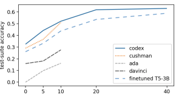
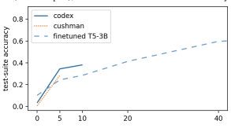

# Evaluating The Text-To-Sql Capabilities Of Large Language Models

Nitarshan Rajkumar1∗, Raymond Li2**, Dzmitry Bahdanau**2345 1University of Cambridge, 2ServiceNow, 3Mila, 4McGill University, 5Canada CIFAR AI Chair nr500@cam.ac.uk, {raymond.li,dzmitry.bahdanau}@servicenow.com https://github.com/nitarshan/codex-text2sql

## Abstract

We perform an empirical evaluation of Text-to- SQL capabilities of the Codex language model. We find that, *without any finetuning*, Codex is a strong baseline on the Spider benchmark; we also analyze the failure modes of Codex in this setting. Furthermore, we demonstrate on the GeoQuery and Scholar benchmarks that a small number of in-domain examples provided in the prompt enables Codex to perform better than state-of-the-art models finetuned on such few-shot examples.

### 1 Introduction

Translating natural language questions to SQL queries (Text-to-SQL) is an important business problem which has seen significant research interest. A common approach to this task involves training a model to produce a SQL query when given a question, a database schema, and possibly database content as inputs. A clear trend in this area is to finetune models pretrained on natural language; notably, performance significantly improves as larger pretrained models are used (Shaw et al., 2021; Scholak et al., 2021).

Recent results from the broader field demonstrate that simply scaling training data and model size for generative language models brings advanced capabilities, such as few-shot learning without finetuning (GPT-3, Brown et al., 2020) and code generation (Codex, Chen et al., 2021). In this work we study if such models are already competitive Text-to-SQL solutions without any further finetuning on task-specific training data, evaluating Codex and GPT-3 models of different sizes with varied prompts on Text-to-SQL benchmarks.

We find that Codex achieves a competitive performance of up to 67% execution accuracy on the Spider development set. We analyze the predicted queries that automatic evaluation judged as wrong

Model VA EX TS Finetuned T5-base 72.7 57.9 54.5 T5-large 84.1 67.2 61.4 T5-3B 87.6 71.4 65.7

T5-3B∗88.2 74.4 68.3 T5-3B + PICARD∗97.8 79.1 71.7 BRIDGE v2∗– 68.0 –

Inference-only GPT-3 ada 33.8 2.3 0.3 GPT-3 babbage 48.8 5.7 3.9 GPT-3 curie 70.9 12.6 8.3 GPT-3 davinci 65.0 26.3 21.7

Codex cushman∗86.3 63.7 53.0 Codex davinci∗91.6 67.0 55.1

Table 1: Best Spider development set performance across models, as measured by percentage of predic-

tions which are valid SQL (VA), execution accuracy
(EX), test-suite accuracy (TS). Models marked with ∗
use database content. T5 results are from Scholak et al.

(2021), BRIDGE v2 results are from Lin et al. (2020).

and find that many of them would be judged correct by humans, whereas others could likely be fixed within the no-finetuning paradigm. Lastly, using GeoQuery and Scholar benchmarks we show that adapting Codex to a specific domain by prompting it with few examples can be more effective than fine-tuning a smaller language model on the same examples.

## 2 Experimental Setup

Models Our evaluation focuses on the models accessible via the OpenAI API: GPT-3 (in the ascending ada, babbage, curie and davinci sizes) and Codex (in the ascending cushman-codex and davinci-codex sizes)1. These are generative language models which perform next-token prediction during training and inference; GPT-3 is trained on a diverse set of sources from the internet, and Codex is further finetuned on code from GitHub. We compare GPT-3 and Codex against methods from Shaw et al. (2021) using the T5 encoder-decoder

∗Work partially done at Mila and the Université de Montréal.

1See Appendix A.2 for a discussion on parameter counts.
model. Starting from public checkpoints pretrained on Common Crawl, the T5 model is finetuned on Spider to predict the output SQL, conditioned on the question and schema. The 3B parameter T5 model is currently the state-of-the-art on Spider when combined with constrained inference using the PICARD algorithm (Scholak et al., 2021). We also compare to BRIDGE v2 (Lin et al., 2020), a sequence-to-sequence model based on BERT.

Zero-Shot Experiments We use the Spider benchmark (Yu et al., 2019) for cross-domain Textto-SQL. We report performance using percentage of development set predictions which are valid (executable) SQLite SQL, execution accuracy, and test-suite execution accuracy. The latter metric was proposed by Zhong et al. (2020) to measure semantic equivalence of SQL queries written in different styles, which is essential when comparing Codex to models trained on Spider. We address concerns around possible memorization of Spider data by Codex in Appendix A.5.

Few-Shot Experiments We re-purpose the question-splits of the GeoQuery and Scholar datasets (Zelle and Mooney, 1996; Iyer et al., 2017; Finegan-Dollak et al., 2018) to perform experiments in a few-shot setting. The examples in these datasets are grouped by query templates. Examples corresponding to the same template have the same SQL query structure, but may have different English questions and SQL literals. To define the few-shot task, we first sort the templates by their frequency in the training set. In the n-shot setting we then use one random example for each of the n most frequent templates.

Prompts We use six prompt structures in our experiments (examples provided in Appendix C). Question provides no database information and just includes the question as a SQL comment. API Docs follows the style of the Text-to-SQL example in Codex documentation and includes a schema in a comment style which does not conform to SQLite standards. **Select X** includes in comments the results of executing a SELECT * FROM T LIMIT X query on each table, including schemas via column headers. **Create Table** includes the CREATE TABLE commands for each table, including column type and foreign key declarations.

Create Table + Select X2is a combination of the

| Prompt       | VA   | EX   | TS   |
|--------------|------|------|------|
| Question     | 14.0 | 8.3  | 8.2  |
| API Docs     | 83.8 | 56.8 | 47.5 |
| Select 1     | 86.3 | 60.9 | 52.0 |
| Select 3     | 85.8 | 60.3 | 52.2 |
| Select 5     | 85.2 | 60.5 | 51.5 |
| Select 10    | 86.0 | 60.8 | 51.2 |
| Create Table | 89.8 | 59.9 | 50.0 |
| + Select 1   | 92.5 | 64.8 | 53.7 |
| + Select 3   | 91.6 | 67.0 | 55.1 |
| + Select 5   | 91.0 | 65.3 | 53.9 |
| + Select 10  | 91.2 | 63.3 | 52.4 |

Table 2: Spider development set performance across prompt styles on the davinci-codex model, as measured by percentage of predictions which are valid SQL (VA), execution accuracy (EX), test-suite accuracy (TS).

preceding two prompt formats. Finally, **Fewshot** additionally includes question-query pairs.

## 3 Zero-Shot Results

We present results for different model sizes in Table 1 and for different prompt styles in Table 2. Full results are available in Table 4 in Appendix B.

Codex provides a strong baseline for Text-to-
SQL tasks In Table 1 the best performing model
(davinci-codex, Create Table + Select 3) achieves 67% execution accuracy and 56.5% test suite execution accuracy on Spider. This is comparable to the performance of the BRIDGE v2 (Lin et al., 2020) model which achieved a (then) state-of-the-art 68%
execution accuracy in December 2020.

Prompt design is critical for performance As seen in Table 2, providing the question alone results in a low 8.3% execution accuracy. There is a progressive improvement to 56.8% as schema information is introduced in API Docs, to 59.9%
when valid SQL and foreign key information is used in Create Table, and to 67.0% when database content is introduced with Create Table + Select 3.

More database content can harm performance In Table 2 we observe that for the Select Limit X prompts there is a negligible change in performance when adding more rows. By contrast, Create Table + Select Limit X prompt accuracy peaks with 3 rows before significantly decreasing in performance as more rows are added.

Diminishing returns for Codex model size While GPT-3 performance significantly benefits from increased model size, the davinci-codex model does not perform drastically better than

2Only the davinci-codex model can evaluate Create Table
+ Select X prompts with more than 1 row, due to its expanded 4096-token prompt window compared to the 2048-token window of all other models. In addition, GPT-3 models preprocess whitespace tokens less efficiently than Codex models, and therefore cannot evaluate Create Table + Select X prompts at all.

| 14%   | Shortcuts                                                                         |                                                                 |      |
|-------|-----------------------------------------------------------------------------------|-----------------------------------------------------------------|------|
| NL    | What is the number of car models created by the car maker American Motor Company? |                                                                 |      |
| Gold  | SELECT                                                                            | JOIN MODEL_LIST  AS T2 ON T1.Id  count(*) FROM CAR_MAKERS AS T1 | =    |
|       |                                                                                   | T2.Maker WHERE T1.FullName =  'American  Motor Company';        |      |
| Pred  | SELECT                                                                            | COUNT(Model)  FROM  model_list  WHERE Maker = 1;                |      |
| NL    |                                                                                   | Give the city and country for the Alton airport.                |      |
| Gold  | SELECT  City                                                                      | , Country FROM AIRPORTS  WHERE AirportName  =  "Alton"          |      |
| Pred  | SELECT                                                                            | City, Country FROM airports WHERE  AirportCode = 'ALN';         |      |
| 8%    | SELECT Extra Columns                                                              |                                                                 |      |
| NL    |                                                                                   | List names of conductors in descending order of years of work.  |      |
| Gold  | SELECT  Name                                                                      | FROM conductor ORDER  BY  Year_of_Work  DESC                    |      |
| Pred  | SELECT                                                                            | Name, Year_of_Work FROM  conductor  ORDER BY Year_of_Work DESC; |      |
| 5%    | SELECT Convention                                                                 |                                                                 |      |
| NL    |                                                                                   | What are all the makers and models?                             |      |
| Gold  | SELECT                                                                            | Maker ,  Model FROM MODEL_LIST;                                 |      |
| Pred  | SELECT                                                                            | DISTINCT car_makers.Maker, model_list.Model  FROM  car_makers   | JOIN |
|       | model_list ON car_makers.Id  = model_list.Maker;                                  |                                                                 |      |

Figure 1: Examples of error types, as made by the davinci-codex model with Create Table + Select 3 prompt. NL stands for natural language question. Percentage indicates the percentage of errors which are of the given type.

Further examples are provided in Figure 3 in Appendix B.

cushman-codex. Full results in Table 4 in Appendix B show cushman-codex generally being within 1 percentage point of davinci-codex for the same prompt style; it even performs 3 percentage points *better* for the Create Table prompt. These results suggest that davinci-codex's longer context window may be a greater contributor to its peak performance than increased parameter count.

### 3.1 Error Analysis

| Annotation              | %    | E%   |
|-------------------------|------|------|
| Test\-Suite Correct     | 55.1 | -    |
| Semantic Incorrect      | 25.2 | 69   |
| - Shortcuts             | 5.1  | 14   |
| - GROUP  BY Convention  | 1.5  | 4    |
| - Other                 | 18.6 | 51   |
| Ambiguous Correct       | 11.3 | 31   |
| - SELECT Extra Columns  | 2.9  | 8    |
| - SELECT Convention     | 1.8  | 5    |
| - Argmax                | 1.5  | 4    |
| - Other                 | 5.1  | 14   |
| Invalid SQL             | 8.4  | -    |
| - Ambiguous column name | 1.9  | -    |
| - No such column        | 4.5  | -    |

We focus our error analysis on the davinci-codex model with Create Table + Select 3 prompt, and present a breakdown of prediction types in Table 3 and examples of errors in Figure 1. Our error categories were chosen to surface the most interesting Codex-specific behaviours we observed amongst the errors made. We randomly selected and annotated 100 predictions which were valid SQL yet were judged incorrect by test-suite evaluation.

We first consider **Semantic Incorrect** behaviours, which Spider evaluation and the human annotator both view as incorrect predictions. Shortcut errors are where Codex made use of either specific table values or "world knowledge" from GPT-3 pretraining, while the ground-truth query contained the exact literals from the question.

GROUP BY Convention errors are where Codex incorrectly groups on a non-primary-key column (such as a name or title column).

We also consider **Ambiguous Correct** behaviours which are semantically different from the gold query and are therefore judged as incorrect by Spider evaluation, but which the human annotator viewed as being an acceptable SQL translation of

Table 3: Breakdown of prediction annotations over Spider development set for the davinci-codex model with Create Table + Select 3 prompt. % is percentage of all predictions, E% is percentage of manually annotated erroneous queries (see Section Section 3.1 for details).

the given question. **SELECT Convention** errors are where Codex selects a different column than the per-database convention of the gold queries (such as name instead of ID). **SELECT Extra Columns** errors are where Codex includes additional useful columns in its query beyond what the gold query includes. **Argmax** errors are where Codex differs from the gold query in how a min/max resolution
(such as "youngest singer") is handled for ties.

We observe in Table 3 that a significant 31%
of valid yet erroneous predictions are penalized by Spider evaluation as being incorrect though a human annotator viewed them as acceptable solutions. Future work could be to investigate to what extent one can control the behaviour of Codex. This could allow to fix these ambiguous errors, either by prompt design or using a few examples.

## 4 Few-Shot

We investigate whether Codex can perform fewshot Text-to-SQL. As described in Section 2, we re-purpose the GeoQuery and Sholar datasets in a few-shot setting. It is well known that models trained on Spider transfer poorly to other singledatabase Text-to-SQL datasets (Suhr et al., 2020) in a zero-shot setting. Studying few-shot Text-to-SQL
on GeoQuery and Scholar should show to what extent models are able to leverage a small amount of examples to effectively adapt to a new domain.

Baseline The baseline is a T5-3B model that was finetuned on Spider, reaching 71% exact-match accuracy on Spider validation set. The model is then further finetuned on the new domain - Geo- Query or Scholar. The learning rate for domainspecific-finetuning was selected in the 20-shot setting among [0.1, 0.2, 0.5, 1, 2] · 10−5, based on the best validation set performance after 300 steps. We use batch-size 1024, such that all the few-shot examples fit in the same batch.

Codex Building on the Create Table + Select X
prompt, we append n question-query examples to the input in an n-shot setting. An example of this prompt is provided in Figure 11. All samples are generated using greedy decoding, with temperature 0. Note that for a given n-shot setting, the baseline and Codex use the same set of support examples. These examples are in the prompt for Codex, and used to finetune the baseline on the new domain. Given the limited window-size of API models, on GeoQuery we can feed up to 40 support examples to davinci-codex, and up to 10 examples to cushman-codex and GPT-3 models. On Scholar the queries are longer and the schema more complex –
we fit only 10 examples in the prompt of davincicodex, 5 for cushman-codex, and none at all for GPT-3 models.

### 4.1 Results

Figure 2 shows test-suite accuracies on the Scholar and GeoQuery datasets. The baseline reaches 85.7% test-set performance when trained on the complete GeoQuery training set (549 examples).

Respectively, it reaches 87.2% test accuracy when trained on the whole Scholar training set (499 examples). This simple baseline is a very competitive model when considering the entire datasets. However Figure 2 shows that it is largely beaten by Codex in few-shot settings. In a zero-shot setting, both davinci-codex and cushman-codex al-

(a) GeoQuery. When trained on the whole GeoQuery training





set (549 examples), the finetuned T5 reaches 85.7% accuracy.

(b) Scholar. When trained on the whole Scholar training set (499 examples), the finetuned T5 reaches 87.2% accuracy.

Figure 2: Test-suite accuracy with varying number of support examples. The x-axis shows the number of fewshot examples used.

ready beat the baseline on GeoQuery. We speculate that Codex performs well here because it uses the same argmax convention as the GeoQuery dataset, which is different than the convention used in Spider. With up to 40 examples in the prompt, davinci-codex outperforms a T5-3B model finetuned on these same examples by a large margin, whereas GPT-3 davinci performs quite poorly on this task. On the other hand, the T5 model outperforms Codex in a zero-shot setting on Scholar. In 5 and 10-shot settings, Codex shows better adaptation from these few samples and beats the T5 baseline.

## 5 Conclusion

We demonstrated that generative language models trained on code provide a strong baseline for Text-to-SQL. We also provided analysis of failure modes for these models, which we hope guides further prompt design (whether few-shot or through natural language instructions) in this setting. Finally, we showed that prompt-based few-shot learning with these models performs competitively with finetuning-based few-shot learning of smaller models. A clear direction for future work is to evaluate the benefits of finetuning with Codex models.

## Acknowledgements

Nitarshan performed all zero-shot and finetuning experiments as well as error-analysis, and wrote most of the paper. Raymond performed all few-shot experiments and the associated writing. Dzmitry supervised, and contributed to paper editing.

We thank Dóra Jámbor for insightful discussions, Laurent Charlin for providing funding for Nitarshan and for providing feedback on this work, Fraser Kelton and Dave Cummings for support with the OpenAI API, and Ruiqi Zhong for assistance with Spider test suites. We also thank anonymous ARR reviewers for their feedback and criticism in the review process.

Nitarshan additionally thanks the city of Montréal and its cafés for providing inspirational settings in which to conduct this work.

## References

Tom B. Brown, Benjamin Mann, Nick Ryder, Melanie Subbiah, Jared Kaplan, Prafulla Dhariwal, Arvind Neelakantan, Pranav Shyam, Girish Sastry, Amanda Askell, Sandhini Agarwal, Ariel Herbert-Voss, Gretchen Krueger, Tom Henighan, Rewon Child, Aditya Ramesh, Daniel M. Ziegler, Jeffrey Wu, Clemens Winter, Christopher Hesse, Mark Chen, Eric Sigler, Mateusz Litwin, Scott Gray, Benjamin Chess, Jack Clark, Christopher Berner, Sam Mc- Candlish, Alec Radford, Ilya Sutskever, and Dario Amodei. 2020. Language models are few-shot learners.

Mark Chen, Jerry Tworek, Heewoo Jun, Qiming Yuan, Henrique Ponde de Oliveira Pinto, Jared Kaplan, Harri Edwards, Yuri Burda, Nicholas Joseph, Greg Brockman, Alex Ray, Raul Puri, Gretchen Krueger, Michael Petrov, Heidy Khlaaf, Girish Sastry, Pamela Mishkin, Brooke Chan, Scott Gray, Nick Ryder, Mikhail Pavlov, Alethea Power, Lukasz Kaiser, Mohammad Bavarian, Clemens Winter, Philippe Tillet, Felipe Petroski Such, Dave Cummings, Matthias Plappert, Fotios Chantzis, Elizabeth Barnes, Ariel Herbert-Voss, William Hebgen Guss, Alex Nichol, Alex Paino, Nikolas Tezak, Jie Tang, Igor Babuschkin, Suchir Balaji, Shantanu Jain, William Saunders, Christopher Hesse, Andrew N.

Carr, Jan Leike, Josh Achiam, Vedant Misra, Evan Morikawa, Alec Radford, Matthew Knight, Miles Brundage, Mira Murati, Katie Mayer, Peter Welinder, Bob McGrew, Dario Amodei, Sam McCandlish, Ilya Sutskever, and Wojciech Zaremba. 2021. Evaluating large language models trained on code.

Xiang Deng, Ahmed Hassan Awadallah, Christopher Meek, Oleksandr Polozov, Huan Sun, and Matthew Richardson. 2021. Structure-grounded pretraining for text-to-sql. Proceedings of the 2021 Conference of the North American Chapter of the Association for Computational Linguistics: Human Language Technologies.

Catherine Finegan-Dollak, Jonathan K. Kummerfeld, Li Zhang, Karthik Ramanathan, Sesh Sadasivam, Rui Zhang, and Dragomir Radev. 2018. Improving text-to-SQL evaluation methodology. In Proceedings of the 56th Annual Meeting of the Association for Computational Linguistics (Volume 1: Long Papers), pages 351–360, Melbourne, Australia. Association for Computational Linguistics.

Leo Gao. 2021. On the Sizes of OpenAI API Models. Srinivasan Iyer, Ioannis Konstas, Alvin Cheung, Jayant Krishnamurthy, and Luke Zettlemoyer. 2017. Learning a neural semantic parser from user feedback. In Proceedings of the 55th Annual Meeting of the Association for Computational Linguistics (Volume 1: Long Papers), pages 963–973, Vancouver, Canada. Association for Computational Linguistics.

Xi Victoria Lin, Richard Socher, and Caiming Xiong.

2020. Bridging textual and tabular data for crossdomain text-to-sql semantic parsing.

Torsten Scholak, Nathan Schucher, and Dzmitry Bahdanau. 2021. Picard: Parsing incrementally for constrained auto-regressive decoding from language models.

Peter Shaw, Ming-Wei Chang, Panupong Pasupat, and Kristina Toutanova. 2021. Compositional generalization and natural language variation: Can a semantic parsing approach handle both? In Proceedings of the 59th Annual Meeting of the Association for Computational Linguistics and the 11th International Joint Conference on Natural Language Processing (Volume 1: Long Papers), pages 922–938, Online. Association for Computational Linguistics.

Alane Suhr, Ming-Wei Chang, Peter Shaw, and Kenton Lee. 2020. Exploring unexplored generalization challenges for cross-database semantic parsing. In Proceedings of the 58th Annual Meeting of the Association for Computational Linguistics, pages 8372– 8388, Online. Association for Computational Linguistics.

Tao Yu, Rui Zhang, Kai Yang, Michihiro Yasunaga, Dongxu Wang, Zifan Li, James Ma, Irene Li, Qingning Yao, Shanelle Roman, Zilin Zhang, and Dragomir Radev. 2019. Spider: A largescale human-labeled dataset for complex and crossdomain semantic parsing and text-to-sql task.

John M. Zelle and Raymond J. Mooney. 1996. Learning to parse database queries using inductive logic programming. In Proceedings of the Thirteenth National Conference on Artificial Intelligence - Volume 2, pages 1050–1055.

Ruiqi Zhong, Tao Yu, and Dan Klein. 2020. Semantic evaluation for text-to-sql with distilled test suites.

Albert Ziegler. 2021. Research recitation.

## A Api Details

At time of writing, the OpenAI API was accessible at https://openai.com/api/.

The example from which our API Docs prompt draws from can be found at https://beta.openai.com/examples/
default-sql-translate.

### A.1 Hyperparameters

We sample 200 tokens from GPT-3 and Codex with temperature 0, with the following strings used as stop tokens to halt generation: "--", "\n\n", ";", "\#".

### A.2 Parameter Counts

Parameter counts for OpenAI API models are not openly available. Gao (2021) evaluated API GPT- 3 models across a variety of language modelling tasks to compare to published results in Brown et al. (2020), finding that "Ada, Babbage, Curie and Davinci line up closely with 350M, 1.3B, 6.7B, and 175B respectively". We presume that the davincicodex model is the same size as the GPT-3 davinci model; cushman-codex is a new model name so we can only guess that it is of a similar (but not the same) size to GPT-3 curie. Nevertheless these remain guesses which should not be relied on.

### A.3 Model Versioning

The exact models served through the OpenAI API may vary over time. We verified that for each model type, only a single model version was used to generate results. These versions are ada:2020-05-03, babbage:2020-05-03, curie:2020-05-03, davinci:2020-05-03, cushman-codex:2021-08-03, davinci-codex:2021-08-03.

### A.4 Finetuning

In Table 4 we include preliminary results from finetuning GPT-3 models on the Spider training set.

We used the full training set, and the default finetuning settings of 4 epochs, a batch size of 8, and a learning rate multiplier of 0.1. We did not perform a hyperparameter sweep due to the significant cost this would incur.

### A.5 Memorization

The Spider development set is available on GitHub, and is therefore possibly in the training set of Codex. We believe that this does not manifest as memorization for our results however, for the following reasons.

Evaluation data on Spider's repo is formatted differently to our prompts. Most related is the dev.sql file, which contains evaluation questionquery pairs in the following format: Question 1: ... SQL: ... ...

This resembles but isn't identical to our "Question" prompt. We prompted Codex with verbatim fragments of this file and generations failed to replicate any file contents. Our "Question" prompt has very poor performance - hardly an indication of memorization from dev.sql. Furthermore, most of Codex's performance is due to including in the prompt the schemas (see Table 2), which are not present in dev.sql.

As well, Codex prediction style is very different to evaluation gold queries. Gold queries make use of a consistent table aliasing strategy (using T1, T2, etc.) which we never see with Codex (see Figure 3 for example comparisons).

Furthermore, in Table 4 we reported performance for all models on spider-realistic (Deng et al., 2021), a modification of the spider evaluation set that removes column name references in questions. We observe a similar trend in performance across models as on spider (the consistent performance drop on spider-realistic is expected due to the difficulty of the updated dataset). Memorization cannot account for the performance observed, as spider-realistic is not publicly available on GitHub.

Finally, Ziegler (2021) studied memorization in Copilot, a derivative of the Codex models, and found that "Copilot can quote a body of code verbatim, but that it rarely does so, and when it does, it mostly quotes code that everybody quotes, and mostly at the beginning of a file". Spider evaluation data is rare on GitHub, and we use long contexts in our prompts that significantly differ from the files on GitHub.

### A.6 Choice Of Spider Evaluation Set

We chose not to evaluate on the held-out test set of Spider, as this could not be done offline - it would instead require sending these held-out examples through the API to OpenAI, which risks inadvertently leaking them for retraining of Codex.

| Engine           | Prompt    | VA          | EX          | TS          |
|------------------|-----------|-------------|-------------|-------------|
| GPT\-3           |           |             |             |             |
| ada              | Question  | 1.2 (1.0)   | 0.0 (0.0)   | 0.0 (0.0)   |
| ada              | Docs      | 3.4 (2.2)   | 0.2 (0.2)   | 0.1 (0.0)   |
| ada              | 1 Row     | 40.1 (34.6) | 1.1 (0.6)   | 0.2 (0.0)   |
| ada              | Schema    | 33.8 (33.9) | 2.3 (3.5)   | 0.3 (0.0)   |
| babbage          | Question  | 4.4 (2.0)   | 1.0 (0.2)   | 1.0 (0.2)   |
| babbage          | Docs      | 22.5 (20.3) | 1.0 (0.6)   | 0.7 (0.2)   |
| babbage          | 1 Row     | 56.0 (49.8) | 5.1 (1.6)   | 3.9 (0.0)   |
| babbage          | Schema    | 48.8 (44.9) | 5.7 (0.8)   | 3.9 (0.0)   |
| curie            | Question  | 9.0 (6.7)   | 2.9 (2.4)   | 2.5 (1.8)   |
| curie            | Docs      | 25.2 (25.0) | 7.4 (5.5)   | 6.3 (3.3)   |
| curie            | 1 Row     | 70.6 (67.3) | 10.8 (7.3)  | 7.6 (1.4)   |
| curie            | Schema    | 70.9 (72.2) | 12.6 (11.0) | 8.3 (4.1)   |
| davinci          | Schema    | 65.0 (65.4) | 26.3 (23.2) | 21.7 (14.2) |
| Finetuned GPT\-3 |           |             |             |             |
| ada              | Schema    | 27.5 (21.3) | 20.2 (14.0) | 19.1 (13.0) |
| babbage          | Schema    | 47.2 (38.0) | 34.8 (23.6) | 31.9 (20.9) |
| curie            | Schema    | 66.9 (60.2) | 51.3 (37.8) | 46.9 (32.9) |
| Codex            |           |             |             |             |
| cushman          | Question  | 11.3 (8.1)  | 8.5 (3.9)   | 8.3 (3.9)   |
| cushman          | Docs      | 83.8 (80.5) | 53.2 (45.1) | 43.5 (32.3) |
| cushman          | 1 Row     | 84.7 (80.9) | 59.6 (49.2) | 48.5 (32.5) |
| cushman          | 3 Rows    | 82.9 (79.1) | 60.3 (49.2) | 49.4 (33.7) |
| cushman          | 5 Rows    | 83.6 (78.3) | 61.5 (49.6) | 50.4 (33.9) |
| cushman          | Schema    | 88.3 (83.1) | 62.1 (49.6) | 53.1 (36.2) |
| cushman          | + 1 Row   | 86.3 (85.0) | 63.7 (54.9) | 53.0 (39.6) |
| davinci          | Question  | 14.0 (8.9)  | 8.3 (4.5)   | 8.2 (4.1)   |
| davinci          | Docs      | 83.8 (87.4) | 56.8 (51.8) | 47.5 (39.0) |
| davinci          | 1 Row     | 86.3 (83.5) | 60.9 (54.7) | 52.0 (41.3) |
| davinci          | 3 Rows    | 85.8 (82.7) | 60.3 (53.3) | 52.2 (40.0) |
| davinci          | 5 Rows    | 85.2 (80.9) | 60.5 (51.4) | 51.5 (38.4) |
| davinci          | 10 Rows   | 86.0 (80.7) | 60.8 (53.3) | 51.2 (39.2) |
| davinci          | Schema    | 89.8 (87.8) | 59.9 (52.2) | 50.0 (38.4) |
| davinci          | + 1 Row   | 92.5 (90.7) | 64.8 (58.7) | 53.7 (41.7) |
| davinci          | + 3 Rows  | 91.6 (90.6) | 67.0 (60.2) | 55.1 (42.9) |
| davinci          | + 5 Rows  | 91.0 (90.2) | 65.3 (60.0) | 53.9 (42.1) |
| davinci          | + 10 Rows | 91.2 (90.6) | 63.3 (58.3) | 52.4 (40.2) |

## B Additional Tables And Figures

Table 4: Performance on Spider across all evaluated models and prompts, as measured by percentage of predictions which are valid/executable SQL (VA), execution accuracy (EX), test-suite accuracy (TS). Main results are on the Spider development set, results in parantheses are on Spider-Realistic (Deng et al., 2021), a modified subset of the Spider development set with explicit references to column names removed from questions.

14% **Shortcuts** Q *What are the template ids with template type description "Presentation".* Gold SELECT T2.template_id FROM Ref_template_types AS T1 JOIN Templates AS T2 ON T1.template_type_code = T2.template_type_code WHERE T1.template_type_description = "Presentation" Pred SELECT Template_ID FROM Templates WHERE Template_Type_Code = 'PPT'; 8% **SELECT Extra Columns** NL *Which city has the most frequent destination airport?* Gold SELECT T1.City FROM AIRPORTS AS T1 JOIN FLIGHTS AS T2 ON T1.AirportCode =
T2.DestAirport GROUP BY T1.City ORDER BY count(*) DESC LIMIT 1 Pred SELECT City, COUNT(*) AS 'Number of Destinations' FROM airports JOIN flights ON airports.AirportCode = flights.DestAirport GROUP BY City ORDER BY COUNT(*)
DESC LIMIT 1; 5% **SELECT Convention** NL *Which airlines have a flight with source airport AHD?* Gold SELECT T1.Airline FROM AIRLINES AS T1 JOIN FLIGHTS AS T2 ON T1.uid =
T2.Airline WHERE T2.SourceAirport = "AHD"
Pred SELECT Airline FROM flights WHERE SourceAirport = 'AHD'; 4% **GROUP BY Convention**
NL *Which makers designed more than 3 car models? List full name and the id.* Gold SELECT T1.FullName , T1.Id FROM CAR_MAKERS AS T1 JOIN MODEL_LIST AS T2 ON
T1.Id = T2.Maker GROUP BY T1.Id HAVING count(*) > 3; Pred SELECT car_makers.FullName, car_makers.Id FROM car_makers JOIN model_list ON car_makers.Id = model_list.Maker GROUP BY car_makers.FullName HAVING COUNT(model_list.Model) > 3; 4% **Argmax** NL *Give the name, year of independence, and surface area of the country that has the lowest population.*
Gold SELECT Name, SurfaceArea, IndepYear FROM country ORDER BY Population LIMIT 1 Pred SELECT Name, IndepYear, SurfaceArea FROM country WHERE Population = (SELECT
MIN(Population) FROM country);
51% **Other - Semantic Incorrect** NL *Which countries have either English or Dutch as an official language?*
Gold SELECT * FROM country AS T1 JOIN countrylanguage AS T2 ON T1.Code =
T2.CountryCode WHERE T2.Language = "English" AND IsOfficial = "T" UNION
SELECT * FROM country AS T1 JOIN countrylanguage AS T2 ON T1.Code =
T2.CountryCode WHERE T2.Language = "Dutch" AND IsOfficial = "T"
Pred SELECT * FROM countrylanguage WHERE IsOfficial = 'T' OR IsOfficial = 'F';
NL *Show the name and the release year of the song by the youngest singer.* Gold SELECT song_name , song_release_year FROM singer ORDER BY age LIMIT 1 Pred SELECT Name, Song_release_year FROM singer WHERE Age = (SELECT MIN(Age) FROM
singer);
NL *What is the maximum miles per gallon of the car with 8 cylinders or produced before 1980 ?* Gold select max(mpg) from cars_data where cylinders = 8 or year < 1980 Pred SSELECT MAX(MPG) FROM cars_data WHERE Cylinders = 8 AND Year < 1980; 14% **Other - Ambiguous Correct** NL *Find the first name and age of students who have a pet.*
Gold SELECT DISTINCT T1.fname , T1.age FROM student AS T1 JOIN has_pet AS T2 ON
T1.stuid = T2.stuid Pred SELECT Fname, Age FROM Student WHERE StuID IN (SELECT StuID FROM Has_Pet); NL *How many countries speak both English and Dutch?*
Gold SELECT COUNT(*) FROM (SELECT T1.Name FROM country AS T1 JOIN countrylanguage AS T2 ON T1.Code = T2.CountryCode WHERE T2.Language = "English" INTERSECT SELECT T1.Name FROM country AS T1 JOIN countrylanguage AS T2 ON T1.Code = T2.CountryCode WHERE T2.Language = "Dutch")
Pred SELECT COUNT(*) FROM countrylanguage WHERE Language = 'Dutch' AND CountryCode IN (SELECT CountryCode FROM countrylanguage WHERE Language = 'English');
NL *What are the Asian countries which have a population larger than that of any country in Africa?* Gold SELECT Name FROM country WHERE Continent = "Asia" AND population > (SELECT
min(population) FROM country WHERE Continent = "Africa")
Pred SELECT Name FROM country WHERE Continent = 'Asia' AND Population > (SELECT
MAX(Population) FROM country WHERE Continent = 'Africa');
Figure 3: Additional examples of error types, as made by davinci-codex model with Create Table + Select 3 prompt. NL stands for natural language question. Percentage indicates the percentage of errors which are of the given type.

|               | 10\-shot examples                                                             |
|---------------|-------------------------------------------------------------------------------|
|               | what  states  does the missouri river  run through SELECT                     |
|               | RIVERalias0.TRAVERSE FROM RIVER AS RIVERalias0 WHERE                          |
|               | RIVERalias0.RIVER_NAME  =  "missouri"  ;  \- what is the size of texas SELECT |
|               | STATEalias0.AREA FROM STATE  AS  STATEalias0  WHERE  STATEalias0.STATE_NAME   |
| =             | "texas"  ;  \- what are  the major  cities in  texas  SELECT                  |
|               | CITYalias0.CITY_NAME FROM CITY  AS CITYalias0 WHERE  CITYalias0.POPULATION    |
|               | > 150000  AND CITYalias0.STATE_NAME  =  "texas"  ;  \- what is the capital    |
|               | of pennsylvania SELECT  STATEalias0.CAPITAL  FROM STATE  AS STATEalias0       |
|               | WHERE STATEalias0.STATE_NAME  =  "pennsylvania" ; \- what  is the  biggest    |
|               | city  in nebraska SELECT CITYalias0.CITY_NAME FROM CITY AS CITYalias0         |
|               | WHERE CITYalias0.POPULATION = ( SELECT  MAX(  CITYalias1.POPULATION           |
| )             | FROM  CITY  AS  CITYalias1 WHERE CITYalias1.STATE_NAME  =  "nebraska"         |
| )             | AND CITYalias0.STATE_NAME  = "nebraska"  ;  \- what is the population         |
|               | of austin  SELECT CITYalias0.POPULATION FROM CITY  AS CITYalias0              |
|               | WHERE CITYalias0.CITY_NAME =  "austin" ; \-  which state is  kalamazoo        |
|               | in SELECT  CITYalias0.STATE_NAME FROM CITY AS CITYalias0  WHERE               |
|               | CITYalias0.CITY_NAME =  "kalamazoo" ; \- name all the rivers  in              |
|               | colorado SELECT RIVERalias0.RIVER_NAME FROM RIVER AS RIVERalias0 WHERE        |
|               | RIVERalias0.TRAVERSE =  "colorado" ;  \-  what  states border missouri SELECT |
|               | BORDER_INFOalias0.BORDER  FROM BORDER_INFO AS BORDER_INFOalias0 WHERE         |
|               | BORDER_INFOalias0.STATE_NAME =  "missouri" ; \-  how many people  live  in    |
|               | new mexico SELECT  STATEalias0.POPULATION  FROM  STATE AS STATEalias0  WHERE  |
|               | STATEalias0.STATE_NAME  =  "new mexico"  ;                                    |
|               | Very similar query in the few\-shot prompt fixes the example                  |
| Question      | which states border iowa                                                      |
| Gold          | SELECT  BORDER_INFOalias0.BORDER FROM BORDER_INFO  AS BORDER_INFOalias0       |
|               | WHERE BORDER_INFOalias0.STATE_NAME = "iowa"  ;                                |
| 0\-shot pred  | SELECT  state_name  FROM  border WHERE  border  = 'iowa'                      |
| 10\-shot pred | SELECT  BORDER_INFOalias0.BORDER FROM BORDER_INFO  AS BORDER_INFOalias0       |
|               | WHERE BORDER_INFOalias0.STATE_NAME = "iowa"                                   |
|               | Argmax convetion fixed                                                        |
| Question      | what state has the smallest population                                        |
| Gold          | SELECT  STATEalias0.STATE_NAME FROM STATE  AS STATEalias0  WHERE              |
|               | STATEalias0.POPULATION  =  (SELECT  MIN(STATEalias1.POPULATION) FROM STATE    |
|               | AS  STATEalias1)  ;                                                           |
| 0\-shot pred  | SELECT  state_name  FROM  state ORDER BY  population  LIMIT 1                 |
| 10\-shot pred | SELECT  STATEalias0.STATE_NAME FROM STATE  AS STATEalias0  WHERE              |
|               | STATEalias0.POPULATION  =  (SELECT  MIN(STATEalias1.POPULATION) FROM STATE    |
|               | AS  STATEalias1)                                                              |
|               | SELECT extra columns fixed                                                    |
| Question      | what is the population of the state with the largest area                     |
| Gold          | SELECT  STATEalias0.POPULATION FROM STATE  AS STATEalias0  WHERE              |
|               | STATEalias0.AREA = (SELECT MAX(STATEalias1.AREA)  FROM  STATE AS              |
|               | STATEalias1) ;                                                                |
| 0\-shot pred  | SELECT  state_name, population FROM state  WHERE area =  (SELECT  MAX(area)   |
|               | FROM  state)                                                                  |
| 10\-shot pred | SELECT  STATEalias0.POPULATION FROM STATE  AS STATEalias0  WHERE              |
|               | STATEalias0.AREA = (SELECT MAX(STATEalias1.AREA)  FROM  STATE AS              |
|               | STATEalias1)                                                                  |

Figure 4: Cherry-picked examples of Codex improvements from 0-shot to 10-shot text-to-SQL on GeoQuery validation set. The style of the generated SQL changes a lot and is much closer to that of the gold SQL when few-shot examples are in the prompt. The few-shot examples were also useful to adapt the generated SQL to the conventions of the dataset, like the way argmax is done, or the selected columns.

## C Example Prompts

What is Kyle's id? | network_1 | highschooler : id, name ( Kyle ), grade | friend :
student_id, friend_id | likes : student_id, liked_id Figure 5: Example input for baseline T5 models.

-- Using valid SQLite, answer the following questions. -- What is Kyle's id? SELECT
Figure 6: Example prompt for **Question**.

\#\#\# SQLite SQL tables, with their properties: \# \# Highschooler(ID, name, grade) \# Friend(student_id, friend_id) \# Likes(student_id, liked_id) \# \#\#\# What is Kyle's id? SELECT
Figure 7: Example prompt for **API Docs**.

/*
3 example rows from table Highschooler:
SELECT * FROM Highschooler LIMIT 3; Table: Highschooler ID name grade 1510 Jordan 9 1689 Gabriel 9 1381 Tiffany 9
*/ /*
3 example rows from table Friend:
SELECT * FROM Friend LIMIT 3; Table: Friend student_id friend_id 1510 1381 1510 1689 1689 1709
*/ /*
3 example rows from table Likes:
SELECT * FROM Likes LIMIT 3; Table: Likes student_id liked_id 1689 1709 1709 1689 1782 1709
*/
-- Using valid SQLite, answer the following questions for the tables provided above. -- What is Kyle's id?

SELECT
Figure 8: Example prompt for **Select 3**.

CREATE TABLE Highschooler( ID int primary key, name text, grade int)
CREATE TABLE Friend( student_id int, friend_id int, primary key (student_id,friend_id), foreign key(student_id) references Highschooler(ID), foreign key (friend_id) references Highschooler(ID)
CREATE TABLE Likes( student_id int, liked_id int, primary key (student_id, liked_id), foreign key (liked_id) references Highschooler(ID), foreign key (student_id) references Highschooler(ID)
)
-- Using valid SQLite, answer the following questions for the tables provided above. -- What is Kyle's id? SELECT
Figure 9: Example prompt for **Create Table**.

)
CREATE TABLE Highschooler( ID int primary key, name text, grade int)
/*
3 example rows:
*/
SELECT * FROM Highschooler LIMIT 3; ID name grade 1510 Jordan 9 1689 Gabriel 9 1381 Tiffany 9 CREATE TABLE Friend( student_id int, friend_id int, primary key (student_id,friend_id), foreign key(student_id) references Highschooler(ID), foreign key (friend_id) references Highschooler(ID)
)
/*
3 example rows:
SELECT * FROM Friend LIMIT 3; student_id friend_id 1510 1381 1510 1689 1689 1709
*/
CREATE TABLE Likes( student_id int, liked_id int, primary key (student_id, liked_id),
foreign key (liked_id) references Highschooler(ID), foreign key (student_id) references Highschooler(ID)
)
/*
3 example rows:
SELECT * FROM Likes LIMIT 3; student_id liked_id 1689 1709 1709 1689 1782 1709
*/
-- Using valid SQLite, answer the following questions for the tables provided above. -- What is Kyle's id?

Figure 10: Example prompt for **Create Table + Select 3**.

SELECT
CREATE TABLE "border_info" ("state_name" text, "border" text)
/*
state_name border alabama tennessee alabama georgia alabama florida
*/
CREATE TABLE "city" ("city_name" text, "population" int DEFAULT NULL, "country_name" varchar(3) NOT NULL DEFAULT '', "
state_name" text)
/*
city_name population country_name state_name birmingham 284413 usa alabama mobile 200452 usa alabama montgomery 177857 usa alabama
*/
CREATE TABLE "highlow" ("state_name" text, "highest_elevation" text, "lowest_point" text, "highest_point" text, "
lowest_elevation" text)
/*
state_name highest_elevation lowest_point highest_point lowest_elevation alabama 734 gulf of mexico cheaha mountain 0 alaska 6194 pacific ocean mount mckinley 0 arizona 3851 colorado river humphreys peak 21
*/
CREATE TABLE "lake" ("lake_name" text, "area" double DEFAULT NULL, "country_name" varchar(3) NOT NULL DEFAULT '', "state_name" text)
/*
lake_name area country_name state_name iliamna 2675.0 usa alaska becharof 1186.0 usa alaska teshekpuk 816.0 usa alaska
*/

```
CREATE TABLE "mountain" ("mountain_name" text, "mountain_altitude" int DEFAULT NULL, "country_name" varchar(3) NOT NULL
     DEFAULT '', "state_name" text)
/*
mountain_name mountain_altitude country_name state_name
     mckinley 6194 usa alaska
   st. elias 5489 usa alaska
     foraker 5304 usa alaska

```

CREATE TABLE "river" ("river_name" text, "length" int DEFAULT NULL, "country_name" varchar(3) NOT NULL DEFAULT '', "traverse" text)
/*
*/
river_name length country_name traverse mississippi 3778 usa minnesota mississippi 3778 usa wisconsin mississippi 3778 usa iowa CREATE TABLE "state" ("state_name" text, "population" int DEFAULT NULL, "area" double DEFAULT NULL, "country_name" varchar(3)
NOT NULL DEFAULT '', "capital" text, "density" double DEFAULT NULL)
/*
*/

```
state_name population area country_name capital density
  alabama 3894000 51700.0 usa montgomery 75.319149
   alaska 401800 591000.0 usa juneau 0.679865
  arizona 2718000 114000.0 usa phoenix 23.842105

```

-- Using valid SQLite, answer the following questions for the tables provided above. -- what is the population of austin SELECT CITYalias0.POPULATION FROM CITY AS CITYalias0 WHERE CITYalias0.CITY_NAME = "austin" ; -- which state is kalamazoo in SELECT CITYalias0.STATE_NAME FROM CITY AS CITYalias0 WHERE CITYalias0.CITY_NAME = "kalamazoo" ; -- name all the rivers in colorado SELECT RIVERalias0.RIVER_NAME FROM RIVER AS RIVERalias0 WHERE RIVERalias0.TRAVERSE = "colorado" ; -- how many people live in new mexico SELECT STATEalias0.POPULATION FROM STATE AS STATEalias0 WHERE STATEalias0.STATE_NAME = "new mexico" ; -- what states border missouri SELECT BORDER_INFOalias0.BORDER FROM BORDER_INFO AS BORDER_INFOalias0 WHERE BORDER_INFOalias0.STATE_NAME = "missouri" ; -- what is the biggest city in arizona SELECT
Figure 11: Example prompt for **5-shot**. It starts with the schema and 3 rows per database (exactly as in Figure 10), followed by 5 few-shot examples, and finally the target question.

*/