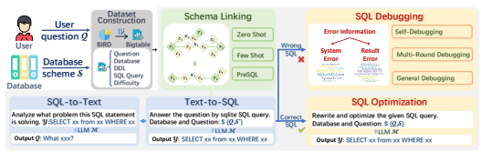
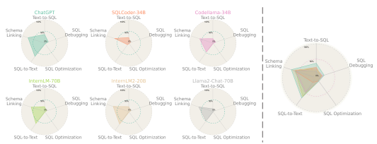
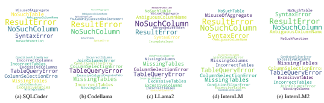
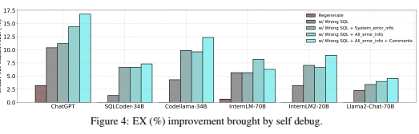
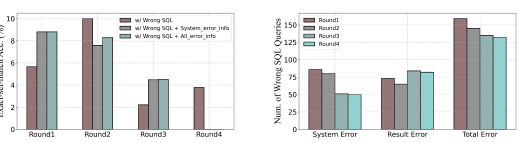
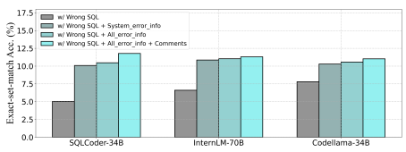

# Benchmarking The Text-To-Sql Capability Of Large Language Models: A Comprehensive Evaluation

Bin Zhang1,2,3,∗ Yuxiao Ye1,4,∗ Guoqing Du1,∗ Xiaoru Hu1,∗ Zhishuai Li1 **Sun Yang**1 Chi Harold Liu4 Rui Zhao1 Ziyue Li1 **Hangyu Mao**1,B
1Sensetime Research 2Institute of Automation, Chinese Academy of Sciences 3School of Artificial Intelligence, University of Chinese Academy of Sciences 4School of Computer Science and Technology, Beijing Institute of Technology

# Abstract

Large Language Models (LLMs) have emerged as a powerful tool in advancing the Text-to-SQL task, significantly outperforming traditional methods. Nevertheless, as a nascent research field, there is still no consensus on the optimal prompt templates and design frameworks. Additionally, existing benchmarks inadequately explore the performance of LLMs across the various sub-tasks of the Text-to-SQL
process, which hinders the assessment of LLMs' cognitive capabilities and the optimization of LLM-based solutions. To address the aforementioned issues, we firstly construct a new dataset designed to mitigate the risk of overfitting in LLMs. Then we formulate five evaluation tasks to comprehensively assess the performance of diverse methods across various LLMs throughout the Text-to-SQL process. Our study highlights the performance disparities among LLMs and proposes optimal in-context learning solutions tailored to each task. These findings offer valuable insights for facilitating the development of LLM-based Text-to-SQL systems.

# 1 Introduction

Text-to-SQL, which involves the automatic transformation of natural language (NL) questions into structured SQL statements, is a pivotal component in facilitating seamless user interaction with databases [35]. Previous approaches to this task primarily focus on pattern matching between natural language and SQL statements, utilizing machine learning models to acquire the mapping between the two [60, 21]. However, the introduction and rapid advancement of Large Language Models (LLMs) have brought about a substantial transformation in this field [9, 33]. LLMs have emerged as powerful tools [38, 18, 43], showcasing tremendous potential in comprehending complex NL questions and generating accurate SQL statements. By combining advanced reasoning techniques and in-context learning capabilities, LLMs have significantly pushed the boundaries of the state-of-the-art in this domain, outperforming traditional methods by a considerable margin. Despite the continuous improvement of LLM-based methods in various benchmarks such as Spider [56] and BIRD [24], there remains a critical gap in the systematic benchmarking of these solutions [17, 35, 19]. The absence of a comprehensive framework for evaluating LLMs in Text-to- SQL complicates the design and assessment of effective systems. The risk of overfitting, particularly for LLMs trained on coding tasks and open-source datasets, poses a significant challenge to the reliability of benchmark evaluations [37]. Additionally, the optimal prompt engineering strategies

B
Corresponding author: {hy.mao@pku.edu.cn, maohangyu@sensetime.com}
∗These authors contributed equally.

Figure 1: Benchmarking tasks in Text-to-SQL pipeline.

that play a crucial role in guiding LLMs to generate accurate SQL queries are yet to be determined. Although various design schemes are explored in different methods [13], there is no consensus on the most effective prompt template. Furthermore, the current benchmarks, while comprehensive in their assessment of end-to-end Text-to-SQL tasks, have not yet provided a detailed exploration of the models' performance across the various sub-tasks and components of the Text-to-SQL process [32, 27]. A detailed exploration of these sub-tasks is crucial for a thorough evaluation of LLMs' cognitive capabilities and their role in facilitating the Text-to-SQL process. Therefore, it is necessary to develop a more granular benchmarking approach that can accurately reflect the multifaceted nature of Text-to-SQL and inform the creation of more effective LLM-based solutions. To address the aforementioned challenges and fill the gap in the systematic benchmarking of LLMs in Text-to-SQL, we construct a comprehensive testing benchmark that provides a holistic assessment of LLM capabilities in this domain. Our approach begins with the construction of a Text-to-SQL dataset, designed to mitigate the risk of overfitting by considering question complexities, database sizes, and prerequisite knowledge. Formally, we devise five distinct tasks—Text-to-SQL, SQL Debugging, SQL Optimization, Schema Linking and SQL-to-Text—to comprehensively evaluate the capabilities of LLMs across the full spectrum of the Text-to-SQL process (see Figure 1). Subsequently, we perform an extensive analysis of various techniques that are essential for improving the in-context learning abilities of LLMs and their precision in generating SQL queries. Specifically, our evaluations are summarized as follows:
- To determine the optimal prompt template, we partition the prompt text into distinct components and perform thorough testing of LLMs' performance on end-to-end Text-to-SQL tasks across all possible combination patterns.

- Our benchmarking approach encompasses a range of LLMs, including both general-purpose and coding-specific models with varying parameter sizes. We determine the performance boundaries of these models and identify their performance disparities (see Figure 2).

- For each task, we systematically assess the impact of information granularity on model performance and identify the optimal context learning strategies, such as zero-shot and few-shot, to maximize the performance of the models.

# 2 Related Work

### 2.1 Traditional Learning-Based Text-To-Sql Methods

Numerous traditional learning-based Text-to-SQL methods existed before the emergence of LLMs [60, 52, 29]. These methods can be essentially divided into non-seq2seq and seq2seq methods according to their network architecture. In **non-seq2seq methods**, representative works [46, 2, 1, 15] typically employ a relation-aware self-attention mechanism as encoder to learn representations of questions and schemas, and then use a grammar-based decoder to generate the SQL as an abstract syntax tree [54], or utilize a sketch-based decoder to obtain the SQL via slot-filling [8, 16, 5]. These methods can further benefit from leveraging pre-trained language models like BERT and its extensions [7, 28, 55]
for input embedding initialization. As another line of research, **seq2seq methods** [36, 26, 34, 23]
directly translate NL questions into SQL queries through transformer-based [45] architectures in an end-to-end manner. These methods obtain competitive performance by fine-tuning rather than training

Figure 2: Overall performance of different LLMs in various sub-tasks.

from scratch, with less effort. They typically use smarter decoding techniques (e.g., constraining the predictions of the decoder [39], or schema-aware denoising [50]) to prevent the production of invalid SQLs. RESDSQL [21] further decouples the intertwined process of schema linking (determining the schema items like tables and columns in a SQL) and skeleton parsing (determining the SQL keywords) , which alleviates the difficulty of Text-to-SQL. Apart from network architectures, the paradigms employed by these methods vary greatly in terms of input encoding, output decoding, neural training, output refinement, making Text-to-SQL a flourishing research area [17]. However, the highest accuracy on the Spider leaderboard achieved by traditional learning-based methods is 79.9%, which is still far from being a reliable Text-to-SQL parser.

### 2.2 Llm-Based Text-To-Sql Methods

With the advancements in LLMs, researchers are increasingly interest in creating a natural language interface for relational databases through the powerful linguistic and coding capabilities of LLMs, forge a new trend of **LLM-based Text-to-SQL**. Given the powerful zero-shot reasoning and domain generalization abilities of LLMs, these methods successively refresh the record on the cross-domain Spider leaderboard. C3 [9], a zero-shot Text-to-SQL method built upon ChatGPT, provides treatment in terms of model input, bias and output, reaching an 82.3% execution accuracy on Spider leaderboard. DIN-SQL [33] proposes decomposing the Text-to-SQL task into smaller sub-tasks effectively and achieves an accuracy of 85.3% on Spider. DAIL-SQL [13] refreshes the accuracy of Spider with 86.6% through both supervised fine-tuning and a systematic study of in-context learning. It explores how to select the most helpful example and organize them properly in prompts in a few-shot scenario.

Similarly, other studies investigate the selection of few-shot demonstrations by synthesising indomain examples [3] and retrieving question skeletons [14]. MAC-SQL [47] utilizes multi-agent collaboration for Text-to-SQL tasks and reach an accuracy of 59.6% on more challenging BIRD. Several other studies focus on special yet non-trivial scenarios, aiming to expand the scope of the Text-to-SQL task. DBCopilot [48] considers a more realistic problem, wherein it deals with largescale schemas, characterized by massive databases and a large number of tables. It proposes the use of a lightweight seq2seq copilot model for schema-routing, increasing scalability in comparison to traditional schema-linking. ACT-SQL [58] designs a chain-of-thought (CoT) [49] prompt to improve the reasoning ability when generating SQLs, and extended to the multi-turn Text-to-SQL task [22]. In summary, these methods primarily focus on improving the performance of the overall Text-to-SQL task through several aspects of the sub-tasks of interest in this paper. However, these methods 1) do not individually and systematically study the performance of sub-tasks, and 2) typically rely on experiments using only OpenAI LLMs (ChatGPT, GPT4, etc.), without verifying the robustness of their approaches when apply to other open-source LLMs.

### 2.3 Datasets And Evaluation Metrics

WikiSQL [60] is considered the first large-scale dataset enabling the training and evaluation of learning-based Text-to-SQL methods, as well as offering a standardized benchmark for straightforward comparison across various methods. It is also known as a cross-domain dataset, featuring over 25,000 tables and 80,000 question-SQL pairs comprising various domains derived from Wikipedia. However, the SQL queries in WikiSQL exhibit low complexity.

Subsequently, most of the recent Text-to-SQL works are done on **Spider** [56] because it is widely acknowledged as the most challenging cross-domain benchmark. It comprises 10,181 queries covering 138 different domains, involves multi-table queries (embodied by JOIN), complex SQL
clauses (ORDER BY, GROUP BY, and HAVING, etc.) and nested SQLs. Several variants of Spider have been designed to evaluate the adaptability of Text-to-SQL methods [40, 12]. Spider-Realistic [6] removes the explicit mention of column names in the NL questions while keeping the SQL queries unchanged, which is more aligned with the use-case of Text-to-SQL in practice. Spider-Syn [10] replaces some schema words in the NL question with their synonyms that reflect real-world question paraphrases. Eliminating such explicit correspondence between NL questions and table schemas poses a greater challenge of Text-to-SQL methods. Spider-DK [11] integrates artificial domain knowledge, aiming to investigate the robustness of text-to-SQL models when the questions require rarely observed domain knowledge. Given that Spider is specifically designed for benchmarking Text-to-SQL methods while diverging from practical scenarios, KaggleDBQA [20] constructs a small-scale cross-domain dataset from Kaggle, highlighting the diversity of actual web-sourced databases. It comprises knowledge such as documentation and metadata of databases, raising an question of how this extra information could be used to improve the performance. The newest seminal benchmark is **BIRD** [24], involving 12,751 Text-to-SQL pairs and 95 databases with a size of 33.4 GB. It incorporates the advantages of previous datasets, such as Spider (which is cross-domain with complex SQLs) and KaggleDBQA (which requires the ability to use external knowledge evidence). It is the first to be curated for evaluating SQL execution efficiency in large-scale databases, thereby further bridging the gap between academic setups and real-world applications. In this paper, we construct a novel dataset built upon BIRD and use it in the evaluation (see Section 3.3). Two primary evaluation metrics for assessing the accuracy of SQLs on Spider are Exact Matching(EM) and **Execution Accuracy(EX)**. EM measures whether the predicted query as a whole is equivalent to the gold query. It is possible to encounter false negative evaluations since a question might be solvable by multiple syntactically different but semantically identical SQL statements. EX is a more widely used metric, measures whether the result of executing the predicted query matches the gold value. We use EX to evaluate the accuracy of SQLs in this paper. Additionally, BIRD further proposes Valid Efficiency Score (VES), an integrated metric assessing both accuracy of execution results
(i.e., EX) and the execution efficiency of SQL queries. To increase the VES, methods are required to enhance both execution accuracy and efficiency of SQL queries. We use this metric to assess the SQL optimization in Section 4.3. Refer to Appendix C.1 for detailed definitions of evaluation metrics.

# 3 Settings

### 3.1 Task Formulation

In an LLM-based Text-to-SQL system, LLMs are employed to facilitate the transformation of natural language questions into executable SQL queries. Specifically, Let Q be a natural language question and S be the database schema. S is defined by a tuple S = (T , C, K), where T = {t1*, ..., t*m} represents multiple tables, C = {c1*, ..., c*n} represents columns, and K represents foreign key relationships. The goal is to produce a SQL query Y such that Y is executable and accurately represents the intent of Q. Given the prompt template P(Q, S), the generation process of the SQL
query Y by an LLM M can be formally defined as a conditional probability distribution:

$$\mathbb{P}_{\mathcal{M}}(\mathcal{Y}|\mathcal{P}(\mathcal{Q},\mathcal{S}))=\prod_{i=1}^{|\mathcal{Y}|}\mathbb{P}_{\mathcal{M}}(\mathcal{Y}_{i}|\mathcal{P}(\mathcal{Q},\mathcal{S}),\mathcal{Y}_{1:i-1}).$$

Here, LLM autoregressively generates each token, Yi denotes the i-th token of the SQL query Y, and |Y| denotes the length of the query Y.

$$\mathrm{(1)}$$

### 3.2 Evaluation Models

Our benchmarking study evaluates the performance of two distinct categories of LLMs with varying parameter sizes: general-purpose and coding-specific. General-purpose LLMs are designed for versatile text generation and comprehension across diverse domains, trained on extensive internet text datasets. Specifically, ChatGPT (gpt-35-turbo-16k) 2, LLaMa2-Chat-70B [44], InternLM-70B 3and InternLM2-20B are selected as the main baseline models. Coding-specific LLMs are fine-tuned and optimized for programming scenarios, excelling in code generation and technical language understanding. In this paper, the performance analysis of Codellama-34B [37] and SQLCoder-34B 4 are provided.

### 3.3 Dataset Construction

Table 1: EX (%) of different LLMs on open source datasets.

|            | SQLCoder\-34B   | InternLM\-70B   | Codellama\-34B   | LLama2\-Chat\-70B   |
|------------|-----------------|-----------------|------------------|---------------------|
| Spider Dev | 65.00           | 67.40           | 71.60            | 54.70               |
| BIRD Dev   | 32.07           | 29.60           | 28.29            | 20.60               |

We conduct a preliminary assessment of the performance of various LLMs on multiple open-source datasets. As depicted in Table 1, the performance of LLMs varies inconsistently across different datasets. Specifically, on the Spider dataset, Codellama-34B outperforms InternLM-70B and SQLCoder-34B, while on the Bird dataset, SQLCoder-34B surpasses InternLM-70B and Codellama34B. On the one hand, there may be differences in the problem types that different LLMs excel at handling. On the other hand, considering that LLMs learn and train from large corpora, these findings suggest that the performance discrepancies observed could be attributed to the potential utilization of open source datasets during the fine-tuning process for coding-specific LLMs. This poses challenges in ensuring the reliability of evaluation results obtained on these datasets. To address the potential overfitting of LLMs, particularly those specialized in coding tasks, and to ensure a reliable and accurate assessment of their capabilities, we construct a novel dataset, termed
"BigTable-0.2k". This dataset is an extension and augmentation of the BIRD dataset, which is a recently released and widely acknowledged benchmark for evaluating Text-to-SQL parsing.

Table 2: The data distribution of "BigTable-0.2k" includes the average number of ground truth (GT)

| No. of GT Tables   | No. of Instances   | Avg. No. of Columns   |
|--------------------|--------------------|-----------------------|
| 1                  | 50                 | 23.30                 |
| 2                  | 50                 | 56.94                 |
| 3                  | 50                 | 31.73                 |
| >3                 | 50                 | 29.04                 |

tables and columns involved in the instances.

Specifically, our construction process involves a systematic analysis of the original BIRD dataset, identifying queries of varying difficulty levels and involving different numbers of tables (1, 2, 3, and more than 3). We modify and expand these queries by altering table and column names, as well as filtering conditions, to create a more diverse set of challenges. In cases where the original dataset lacks sufficient examples with four or more tables (there are only 20 instances in BIRD-Dev dataset), queries that involved three tables are expanded to four. As shown in Table 2, this process generates 50 new instances for each category, resulting in the "BigTable-0.2k" dataset. Moreover, each item in the dataset underwent mutual verification by at least two individuals to ensure the accuracy. Although the prevalence of queries involving more than three tables may not align with common realworld applications, this approach allows for a more nuanced evaluation of LLMs' cognitive abilities across a spectrum of sub-tasks. Additionally, the "BigTable-0.2k" dataset retains the original BIRD
dataset's attributes, such as its large-scale and complexity, diversity of data sources, cross-domain applicability, and the requirement for external knowledge reasoning. Moreover, we standardize the

2https://chat.openai.com 3https://internlm.intern-ai.org.cn 4https://github.com/defog-ai/sqlcoder
dataset format to align with other benchmarks, by combining user NL questions Q with external knowledge E to form new, contextually rich questions.

# 4 Evaluation

In this section, we formally evaluate the different sub-tasks within the Text-to-SQL process to determine the performance differences among various LLMs and provide recommendations for addressing specific task requirements.

1 DDL Format : 2 CREATE TABLE stadium ( stadium_id NUMBER PRIMARY KEY , location TEXT ,
↰name TEXT , capacity NUMBER , highest NUMBER , lowest NUMBER , average ↰NUMBER );
3 SimpleDDL Format : 4 stadium ( Stadium_ID , Location ,Name , Capacity , Highest ,Lowest , Average );
Listing 1: Examples of "DDL" and "SimpleDDL" formats.

1 MD Format : 2 \#\#\# How many singers do we have ? 3 HTML Format : 4 < Question >How many singers do we have ? </ Question > 5 Coding Format : 6 /* How many singers do we have ? */
Listing 2: Examples of "MD", "HTML" and "Coding" formats.

1 Complete Format : 2 Question : How many singers do we have ? 3 SQL : SELECT 4 Chat Format : 5 Question : How many singers do we have ? 6 SQL :
Listing 3: Examples of "Complete" and "Chat" formats.

### 4.1 Text2Sql 4.1.1 Zero-Shot Prompting Optimization.

Unlike previous learning-based studies, the primary challenge in LLM-based Text-to-SQL is the design of an effective prompt template P (as introduced in Section 3.1) for LLMs to generate accurate SQL queries, known as prompt engineering. Researchers have evaluated a variety of prompt templates [13]. However, these representations lack uniformity in their structure, making it difficult to find out how a specific feature within a prompt template impact performance. To address this issue, we investigate a more unified series of prompt templates. As shown in Listing 1- 3, these templates differ across three features:
- **DDL/SimpleDDL prefix** affects the representation of the database schema S.

- "DDL" (Data Definition Language) encompasses the standardized language that includes commands for defining the structure and properties of a database, providing detailed information necessary for database creation, including column types and primary/foreign keys.

- "SimpleDDL" is simplified by only supplying table and column names.

- **MD/HTML/Coding infix** wraps the entire prompt template with Markdown syntax, HTML
snippets and code comment blocks.

- **Complete/Chat postfix** indicates the task of either completing SQL statements based on the
"SELECT" clause or directly answering questions.

1 \#\#\# Answer the question by sqlite SQL query only and with no
↰explanation 2 \#\#\# Sqlite SQL tables , with their properties : 3 \# 4 \# stadium ( Stadium_ID , Location ,Name , Capacity , Highest , Lowest , Average ); 5 \# singer ( Singer_ID ,Name , Country , Song_Name , Song_release_year ,Age ,
↰Is_male );
6 \# concert ( concert_ID , concert_Name ,Theme , Stadium_ID , Year ); 7 \# singer_in_concert ( concert_ID , Singer_ID ). 8 \# 9 \#\#\# How many singers do we have ?

10 \#\#\# SQL :
Listing 4: Proposed prompt template "SimpleDDL-MD-Chat".

| prompt template         | SQLCoder\-34B   | Codellama\-34B   | InternLM\-70B   | Llama2\-Chat\-70B   |
|-------------------------|-----------------|------------------|-----------------|---------------------|
| DDL\-HTML\-Chat         | 57.8            | 63.7             | 65.0            | 49.6                |
| DDL\-HTML\-Complete     | 61.8            | 65.2             | 53.8            | 50.2                |
| DDL\-MD\-Chat           | 63.2            | 68.4             | 66.3            | 48.7                |
| DDL\-MD\-Complete       | 62.4            | 69.8             | 64.1            | 46.8                |
| DDL\-Coding\-Chat       | 60.3            | 67.1             | 66.1            | 48.4                |
| DDL\-Coding\-Complete   | 59.7            | 66.9             | 62.9            | 53.4                |
| SimpleDDL\-MD\-Chat     | 65.0            | 71.6             | 67.4            | 54.7                |
| SimpleDDL\-MD\-Complete | 63.3            | 66.0             | 61.7            | 50.2                |

Table 3: EX (%) of 8 zero-shot prompt templates on Spider dev set.

These features are combined to form a complete prompt template P, and more details of these representations can be found in Appendix A.1. We test these templates on Spider dev set. As shown in Table 3, "SimpleDDL-MD-Chat" (see Listing 4) consistently outperforms all other prompts when applied to all 5 backbone LLMs. To this end, we consistently utilize the prompt template
"SimpleDDL-MD-Chat" throughout the subsequent evaluations in this paper.

Core Conclusion 1. The prompt template "SimpleDDL-MD-Chat" achieves optimal performance in the Text-to-SQL task.

| No. of GT Tables   | ChatGPT   | SQLCoder\-34B   | Codellama\-34B   | InternLM\-70B   | Llama2\-Chat\-70B   | InternLM2\-20B   |
|--------------------|-----------|-----------------|------------------|-----------------|---------------------|------------------|
| 1                  | 60.00     | 44.00           | 32.00            | 44.00           | 22.00               | 40.00            |
| 2                  | 20.00     | 8.00            | 10.00            | 10.00           | 10.00               | 6.00             |
| 3                  | 38.00     | 24.00           | 22.00            | 20.00           | 8.00                | 18.00            |
| >3                 | 30.00     | 20.00           | 12.00            | 10.00           | 8.00                | 20.00            |
| Total              | 37.00     | 24.00           | 19.00            | 21.00           | 12.00               | 21.00            |

Table 4: EX (%) of different LLMs on "BigTable-0.2k". Prompt template is "SimpleDDL-MD-Chat".

### 4.1.2 End-To-End Text2Sql Evaluation.

This research conducts an end-to-end evaluation of the Text-to-SQL capabilities of various LLMs using the "SimpleDDL-MD-Chat" prompt template on the "BigTable-0.2k" dataset, with results depicted in Table 4. Comparison of Performance Across Different Models. The results demonstrate a clear performance hierarchy among the models, with SQLCoder, CodeLlama, InternLM, and InternLM2 consistently outperforming Llama2-Chat. This finding highlights the effectiveness of coding-specific models, such as SQLCoder and CodeLlama, in the Text-to-SQL domain. Additionally, certain general-purpose models, like InternLM and InternLM2, can achieve performance levels comparable to specialized models, even without fine-tuning for coding tasks. Difficulty Comparison Across Different Numbers of GT Tables. We examine the query difficulty based on the number of GT tables involved. The results reveal a decrease in EX as the number of GT
tables increases. Notably, the EX for models on queries with two GT tables is unexpectedly lower

Figure 3: Word cloud representation of error information for incorrect SQL queries generated by LLMs. Top: System Error and Result Error. *Bottom*: Detailed classification of Result Error.

compared to those with three or more GT tables. This observation can be attributed to the fact that queries involving two GT tables have the highest average number of columns (see Table 2).

Core Conclusion 2. As the number of tables and columns involved in user queries increases, the Text-to-SQL challenge for LLMs significantly escalates.

### 4.2 Sql Debugging

In recent studies, researchers have demonstrated that LLMs possess self-reflection and self-correction capabilities similar to those of humans [53, 41, 57]. Additionally, previous studies also investigate the potential of LLMs to debug the code they generate [4, 33]. In this section, we provide a comprehensive analysis of the performance of numerous SQL debugging methods across LLMs.

### 4.2.1 Debugging Dataset

We collect incorrect SQL queries generated by various LLMs in Section 4.1.2 and visualize the distribution of their error information, as shown in Figure 3. The error information can be divided into two categories:
- **System Error** refers to syntax errors in the SQL statement, and the detailed system error information is generated by the Database Management System (DBMS), e.g., "syntax error" and "no such column".

- **Result Error** indicates that the syntax of the SQL statement is correct, but the execution result does not match the ground truth.

The word cloud distribution reveals that "no such column" and Result Error are the primary areas of error concentration for all models. Additionally, more advanced models exhibit a greater proportion of the Result Error. This aligns with expectations, as powerful models are less prone to low-level System Errors. However, the concise nature of the error information in the Result Error category significantly hampers the debugging performance. Therefore, we propose a further detailed classification method. Specifically, in addressing the Result Error category, we categorize these errors based on the logical construction of SQL statements. This classification is prioritized according to the logical structure within the SQL query. It is delineated in order into the following five subcategories:
(1) **Table Query Error** pertains to issues related to the selection of tables in the SQL query. It is further subdivided into three types: Excessive/Missing/Incorrect Tables, which respectively address scenarios where unnecessary tables are included, required tables are omitted, or the wrong tables are referenced.

(2) **Column Selection Error** focuses on the appropriateness of column selection. Similar to the Table Query Error, it is broken down into Excessive/Missing/Incorrect Columns.

(3) **Join Columns Error** examines the errors associated with JOIN operations.

(4) **Condition Filter Error** encompasses errors that occur in the conditions used to filter the data, including incorrect comparisons or misapplied filters.

Figure 5: *Left*: EX (%) improvement brought by multi-round self debug. *Right*: Numbers of wrong SQL queries of detailed error type during the process of multi-round self debug.

(5) **Data Processing Error** pertains to errors in the data processing stage, which includes aggregations, calculations, etc. applied to the data within the SQL query.

During the categorization process, we employ rules to determine the first three error types and utilize LLMs to perform binary classification for the last two error types (see Appendix A.2). The distribution of different subcategories within Result Error is shown in the bottom section of Figure 3.

### 4.2.2 Debug Evaluation

To assess the impact of different levels of information granularity on performance, we propose 5 distinct strategies for self-debugging, progressively incorporating more detailed information:
- **Regenerate**. Simply regenerate the SQL query with the same prompt in Section 4.1. This setting acts as a baseline to eliminate the impact of model randomness.

- **w/ Wrong SQL**. Let LLMs generate a new SQL query based on the wrong SQL statement. - **w/ Wrong SQL + System_error_info**. Provide the wrong SQL statement, the corresponding System Error information and the rough Result Error information.

- **w/ Wrong SQL + All_error_info**. Add detailed Result Error information for those SQL
queries that are syntactically correct but semantically wrong.

- **w/ Wrong SQL + All_error_info + Comment**. Add manual annotations for all error information. See Appendix A.2 for a detailed prompt template.

What is the most powerful information organization of self debug? As shown in Figure 4, it is evident that the self-debugging performance of LLMs exhibits an upward trend with the introduction of more granular error information. In the absence of additional information, LLM does not possess the capability to regenerate correct answers. However, all models are able to comprehend fine-grained error information, whether it includes comments or not, and rectify their own mistakes. Core Conclusion 3. Detailed error information and corresponding annotations greatly enhance the capabilities of LLMs, enabling them to effectively correct errors.

Can LLMs benefit from multi-round self debug? As shown in Figure 5, substantial improvements in EX are achieved in the initial rounds of debugging, yet the performance gain become marginal later. This indicates that conducting 1-2 debugging rounds might strikes a favorable balance between

| Codellama\-34B Dataset −→  SQLCoder\-34B   |       |       | InternLM\-70B   | Llama2\-Chat\-70B   |
|--------------------------------------------|-------|-------|-----------------|---------------------|
| SQLCoder Debugs All Errors                 |       |       |                 |                     |
| Regenerate                                 | 0.00  | 12.42 | 13.21           | 18.75               |
| w/ Wrong SQL                               | 0.66  | 2.48  | 6.92            | 7.95                |
| w/ Wrong SQL + System_error_info           | 4.64  | 11.18 | 9.43            | 11.36               |
| w/ Wrong SQL + All_error_info              | 4.64  | 11.80 | 8.81            | 10.80               |
| InternLM Debugs All Errors                 |       |       |                 |                     |
| Regenerate                                 | 9.27  | 11.80 | 0.63            | 15.34               |
| w/ Wrong SQL                               | 7.95  | 10.56 | 5.66            | 9.66                |
| w/ Wrong SQL + System_error_info           | 10.60 | 10.56 | 8.81            | 11.93               |
| w/ Wrong SQL + All_error_info              | 11.92 | 11.80 | 8.81            | 13.07               |

Table 5: EX (%) results of general debug. Each column demonstrates the debugging results of SQLCoder or InternLM for the wrong SQL statements generated by the corresponding model.

performance improvement and economic efficiency. In addition, we analyze the distribution of detailed error types during the multi-round self-debugging process. As the debugging rounds advance, we observe a reduction in System Error and a slight rise in Result Error. This suggests that although syntax errors are fixed, the regenerated SQL statements may still have semantic errors. With each round of debugging, the generated statements tend to transition from System Error to Result Error before eventually converging towards correct SQL statements. Core Conclusion 4. Multi-round self-debugging aids in error correction for LLMs, but there exists a performance boundary, with 1-2 rounds of debugging being the optimal choice. Can an LLM debug the error incurred by other LLMs (general debugging)? As depicted in Table 5, we select two representative LLMs, SQLCoder and InternLM, to assess their general debugging capabilities. When debugging erroneous SQL statements generated by other LLMs, additional error information can potentially impair the performance. Conversely, the most naive approach of simply regenerating the SQL statements often yields the best results. This highlights the differences between different LLMs. The debugger LLMs may not encounter errors caused by other LLMs, and these error type informations might confuse them. Consequently, it is unlikely to achieve performance improvement through general debugging. However, the integration of results generated by different LLMs holds promise as a future research direction. Core Conclusion 5. The performance of cross-LLM SQL debugging is inferior to the direct regeneration. A multi-agent approach that integrates outputs from different models shows great potential.

### 4.3 Sql Optimization

Execution efficiency of SQL queries is a critical aspect, particularly in real-time systems that utilize large-scale databases. In this section, we further explore whether LLMs are able to enhance the execution efficiency of correct SQL queries. Formally, the SQL optimization process [31] involves transforming the initial SQL queries Y into an optimized form, denoted as Y
o, with the goal of improving efficiency while maintaining identical results:

$${\mathcal{Y}}^{\mathrm{o}}=f_{{\mathcal{M}}}({\mathcal{P}}_{\mathrm{o}}({\mathcal{Y}},{\mathcal{I}})),$$
$$(2)^{\frac{1}{2}}$$
o = fM(Po(Y, I)), (2)
where Po and I are the corresponding prompt template and the additional information used for SQL optimization, fM(·) represents the mapping function of the LLM M.

VES is commonly employed to evaluate the efficiency of SQL query execution. However, in practice, LLMs can sometimes rewrite a correct SQL query into an incorrect one, making it challenging to figure out if the main reason for the decline in VES is due to these incorrect rewrites or a decrease in the SQL execution efficiency. To this end, we suggest adopting a complementary metric C-VES (Correct-VES):

$$\mathrm{C-VES}=\frac{\sum_{n\in\mathcal{N}_{c}}R(\mathcal{Y}_{n}^{0},\hat{\mathcal{Y}}_{n})}{|\mathcal{N}_{c}|},$$  where $\mathcal{N}_{c}\doteq\{n|1\!\left(V_{n},\hat{V}_{n}\right)=1\}$.  
$$({\mathfrak{I}})$$
$$(4)$$

Here, Nc represent the set of accurate SQLs (see Appendix C.1 for detailed notations). C-VES is designed exclusively to validate the capability of LLMs to generate more efficient SQL queries, regardless of the potential drawback of rewriting correct SQLs into erroneous ones. Do LLMs have the capability for SQL self-optimization? To the best of our knowledge, we are the first to consider utilizing LLMs for SQL optimization. Specifically, we devise an extensive suite of prompts Po curated to SQL optimization:
- **with** Y: In this basic form, only original SQL statements are provided.

- w/ Y + S + Q: Further incorporates the database schema S and the user question Q.

- **w/ demo**: Introduce few-shot demonstrations without explanations. Demonstrations are intuitively designed, incorporating common optimization rules, such as substituting *"COUNT(*)"* with *"COUNT(<column_name>)"*.

- **w/ demo + comments**: Add an explanation for the few-shot demonstrations. See Appendix A.3 for a detailed prompt template.

- **SimpleDDL-MD-Chat-Efficiency**: To avoid the accumulation of errors caused by multiple generations, this prompt template require LLMs to directly generate the most efficient SQL query statement based on user query.

Table 6: VES and C-VES results of different SQL optimization methods.

| Methods               | Prompt Template                 |                      | Metrics     | ChatGPT      | SQLCoder\-34B   | Codellama\-34B   | InternLM\-70B   | InternLM2\-20B   |
|-----------------------|---------------------------------|----------------------|-------------|--------------|-----------------|------------------|-----------------|------------------|
| Baseline              | SimpleDDL\-MD\-Chat             |                      | VES  C\-VES | 36.90 102.50 | 24.28  101.17   | 18.94  99.68     | 22.63  110.39   | 19.81   94.33    |
| Two\-Stage Generation | zero\-shot                      | with Y  w/ Y + S + Q | VES  VES    | 30.73 32.21  | 16.86  18.90    | 17.34  19.28     | 15.33  18.44    | 20.28   20.77    |
|                       |                                 |                      | C\-VES      | 102.43       | 102.19          | 102.08           | 102.17          | 101.42           |
|                       |                                 |                      | C\-VES      | 102.24       | 102.14          | 101.47           | 102.43          | 101.30           |
|                       | few\-shot                       | w/ demo              | VES  C\-VES | 32.19 102.18 | 18.84  101.84   | 18.34  101.88    | 17.97  102.68   | 20.86   101.75   |
|                       |                                 | w/ demo + comments   | VES  C\-VES | 32.65 102.03 | 18.28  101.54   | 18.52  102.86    | 17.45  102.66   | 20.92   102.06   |
| Direct Generation     | SimpleDDL\-MD\-Chat\-Efficiency |                      | VES         | 39.26        | 27.77           | 20.75            | 25.23           | 25.93            |
|                       |                                 |                      | C\-VES      | 103.31       | 102.84          | 103.75           | 102.98          | 101.70           |

The effectiveness of these SQL optimization methods are demonstrated in Table 6. Almost all twostage methods experience a significant decrease in VES. It can be attributed to the possibility of LLMs optimizing the correct SQL statements into incorrect ones, thereby resulting in a further decrease in accuracy. Even when considering only the correct results, the performance improvement in terms of execution efficiency brought by the optimized SQL statements is almost negligible. Furthermore, it is intriguing to note that directly instructing the LLM to generate efficient SQL statements appears to achieve improved accuracy. This suggests that placing higher demands on the LLM could yield surprisingly positive outcomes. Core Conclusion 6. In-context learning methods present challenges in achieving effective SQL optimization with LLMs.

### 4.4 Sql-To-Text

The goal of SQL-to-Text is to transform the SQL query back into its original natural language question [51, 30, 42]. While it seems that SQL-to-Text cannot serve as a sub-task within the Textto-SQL pipeline to improve the performance of End-to-End Text-to-SQL systems, employing this conversion as a supplementary step within the pipeline can indeed provide valuable insights. By converting the generated SQL statements back into text and juxtaposing these with the semantics of the original user questions, we can assess the accuracy of the SQL statements produced. In addition, it can assist researchers in evaluating the semantic comprehension capabilities of different LLMs, thus facilitating the development of more effective Text-to-SQL methodologies. To this end, we assess the performance of SQL-to-Text across different LLMs (See Appendix A.4 for prompt templates). The selected metrics for evaluation encompass the F1 values of Rouge-1/2/L and BertScore, along with the application of LLM to assess the semantic coherence between the two texts.

The evaluation results are depicted in Table 7. ChatGPT and InternLM2 demonstrate the highest performance, followed by InternLM, while Codellama and SQLCoder exhibit comparatively lower

|                     | ChatGPT   | SQLCoder\-34B   | Codellama\-34B   | InternLM\-70B   | InternLM2\-20B   | Llama2\-Chat\-70B   |
|---------------------|-----------|-----------------|------------------|-----------------|------------------|---------------------|
| Rouge\-1            | 0.428     | 0.118           | 0.359            | 0.408           | 0.410            | 0.368               |
| Rouge\-2            | 0.384     | 0.039           | 0.167            | 0.198           | 0.294            | 0.159               |
| Rouge\-L            | 0.545     | 0.108           | 0.320            | 0.372           | 0.358            | 0.325               |
| BertScore           | 0.887     | 0.779           | 0.856            | 0.886           | 0.887            | 0.885               |
| ChatGPT Evaluator   | 70.5%     | 8.5%            | 47.0%            | 63.5%           | 66.5%            | 50.0%               |
| InternLM2 Evaluator | 62%       | 22.5%           | 49.8%            | 65.8%           | 71.3%            | 60.0%               |

Table 7: SQL-to-Text performance of different LLMs, including the F1 scores of Rouge and BertScore, as well as the accuracy rate assessed by LLM.

performance. This highlights that even in regards to semantic description of code, general-purpose models exhibit significantly stronger descriptive capabilities compared to coding-specific models.

Core Conclusion 7. Utilizing a general-purpose model for semantic description of SQL statements is a better choice.

### 4.5 Schema Linking

Schema linking is recognized as a crucial prerequisite of generating correct SQL queries. It involves aligning entity references in the question with the corresponding schema tables or columns, requiring the model to understand both structure and value of the database, as well as the the semantics of user questions. In LLM-based Text-to-SQL, prior studies [9, 33] design prompt instructions with in-context learning examples to enable LLMs to retrieve linked tables and columns, which are then used for the downstream Text-to-SQL task. However, none of these methods individually evaluate the performance of schema linking, and explicit evaluation metrics have yet to be established. Moreover, despite considerable advancements in semantic comprehension and generalization brought by LLMs, the performance of schema linking is still far from promising. In this section, we aim to bridge these gaps by: (1) introducing a elaborately designed metrics to assess schema linking methods, (2) presenting a novel schema linking method "PreSQL", which demonstrates superior performance, (3) conducting a comprehensive evaluation of a range of schema linking methods across various LLMs.

### 4.5.1 Evaluation Metric For Schema Linking: Res

What schema linking method is considered good? A straightforward goal of schema linking is that the GT tables should be retrieved as much as possible. However, due to the ambiguity inherent in natural language and the potential semantic similarities between candidate tables, retrieving more GT tables typically comes at the cost of a higher redundancy, known as the precision-recall trade-off. As discussed in [33], excessive table retrieval can introduce redundant joins between tables, potentially impairing the EX of Text-to-SQL generation. Therefore, the objective of schema linking is to **retrieve all GT tables while avoiding the retrieval** of excessive tables (with minimal redundancy). To evaluate this, we design a comprehensive metric called **Retrieval Efficiency Score (RES)**, defined as:

$$\text{RES}=\frac{\sum_{n=1}^{N}\mathbb{1}\left(T_{n},\hat{T}_{n}\right)\cdot R(T_{n},\hat{T}_{n})}{N},\tag{5}$$  where $\mathbb{1}\left(T_{n},\hat{T}_{n}\right)=\begin{cases}1,\text{if}T_{n}\subseteq\hat{T}_{n}\\ 0,\text{if}T_{n}\notin\hat{T}_{n}\end{cases},\quad R(T_{n},\hat{T}_{n})=\sqrt{\frac{|T_{n}|}{|\hat{T}_{n}|}},$ (6)
where Tn and Tˆn denote the set of GT tables and retrieved tables for the n-th instance, respectively, | · | refers to the scale of a set. We emphasize that the RES serves as a more appropriate metric for evaluating schema linking than the F1-score. This is because it aligns the principle that recalling all GT tables is more important than increasing the precision of retrieval, as the former constitutes a prerequisite for generating correct SQL queries.

### 4.5.2 Schema Linking Evaluation

The methods we evaluated are as follows (see Appendix A.5 for the full prompt of these methods):
- Zero Shot: A schema linking prompt proposed in C3 [9], which instructs the LLM to rank all the tables from relevant to irrelevant in a zero-shot manner.

- Few Shot: Instructing the LLM to retrieve only the most important tables with few-shot demonstration, presented in DIN-SQL [33].

- PreSQL: First, we employ the zero-shot Text-to-SQL described in Section 4.1 to generate a preliminary SQL query. From this preliminary SQL, table and column entities are parsed to serve as the retrieval results for schema linking.

- Few Shot + PreSQL: This approach takes the union of the retrieval results from both the Few Shot and PreSQL methods, aiming to leverage the strengths of each.

Note that we organize the information of the database schema in a way similar to "SimpleDDL-" in the prompt of all the methods mentioned above, which ignores the information about foreign keys. However, as argued in [46], foreign keys embody features of known schema relations and provide importance clues for understanding the database structure. To this end, we conduct experiments under both settings, w/ and w/o foreign keys, to investigate how incorporating foreign keys in the prompt influences the performance of schema linking. Results are demonstrated in Table 8 (refer to Appendix B for results on detailed metrics like Exact Match & Subset Match).

Table 8: RES results of different Schema Linking methods.

|                   | ChatGPT   |        | SQLCoder\-34B   |        |        | InternLM\-70B        | Codellama\-34B   |        |        | InternLM2\-20B   |        | Llama2\-Chat\-70B   |
|-------------------|-----------|--------|-----------------|--------|--------|----------------------|------------------|--------|--------|------------------|--------|---------------------|
|                   | w/o fk    | w/ fk  | w/o fk          | w/ fk  | w/o fk | w/ fk                | w/o fk           | w/ fk  | w/o fk | w/ fk            | w/o fk | w/ fk               |
| Zero Shot         | 0.6384    | 0.6399 | 0.2278          | 0.4686 | 0.5745 | 0.5652               | 0.3675           | 0.4835 | 0.5687 | 0.5811           | 0.4759 | 0.5566              |
| Few Shot          | 0.6222    | 0.6402 | 0.3657          | 0.3919 | 0.5302 | 0.4961               | 0.4401           | 0.4745 | 0.464  | 0.4829           | 0.4123 | 0.5375              |
| PreSQL            | 0.6888    | 0.6610 | 0.5661          | 0.6417 | 0.4632 | 0.4881               | 0.5085           | 0.597  | 0.5649 | 0.6267           | 0.4478 | 0.5273              |
| Few Shot + PreSQL | 0.7340    | 0.7469 | 0.5354          | 0.6336 |        | 0.5999 0.6054 0.5576 |                  | 0.5646 | 0.6594 | 0.7016           | 0.6105 | 0.6418              |

Which method achieved the best performance in schema linking? It can be seen that code-specific models excel in performance when utilizing the PreSQL approach, whereas general-purpose models yield optimal results through the Few-Shot + PreSQL method. This aligns with our expectations, as these two types of models excel in coding tasks (see Section 4.1) and semantic understanding tasks (see Section 4.4), respectively. Can foreign key information facilitate schema linking? The introduction of foreign key information yield improved performance across all methods and all LLMs. This is evident since a valid JOIN operation in SQL queries is typically based on foreign keys. The foreign key information helps the model retrieve more ground truth tables by indicating all potential table pairs involved in a JOIN operation.

Core Conclusion 8. Foreign key information is capable of advance the performance of schema linking. PreSQL yields the highest performance on coding-specific models, and integrating the results from Few Shot can further enhance performance on general-purpose models.

# 5 Conclusion

In this study, we conduct a systematic benchmarking of the various sub-tasks within the Text-to- SQL pipeline, encompassing Text-to-SQL, SQL-Debugging, SQL-Optimization, SQL-to-Text, and Schema-Linking. Our comprehensive evaluation involves six distinct LLMs, spanning both generalpurpose and coding-specific models. We focus on determining the optimal prompt templates for each task, assessing performance variations among different approaches, and identifying the distinct capabilities and limitations of each LLM. The results of the study demonstrate notable performance variations across the LLMs, underscoring the significance of careful model selection and prompt engineering in attaining optimal outcomes in text-to-SQL tasks. Our benchmarking provides a meticulous perspective on the pipeline, equipping the research community with strategies to improve the semantic understanding and computational performance of LLMs. This advancement contributes to the development of more reliable Text-to-SQL systems.

# References

[1] Ruichu Cai, Jinjie Yuan, Boyan Xu, and Zhifeng Hao. Sadga: Structure-aware dual graph aggregation network for text-to-sql. *Advances in Neural Information Processing Systems*, 34:7664–7676, 2021.

[2] Ruisheng Cao, Lu Chen, Zhi Chen, Yanbin Zhao, Su Zhu, and Kai Yu. Lgesql: line graph enhanced text-to-sql model with mixed local and non-local relations. *arXiv preprint arXiv:2106.01093*, 2021.

[3] Shuaichen Chang and Eric Fosler-Lussier. Selective demonstrations for cross-domain text-to-sql. arXiv preprint arXiv:2310.06302, 2023.

[4] Xinyun Chen, Maxwell Lin, Nathanael Schärli, and Denny Zhou. Teaching large language models to self-debug. *arXiv preprint arXiv:2304.05128*, 2023.

[5] DongHyun Choi, Myeong Cheol Shin, EungGyun Kim, and Dong Ryeol Shin. Ryansql: Recursively applying sketch-based slot fillings for complex text-to-sql in cross-domain databases. Computational Linguistics, 47(2):309–332, 2021.

[6] Xiang Deng, Ahmed Hassan Awadallah, Christopher Meek, Oleksandr Polozov, Huan Sun, and Matthew Richardson. Structure-grounded pretraining for text-to-sql. *arXiv preprint arXiv:2010.12773*, 2020.

[7] Jacob Devlin, Ming-Wei Chang, Kenton Lee, and Kristina Toutanova. Bert: Pre-training of deep bidirectional transformers for language understanding. *arXiv preprint arXiv:1810.04805*, 2018.

[8] Li Dong and Mirella Lapata. Coarse-to-fine decoding for neural semantic parsing. arXiv preprint arXiv:1805.04793, 2018.

[9] Xuemei Dong, Chao Zhang, Yuhang Ge, Yuren Mao, Yunjun Gao, Jinshu Lin, Dongfang Lou, et al. C3:
Zero-shot text-to-sql with chatgpt. *arXiv preprint arXiv:2307.07306*, 2023.

[10] Yujian Gan, Xinyun Chen, Qiuping Huang, Matthew Purver, John R Woodward, Jinxia Xie, and Pengsheng Huang. Towards robustness of text-to-sql models against synonym substitution. arXiv preprint arXiv:2106.01065, 2021.

[11] Yujian Gan, Xinyun Chen, and Matthew Purver. Exploring underexplored limitations of cross-domain text-to-sql generalization. *arXiv preprint arXiv:2109.05157*, 2021.

[12] Yujian Gan, Xinyun Chen, Qiuping Huang, and Matthew Purver. Measuring and improving compositional generalization in text-to-sql via component alignment. *arXiv preprint arXiv:2205.02054*, 2022.

[13] Dawei Gao, Haibin Wang, Yaliang Li, Xiuyu Sun, Yichen Qian, Bolin Ding, and Jingren Zhou. Text-to-sql empowered by large language models: A benchmark evaluation. *arXiv preprint arXiv:2308.15363*, 2023.

[14] Chunxi Guo, Zhiliang Tian, Jintao Tang, Pancheng Wang, Zhihua Wen, Kang Yang, and Ting Wang.

Prompting gpt-3.5 for text-to-sql with de-semanticization and skeleton retrieval. In Pacific Rim International Conference on Artificial Intelligence, pages 262–274. Springer, 2023.

[15] Binyuan Hui, Ruiying Geng, Lihan Wang, Bowen Qin, Bowen Li, Jian Sun, and Yongbin Li. S2sql:
Injecting syntax to question-schema interaction graph encoder for text-to-sql parsers. *arXiv preprint* arXiv:2203.06958, 2022.

[16] Wonseok Hwang, Jinyeong Yim, Seunghyun Park, and Minjoon Seo. A comprehensive exploration on wikisql with table-aware word contextualization. *arXiv preprint arXiv:1902.01069*, 2019.

[17] George Katsogiannis-Meimarakis and Georgia Koutrika. A survey on deep learning approaches for text-to-sql. *The VLDB Journal*, pages 1–32, 2023.

[18] Yilun Kong, Jingqing Ruan, Yihong Chen, Bin Zhang, Tianpeng Bao, Shiwei Shi, Guoqing Du, Xiaoru Hu, Hangyu Mao, Ziyue Li, et al. Tptu-v2: Boosting task planning and tool usage of large language model-based agents in real-world systems. *arXiv preprint arXiv:2311.11315*, 2023.

[19] Ayush Kumar, Parth Nagarkar, Prabhav Nalhe, and Sanjeev Vijayakumar. Deep learning driven natural languages text to sql query conversion: A survey. *arXiv preprint arXiv:2208.04415*, 2022.

[20] Chia-Hsuan Lee, Oleksandr Polozov, and Matthew Richardson. Kaggledbqa: Realistic evaluation of text-to-sql parsers. *arXiv preprint arXiv:2106.11455*, 2021.

[21] Haoyang Li, Jing Zhang, Cuiping Li, and Hong Chen. Resdsql: Decoupling schema linking and skeleton parsing for text-to-sql. In *Proceedings of the AAAI Conference on Artificial Intelligence*, volume 37, pages 13067–13075, 2023.

[22] Jieyu Li, Zhi Chen, Lu Chen, Zichen Zhu, Hanqi Li, Ruisheng Cao, and Kai Yu. Dir: A large-scale dialogue rewrite dataset for cross-domain conversational text-to-sql. *Applied Sciences*, 13(4):2262, 2023.

[23] Jinyang Li, Binyuan Hui, Reynold Cheng, Bowen Qin, Chenhao Ma, Nan Huo, Fei Huang, Wenyu Du, Luo Si, and Yongbin Li. Graphix-t5: Mixing pre-trained transformers with graph-aware layers for text-to-sql parsing. *arXiv preprint arXiv:2301.07507*, 2023.

[24] Jinyang Li, Binyuan Hui, Ge Qu, Jiaxi Yang, Binhua Li, Bowen Li, Bailin Wang, Bowen Qin, Ruiying Geng, Nan Huo, et al. Can llm already serve as a database interface? a big bench for large-scale database grounded text-to-sqls. *Advances in Neural Information Processing Systems*, 36, 2024.

[25] Chin-Yew Lin. Rouge: A package for automatic evaluation of summaries. In Text summarization branches out, pages 74–81, 2004.

[26] Xi Victoria Lin, Richard Socher, and Caiming Xiong. Bridging textual and tabular data for cross-domain text-to-sql semantic parsing. *arXiv preprint arXiv:2012.12627*, 2020.

[27] Aiwei Liu, Xuming Hu, Lijie Wen, and Philip S Yu. A comprehensive evaluation of chatgpt's zero-shot text-to-sql capability. *arXiv preprint arXiv:2303.13547*, 2023.

[28] Yinhan Liu, Myle Ott, Naman Goyal, Jingfei Du, Mandar Joshi, Danqi Chen, Omer Levy, Mike Lewis, Luke Zettlemoyer, and Veselin Stoyanov. Roberta: A robustly optimized bert pretraining approach. arXiv preprint arXiv:1907.11692, 2019.

[29] Qin Lyu, Kaushik Chakrabarti, Shobhit Hathi, Souvik Kundu, Jianwen Zhang, and Zheng Chen. Hybrid ranking network for text-to-sql. *arXiv preprint arXiv:2008.04759*, 2020.

[30] Da Ma, Xingyu Chen, Ruisheng Cao, Zhi Chen, Lu Chen, and Kai Yu. Relation-aware graph transformer for sql-to-text generation. *Applied Sciences*, 12(1):369, 2021.

[31] Hamid Pirahesh, Joseph M Hellerstein, and Waqar Hasan. Extensible/rule based query rewrite optimization in starburst. *ACM Sigmod Record*, 21(2):39–48, 1992.

[32] Mohammadreza Pourreza and Davood Rafiei. Evaluating cross-domain text-to-sql models and benchmarks.

arXiv preprint arXiv:2310.18538, 2023.

[33] Mohammadreza Pourreza and Davood Rafiei. Din-sql: Decomposed in-context learning of text-to-sql with self-correction. *Advances in Neural Information Processing Systems*, 36, 2024.

[34] Jiexing Qi, Jingyao Tang, Ziwei He, Xiangpeng Wan, Yu Cheng, Chenghu Zhou, Xinbing Wang, Quanshi Zhang, and Zhouhan Lin. Rasat: Integrating relational structures into pretrained seq2seq model for text-to-sql. *arXiv preprint arXiv:2205.06983*, 2022.

[35] Bowen Qin, Binyuan Hui, Lihan Wang, Min Yang, Jinyang Li, Binhua Li, Ruiying Geng, Rongyu Cao, Jian Sun, Luo Si, et al. A survey on text-to-sql parsing: Concepts, methods, and future directions. *arXiv* preprint arXiv:2208.13629, 2022.

[36] Colin Raffel, Noam Shazeer, Adam Roberts, Katherine Lee, Sharan Narang, Michael Matena, Yanqi Zhou, Wei Li, and Peter J Liu. Exploring the limits of transfer learning with a unified text-to-text transformer. The Journal of Machine Learning Research, 21(1):5485–5551, 2020.

[37] Baptiste Roziere, Jonas Gehring, Fabian Gloeckle, Sten Sootla, Itai Gat, Xiaoqing Ellen Tan, Yossi Adi, Jingyu Liu, Tal Remez, Jérémy Rapin, et al. Code llama: Open foundation models for code. arXiv preprint arXiv:2308.12950, 2023.

[38] Jingqing Ruan, Yihong Chen, Bin Zhang, Zhiwei Xu, Tianpeng Bao, Guoqing Du, Shiwei Shi, Hangyu Mao, Xingyu Zeng, and Rui Zhao. Tptu: Task planning and tool usage of large language model-based ai agents. *arXiv preprint arXiv:2308.03427*, 2023.

[39] Torsten Scholak, Nathan Schucher, and Dzmitry Bahdanau. Picard: Parsing incrementally for constrained auto-regressive decoding from language models. *arXiv preprint arXiv:2109.05093*, 2021.

[40] Peter Shaw, Ming-Wei Chang, Panupong Pasupat, and Kristina Toutanova. Compositional generalization and natural language variation: Can a semantic parsing approach handle both? arXiv preprint arXiv:2010.12725, 2020.

[41] Noah Shinn, Beck Labash, and Ashwin Gopinath. Reflexion: an autonomous agent with dynamic memory and self-reflection. *arXiv e-prints*, pages arXiv–2303, 2023.

[42] Chang Shu, Yusen Zhang, Xiangyu Dong, Peng Shi, Tao Yu, and Rui Zhang. Logic-consistency text generation from semantic parses. *arXiv preprint arXiv:2108.00577*, 2021.

[43] Guanghu Sui, Zhishuai Li, Ziyue Li, Sun Yang, Jingqing Ruan, Hangyu Mao, and Rui Zhao. Reboost large language model-based text-to-sql, text-to-python, and text-to-function–with real applications in traffic domain. *arXiv preprint arXiv:2310.18752*, 2023.

[44] Hugo Touvron, Louis Martin, Kevin Stone, Peter Albert, Amjad Almahairi, Yasmine Babaei, Nikolay Bashlykov, Soumya Batra, Prajjwal Bhargava, Shruti Bhosale, et al. Llama 2: Open foundation and fine-tuned chat models. *arXiv preprint arXiv:2307.09288*, 2023.

[45] Ashish Vaswani, Noam Shazeer, Niki Parmar, Jakob Uszkoreit, Llion Jones, Aidan N Gomez, Łukasz Kaiser, and Illia Polosukhin. Attention is all you need. *Advances in neural information processing systems*, 30, 2017.

[46] Bailin Wang, Richard Shin, Xiaodong Liu, Oleksandr Polozov, and Matthew Richardson. Rat-sql: Relationaware schema encoding and linking for text-to-sql parsers. *arXiv preprint arXiv:1911.04942*, 2019.

[47] Bing Wang, Changyu Ren, Jian Yang, Xinnian Liang, Jiaqi Bai, Qian-Wen Zhang, Zhao Yan, and Zhoujun Li. Mac-sql: Multi-agent collaboration for text-to-sql. *arXiv preprint arXiv:2312.11242*, 2023.

[48] Tianshu Wang, Hongyu Lin, Xianpei Han, Le Sun, Xiaoyang Chen, Hao Wang, and Zhenyu Zeng.

Dbcopilot: Scaling natural language querying to massive databases. *arXiv preprint arXiv:2312.03463*, 2023.

[49] Jason Wei, Xuezhi Wang, Dale Schuurmans, Maarten Bosma, Fei Xia, Ed Chi, Quoc V Le, Denny Zhou, et al. Chain-of-thought prompting elicits reasoning in large language models. *Advances in Neural* Information Processing Systems, 35:24824–24837, 2022.

[50] Kuan Xu, Yongbo Wang, Yongliang Wang, Zujie Wen, and Yang Dong. Sead: End-to-end text-to-sql generation with schema-aware denoising. *arXiv preprint arXiv:2105.07911*, 2021.

[51] Kun Xu, Lingfei Wu, Zhiguo Wang, Yansong Feng, and Vadim Sheinin. Sql-to-text generation with graph-to-sequence model. *arXiv preprint arXiv:1809.05255*, 2018.

[52] Xiaojun Xu, Chang Liu, and Dawn Song. Sqlnet: Generating structured queries from natural language without reinforcement learning. *arXiv preprint arXiv:1711.04436*, 2017.

[53] Shunyu Yao, Jeffrey Zhao, Dian Yu, Nan Du, Izhak Shafran, Karthik Narasimhan, and Yuan Cao. React:
Synergizing reasoning and acting in language models. *arXiv preprint arXiv:2210.03629*, 2022.

[54] Pengcheng Yin and Graham Neubig. A syntactic neural model for general-purpose code generation. arXiv preprint arXiv:1704.01696, 2017.

[55] Pengcheng Yin, Graham Neubig, Wen-tau Yih, and Sebastian Riedel. Tabert: Pretraining for joint understanding of textual and tabular data. *arXiv preprint arXiv:2005.08314*, 2020.

[56] Tao Yu, Rui Zhang, Kai Yang, Michihiro Yasunaga, Dongxu Wang, Zifan Li, James Ma, Irene Li, Qingning Yao, Shanelle Roman, et al. Spider: A large-scale human-labeled dataset for complex and cross-domain semantic parsing and text-to-sql task. *arXiv preprint arXiv:1809.08887*, 2018.

[57] Bin Zhang, Hangyu Mao, Jingqing Ruan, Ying Wen, Yang Li, Shao Zhang, Zhiwei Xu, Dapeng Li, Ziyue Li, Rui Zhao, et al. Controlling large language model-based agents for large-scale decision-making: An actor-critic approach. *arXiv preprint arXiv:2311.13884*, 2023.

[58] Hanchong Zhang, Ruisheng Cao, Lu Chen, Hongshen Xu, and Kai Yu. Act-sql: In-context learning for text-to-sql with automatically-generated chain-of-thought. *arXiv preprint arXiv:2310.17342*, 2023.

[59] Tianyi Zhang, Varsha Kishore, Felix Wu, Kilian Q Weinberger, and Yoav Artzi. Bertscore: Evaluating text generation with bert. *arXiv preprint arXiv:1904.09675*, 2019.

[60] Victor Zhong, Caiming Xiong, and Richard Socher. Seq2sql: Generating structured queries from natural language using reinforcement learning. *arXiv preprint arXiv:1709.00103*, 2017.

# A Prompt Template

### A.1 Text-To-Sql

Listing 5- 10 demonstrate eight prompt templates evaluated in the end-to-end Text-TO-SQL task, where "SimpleDDL-MD-Chat" obtains the best evaluation performance.

1 Figure out corresponding SQLite SQL Query of Question according to
↰database .

2 < Database >
3 CREATE TABLE stadium ( stadium_id NUMBER PRIMARY KEY , ...) ; 4 CREATE TABLE singer ( singer_id NUMBER PRIMARY KEY , name TEXT , ...) ; 5 </ Database > 6 < Question >How many singers do we have ? </ Question > 7 ( < SQL > SELECT )
Listing 5: Prompt template "DDL-HTML-Chat/Complete". The content in parentheses is unique to"Complete".

1 Figure out corresponding SQLite SQL Query of Question according to
↰database .

2 < Database > 3 stadium ( Stadium_ID , Location , Name , Capacity , Highest , Lowest , Average ) ; 4 singer ( Singer_ID , Name , Country , Song_Name ,...) ; 5 </ Database > 6 < Question >How many singers do we have ? </ Question > 7 ( < SQL > SELECT )
Listing 6: Prompt template "SimpleDDL-HTML-Chat/Complete". The content in parentheses is unique to"Complete".

1 \#\#\# Answer the question by sqlite SQL query only and with no
↰explanation 2 \#\#\# Sqlite SQL tables , with their properties : 3 CREATE TABLE stadium ( stadium_id NUMBER PRIMARY KEY ,...) ; 4 CREATE TABLE singer ( singer_id NUMBER PRIMARY KEY , name TEXT , ...) ; 5 \#\#\# Question : How many singers do we have ? 6 \#\#\# SQL : ( SELECT )
Listing 7: Prompt template "DDL-MD-Chat/Complete". The content in parentheses is unique to"Complete".

### A.2 Sql Debugging

Listing 11 is used for error classification. In the detailed categorization process of Result Error, Table Query Error, Column Selection Error, and Join Column Error can be determined by comparing SQL Query with the ground truth using predefined rules. For Data processing Error and Condition Filter Error, we employ InternLM2-20B for binary classification tasks. Listing 12 is the prompt template used for SQL debugging tasks.

### A.3 Sql Optimization

Listing 13 is the prompt template "w/ demo + comments" used for SQL optimization tasks. Other variations of the template correspond to the removal of relevant content.

1 \#\#\# Answer the question by sqlite SQL query only and with no
↰explanation 2 \#\#\# Sqlite SQL tables , with their properties : 3 \# 4 \# stadium ( Stadium_ID , Location , Name , Capacity , Highest , Lowest , Average ) ; 5 \# singer ( Singer_ID , Name , Country , Song_Name ,...) ; 6 \# 7 \#\#\# How many singers do we have ? 8 \#\#\# SQL : ( SELECT )
Listing 8: Prompt template "SimpleDDL-MD-Chat/Complete". The content in parentheses is unique to"Complete".

1 /* Given the following database schema : */ 2 CREATE TABLE stadium ( stadium_id NUMBER PRIMARY KEY , ...) ; 4 CREATE TABLE singer ( singer_id NUMBER PRIMARY KEY , name TEXT , ...) ;
5 6 /* Answer the following by SQLite SQL Query according to database :
↰Show name , country , age for all singers ordered by age from the ↰oldest to the youngest . */
7 /* SQL Query here */ 8 ( SELECT )
Listing 9: Prompt template "DDL-Coding-Chat/Complete". The content in parentheses is unique to"Complete".

1 /* Given the following database schema : */ 2 stadium ( Stadium_ID , Location , Name , Capacity , Highest , Lowest , Average ) ; 3 singer ( Singer_ID , Name , Country , Song_Name ,...) ;
4 5 /* Answer the following by SQLite SQL Query according to database :
↰Show name , country , age for all singers ordered by age from the ↰oldest to the youngest . */
6 /* SQL Query here */ 7 ( SELECT )
Listing 10: Prompt template "SimpleDDL-Coding-Chat/Complete". The content in parentheses is unique to"Complete".

1 You are an expert in SQL queries . Please provide the error categories
↰for incorrect SQL queries based on the Question and the correct SQL
2 Please think step by step and check for the following errors in order : 4 2. Data Processing Error : The condition is filtered correctly , but the 3 9 6 Question : What is the name and capacity for the stadium with highest
↰average attendance ?

7 Correct SQL Query : SELECT name , capacity FROM stadium ORDER BY
↰average DESC LIMIT 1 8 Wrong SQL Query : SELECT Name , Capacity FROM stadium WHERE Average = (
↰SELECT MAX ( Average ) FROM stadium ) ORDER BY Highest DESC
10 Give your Thought and Answer based on the information above .

Listing 11: Prompt template for conducting the "Condition Filter Error" and "Data Processing Error" classification tasks.

↰query .

3 1. Condition Filter Error : Incorrect filtering of conditions .

↰data processing is wrong . Note that the premise of this error is ↰that the conditional filtering is correct .

5
1 \#\#\# Write the correct SQLite SQL Query corresponding to the Question
↰based on the database , the Wrong SQL Query and the cause of the ↰error .

2 \#\#\# Sqlite SQL tables , with their properties : 3 \# 4 \#{ SimpleDDL } 5 \# 6 \#\#\# Question : Under whose administration does the school with the
↰highest number of test takers whose total SAT Scores are greater or ↰equal to 1500 belong to ? Indicate his or her full name .

7 \#\#\# Wrong SQL Query : 8 SELECT T1 . AdmFName1 , T1 . AdmLName1 FROM schools AS T1 JOIN satscores
↰AS T2 ON T1 . CDSCode = T2 . cds WHERE T2 . NumTstTakr = ( SELECT ↰NumTstTakr FROM satscores GROUP BY cds HAVING NumGE1500 >= 1500 ↰ORDER BY NumTstTakr DESC LIMIT 1 )
9 \#\#\# Error Information :
10 Executed correctly , but with the wrong result . 11 You have found the correct tables . But you select wrong columns , you
↰need to select more Columns .

12 \#\#\# Correct SQL :
Listing 12: Prompt template "w/ Wrong SQL + All_error_info + Comment" for SQL Debugging.

1 \#\#\# Rewrite and optimize the given SQL query to improve SQL query
↰efficiency and minimize SQL execution time while ensuring ↰correctness . Only output sql query , do not output any other content . ↰Only output sql query , do not output any other content .

2 \#\#\# Here are some reference cases : 3 \# 4 \# Question : List out the age of users who located in Vienna , Austria
↰obtained the badge ?

5 \# SQL Query : SELECT Age FROM users WHERE Location = ' Vienna , Austria '
↰AND Id IN ( SELECT UserId FROM badges )
6 \# New SQL Query : SELECT u . Age FROM users AS u INNER JOIN badges AS b
↰ON u . Id = b . UserId WHERE u . Location = ' Vienna , Austria '
7 \# Explanation : By applying a JOIN operation instead of a subquery with
↰IN can improve efficiency , as the database may execute the JOIN and ↰filtering processes concurrently in just one operation without the ↰need to store the intermediate results to filter primary query .

8 \#... 9 \#
10 \#\#\# Sqlite SQL tables , with their properties : 11 \# 12 \#{ SimpleDDLdd } 13 \# 14 \#\#\# Question : What is the short name and fifa ID for Queens Park
↰Rangers Football Team ?...

15 \#\#\# SQL Query : SELECT team_short_name , team_fifa_api_id FROM Team
↰WHERE team_long_name = " Queens Park Rangers "
16 \#\#\# New SQL Query :
Listing 13: Prompt template "w/ demo + comments" for SQL Optimization.

### A.4 Sql-To-Text

Listing 14 is the prompt template used for SQL-to-Text task. Listing 15 is utilized to assess the consistency between the transformed text description and the original user query semantics. To mitigate the influence of the order of the two text inputs, we employ ChatGPT and InternLM2 to conduct two sequential tests and calculate the average of the results.

1 < Instruction > 2 You are an expert in database analysis and processing of SQL
↰statements .

3 I will provide an SQL statement and relevant evidence . You need to
↰help me analyze what problem this SQL statement is solving .

4 Here are some reference cases : 5 SQL : SELECT list_id FROM lists_users WHERE user_id = 85981819 ORDER BY
↰list_creation_date_utc ASC LIMIT 1 6 question : What is the list ID that was first created by user 85981819? 7 SQL : SELECT COUNT ( T2 . user_id ) FROM movies AS T1 INNER JOIN ratings AS
↰T2 ON T1 . movie_id = T2 . movie_id WHERE T1 . movie_title = ' Pavee ↰Lackeen : The Traveller Girl ' AND T2 . rating_score = 4 8 question :How many users gave \" Pavee Lackeen : The Traveller Girl \"
↰movie a rating score of 4?

9 Please answer strictly in the following format and do not change the
↰format arbitrarily :
10 question : This is a problem description .

11 </ Instruction >
12 <SQL > SELECT ... </ SQL >
Listing 14: Prompt template for SQL-to-Text.

1 < Instruction > Determine whether the following two sentences ask the
↰same question and whether their corresponding answers are the same ↰. </ Instruction >
2 < sentence1 >How many singers do we have ? </ sentence1 > 3 < sentence2 >How many singers are there in total ? </ sentence2 > 4 < Question > Just output True or False , do not output anything else </
↰Question >
Listing 15: Prompt template for semantic consistency checking.

### A.5 Schema Linking

Listing 16 is a schema linking prompt template proposed in C3 [9]. Listing 17 is used for few-shot learning proposed in DIN-SQL [33]. In addition, we conduct tests on the PreSQL method. This method generates an SQL query statement based on the user query and database schema, and extracts the corresponding tables from that statement.

1 Given the database schema and question , perform the following actions : 2 1 - Rank all the tables based on the possibility of being used in the
↰SQL according to the question from the most relevant to the least ↰relevant , Table or its column that matches more with the question ↰words is highly relevant and must be placed ahead .

3 2 - Check whether you consider all the tables . 4 3 - Output a list object in the order of step 2 , Your output should
↰contain all the tables . The format should be like :
5 [ 6 " table_1 " , " table_2 " , ... 7 ]
8 9 Database schemas with their properties :
10 { SimpleDDL }
11 12 Question : What is the short name and fifa ID for Queens Park Rangers
↰Football Team ? In the database , short name of the football team ↰refers to team_short_name ; Queens Park Rangers refers to ↰team_long_name = ' Queens Park Rangers '; fifa ID refers to ↰team_fifa_api_id .

13 Answer ( Only output the list object containing all tables , do not
↰output other content ) :
Listing 16: Prompt template for zero-shot schema linking.

1 Given the database schema and question , perform the following actions : 2 1 - Evaluate the importance of each table ** in relation to the SQL
↰query ** , prioritizing tables and columns that closely match the ↰question words . Rank the tables from the most crucial to the least ↰crucial .

3 2 - Focus on identifying and listing only the most important tables
↰based on the evaluation in step 1.

4 3 - Output a list object representing the order determined in step 2.

↰The output should include ** the most important tables ** and follow ↰this format :
5 [ 6 " most_important_table_1 " , " most_important_table_2 " , ... 7 ]
8 9 Schema :
10 \# department ( Department_ID , Name , Creation , ...) 11 \# head ( head_ID , name , born_state , age ) 12 \# management ( department_ID , head_ID , temporary_acting ) 13 Foreign key : 14 management ( department_ID ) REFERENCES department ( Department_ID ) \
↰nmanagement ( head_ID ) REFERENCES head ( head_ID )
15 Question : what are the distinct creation years of the departments
↰managed by a secretary born in state ' Alabama '?

16 Answer : [" department " ," management " ," head "]
17 18 Schema : 19 \# Country ( id , name ) 20 \# League ( id , country_id , name ) 21 \# Player ( id , player_api_id , player_name , player_fifa_api_id , birthday ,
↰height , weight )
22 \# Player_Attributes ( id , player_fifa_api_id , ...) 23 \# Team ( id , team_api_id , team_fifa_api_id , team_long_name , team_short_name ) 24 \# Team_Attributes ( id , team_fifa_api_id , ...) 25 \# sqlite_sequence ( name , seq ) 26 Foreign key : 27 Player_Attributes ( player_api_id ) REFERENCES Player ( player_api_id ) \
↰nLeague ( country_id ) REFERENCES country ( id ) \ nTeam_Attributes ( ↰team_api_id ) REFERENCES Team ( team_api_id ) \ nMatch ( away_player_11 ) ↰REFERENCES Player ( player_api_id )
28 Question : List the names of all left - footed players who have overall
↰rating between 85 and 90.

29 Answer : [" Player " ," Player_Attributes "]
30 31 Database schemas with their properties : 32 { SimpleDDL }
33 34 Question : What is the short name and fifa ID for Queens Park Rangers
↰Football Team ? In the database , short name of the football team ↰refers to team_short_name ; Queens Park Rangers refers to
↰team_long_name = ' Queens Park Rangers '; fifa ID refers to
↰team_fifa_api_id .

35 Answer :
Listing 17: Prompt template for few-shot schema linking.

Figure 6: EX (%) improvement brought by self debug on BIRD dev set.

# B Supplemental Evaluation Results

### B.1 Additional Experimental Results On "Bigtable-0.2K"

For a more detailed analysis of schema linking, we introduce two supplemental metrics, Subset Match and Exact Match. These metrics measure the proportion of instances in which the GT tables are a subset of, or exactly match, retrieved tables, respectively. We observe from Table 9 that the Few Shot
+ PreSQL and PreSQL method achieves the highest Subset Match and the Exact Match, respectively, which explains the higher RES achieved by these methods.

|                               |              |        | SQLCoder\-34B   |        | InternLM\-70B   |        | Codellama\-34B   |        | InternLM2\-20B   |        | Llama2\-Chat\-70B   |
|-------------------------------|--------------|--------|-----------------|--------|-----------------|--------|------------------|--------|------------------|--------|---------------------|
|                               |              | w/o fk | w/ fk           | w/o fk | w/ fk           | w/o fk | w/ fk            | w/o fk | w/ fk            | w/o fk | w/ fk               |
| Zero Shot                     | Subset Match | 0.28   | 0.55            | 0.66   | 0.645           | 0.495  | 0.655            | 0.605  | 0.67             | 0.655  | 0.76                |
|                               | Exact Match  | 0.135  | 0.295           | 0.355  | 0.34            | 0.19   | 0.27             | 0.235  | 0.415            | 0.12   | 0.135               |
| Few Shot                      | Subset Match | 0.5    | 0.475           | 0.595  | 0.555           | 0.645  | 0.7              | 0.53   | 0.545            | 0.57   | 0.72                |
|                               | Exact Match  | 0.155  | 0.22            | 0.355  | 0.34            | 0.19   | 0.155            | 0.33   | 0.355            | 0.125  | 0.18                |
| PreSQL                        | Subset Match | 0.6    | 0.675           | 0.475  | 0.505           | 0.525  | 0.62             | 0.6    | 0.67             | 0.51   | 0.65                |
|                               | Exact Match  | 0.465  | 0.55            | 0.43   | 0.435           | 0.45   | 0.525            | 0.5    | 0.525            | 0.3    | 0.23                |
| Few Shot + PreSQL Exact Match | Subset Match | 0.715  | 0.77            | 0.67   | 0.675           | 0.755  | 0.785            | 0.74   | 0.78             | 0.815  | 0.86                |
|                               |              | 0.195  | 0.345           | 0.395  | 0.405           | 0.2    | 0.185            | 0.42   | 0.46             | 0.19   | 0.165               |

Table 9: The results of table linking include the metrics of exact match and subset match.

### B.2 Additional Experimental Results On Bird

To further justify the effectiveness and robustness of the core conclusions of this paper, we conduct identical experiments on the BIRD development dataset. The BIRD dev set contains 1,534 instances, which exhibit a larger scale compared to "BigTable-0.2k". In the experiments, we only choose representative LLMs and methods that are influential in deriving core conclusions. Results for five sub-tasks are shown in Table 10, Figure 6, Tables 11–13, respectively. These experimental results are largely consistent with the core conclusions obtained on "BigTable-0.2k", supporting the validity of the conclusions.

| No. of GT Tables   | SQLCoder\-34B   | InternLM\-70B   | Codellama\-34B   | InternLM2\-20B   |
|--------------------|-----------------|-----------------|------------------|------------------|
| 1                  | 40.33           | 43.37           | 40.88            | 40.33            |
| 2                  | 28.42           | 25.24           | 27.57            | 28.31            |
| 3                  | 21.05           | 15.79           | 16.75            | 21.05            |
| >3                 | 30.00           | 5.00            | 15.00            | 30.00            |
| Total              | 30.25           | 27.97           | 29.07            | 30.18            |

Table 10: EX (%) of different LLMs on BIRD dev set. prompt template is "SimpleDDL-MD-Chat".

Table 11: VES results of SQL Optimization on BIRD dev set.

| Prompt Template                 | SQLCoder\-34B   | InternLM\-70B   | Codellama\-34B   |
|---------------------------------|-----------------|-----------------|------------------|
| with Y                          | 99.68           | 99.99           | 99.04            |
| w/ Y + S                        | 102.65          | 100.10          | 101.48           |
| w/ Y + S + Q                    | 102.92          | 100.69          | 101.78           |
| SimpleDDL\-MD\-Chat\-Efficiency | 101.26          | 100.51          | 100.34           |

|               | Codellama\-34B   | InternLM\-70B   | Llama2\-Chat\-70B   |
|---------------|------------------|-----------------|---------------------|
| Rouge\-1      | 0.423            | 0.495           | 0.454               |
| Rouge\-2      | 0.231            | 0.273           | 0.230               |
| Rouge\-L      | 0.423            | 0.449           | 0.408               |
| BertScore     | 0.908            | 0.924           | 0.919               |
| LLM Evaluator | 64.0%            | 80.8%           | 75.3%               |

|                   |        | SQLCoder 34B   |        | InternLM\-70B   | Codellama\-34B   |        |
|-------------------|--------|----------------|--------|-----------------|------------------|--------|
|                   | w/o fk | w/ fk          | w/o fk | w/ fk           | w/o fk           | w/ fk  |
| Zero Shot         | 0.7034 | 0.7138         | 0.7505 | 0.7739          | 0.7130           | 0.6564 |
| Few Shot          | 0.4343 | 0.4078         | 0.7365 | 0.7574          | 0.5712           | 0.5822 |
| PreSQL            | 0.7274 | 0.7715         | 0.5563 | 0.5958          | 0.6389           | 0.6615 |
| Few Shot + PreSQL | 0.6621 | 0.7296         | 0.7686 | 0.7936          | 0.6551           | 0.6417 |

Table 12: SQL-to-Text performance on BIRD dev set, including the F1 scores of Rouge and BertScore, as well as the accuracy rate assessed by LLM.

Table 13: RES results of Schema Linking on BIRD dev set.

# C Details For Sub-Tasks

### C.1 Details For Evaluation Metrics

In this section, we present the detailed definition of evaluation metrics in this paper. EX is defined as:

$$\text{EX}=\frac{\sum_{n=1}^{N}\mathbb{1}(V_{n},\hat{V}_{n})}{N},$$  where $\mathbb{1}(V_{n},\hat{V}_{n})=\begin{cases}1,\text{if}V_{n}=\hat{V}_{n}\\ 0,\text{if}V_{n}\neq\hat{V}_{n}\end{cases},$
$$\left(7\right)$$
$$({\mathfrak{s}})$$

where Vn and Vˆn denote execution results of the predicted SQL and the GT SQL for the n-th instance in the evaluation set, respectively. The evaluation metric VES used for assessing the performance of SQL optimization is defined as:

$$\text{VES}=\frac{\sum_{n=1}^{N}\mathbb{I}\left(V_{n},\hat{V}_{n}\right)\cdot R(\mathcal{Y}_{n}^{\text{o}},\hat{\mathcal{Y}}_{n})}{N},\tag{9}$$  $$\text{where}\quad R(\mathcal{Y}_{n}^{\text{o}},\hat{\mathcal{Y}}_{n})=\sqrt{\frac{\mathbf{E}(\mathcal{Y}_{n}^{\text{o}})}{\mathbf{E}(\hat{\mathcal{Y}}_{n})}},\tag{10}$$

where Y
on and Yˆn denote the optimized predicted SQL and GT SQL for the n-th instance, respectively.

E(·) serves as a function that quantifies the absolute execution efficiency (e.g., the reciprocal of execution time) of each SQL within a specified environment.

### C.2 Details For Sql Debugging

Detailed comments for all Result Error are shown in Table 14.

| Error Type             | Subcategory        | comments prompt                                                            |
|------------------------|--------------------|----------------------------------------------------------------------------|
| Table Query Error      | Excessive  Tables  | The tables you inquired about is incorrect, you query too much tables.     |
|                        | Missing            | The tables you inquired about is incorrect, you need to query more tables. |
|                        | Tables             |                                                                            |
|                        | Incorrect  Tables  | The tables you inquired about is incorrect.                                |
| Column Selection Error | Excessive          | You have found the correct tables.                                         |
|                        | Columns            | But you select wrong columns,you select too much Columns.                  |
|                        | Missing            | You have found the correct tables.                                         |
|                        | Columns            | But you select wrong columns,you need to select more Columns.              |
|                        | Incorrect  Columns | You have found the correct tables.But you select wrong columns.            |
| Join Columns Error     |                    | You have found the correct tables.                                         |
|                        |                    | You have selected the correct Columns.                                     |
|                        |                    | But you combine wrong rows when JOIN two tables.                           |
| Condition Filter Error |                    | You have found the correct tables.You have selected the correct Columns.   |
|                        |                    | You have combined (JOIN) the correct tables.                               |
|                        |                    | But an error occurred in the conditional filter.                           |
| Data Processing Error  |                    | You have found the correct tables.                                         |
|                        |                    | You have selected the correct Columns.                                     |
|                        |                    | You have combined (JOIN) the correct tables.                               |
|                        |                    | You have used the correct conditional filtering.                           |
|                        |                    | But there was an error in your processing of the data.                     |

Table 14: Comments for different categories of Result Error used in SQL debugging.

### C.3 Details For Sql Optimization

We suspect the reasons LLMs are challenging to achieve effective SQL optimization are as follows:
- **Lack of in-context learning guidance.** For self-debug, models can benefit from the error messages given by DBMS (see the last two rows of Figure 4). However, SQL optimization tasks lack explicit feedback from the system and guidance through In-context learning, despite the comprehensively designed prompt templates.

- **Lack of pre-training data.** During the pre-training phase, models can access massive correct SQL statements as training data, yet they may lack information on what kind of SQL statements are efficient.

- **System-level optimization is inherently challenging.** The efficiency of a SQL query can only be assessed by executing it within a database system. This is a system-level optimization beyond the scope of syntactic-level and semantic-level language modeling areas in which LLMs excel. It is challenging for models to capture the mapping between SQLs and their execution efficiency.

### C.4 Details For Sql-To-Text

Detailed description of evaluation metrics used for SQL-to-Text task are as follows:
- *Rouge* [25] focuses on token-level syntactical similarity by breaking down the predicted question and the GT question into N-grams and calculating the recall rate. We use ROUGE-1, ROUGE-2, and ROUGE-L, respectively.

- *BertScore* [59] focuses on semantic similarity between predicted and GT questions. Based on the BERT pre-trained model, BertScore uses contextual embeddings to describe sentences and calculates the cosine similarity between them.

- *Using LLMs as evaluator* is an intuitive and recently prevalent evaluation approach. This involves presenting two questions to an LLM to determine whether they are semantically identical, with the accuracy rate being recorded. We use InternLM2 as evaluator, which achieves the best performance in the first two metrics. In practice, to mitigate the potential bias introduced by positional preference, we alter the order of predicted and GT questions in the input of InternLM2 and report the average result of two experiments.